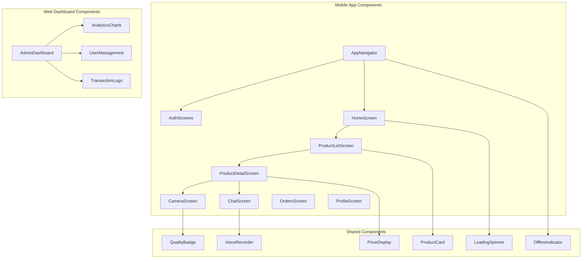
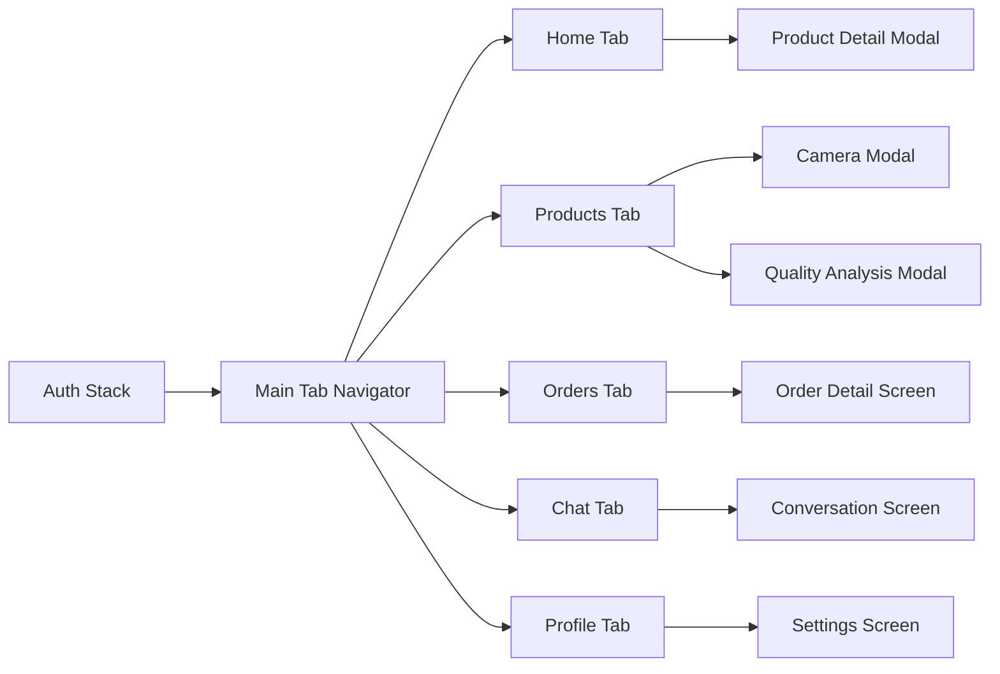
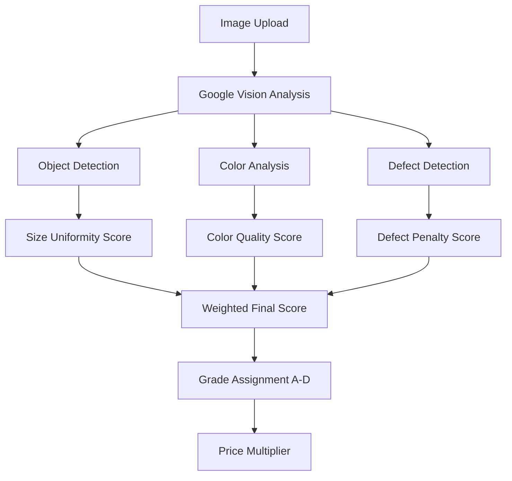
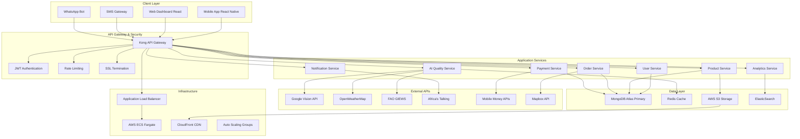
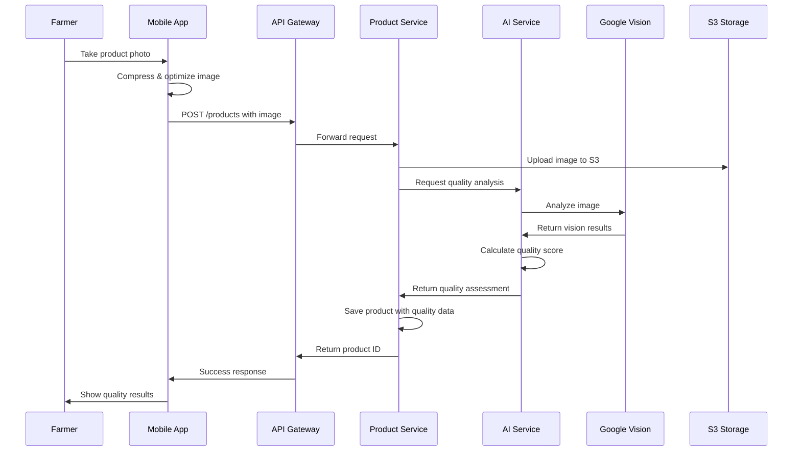

# AgriTrade AI Platform - Technical Design Document

## Overview

AgriTrade AI is a revolutionary agricultural commodities trading platform that connects farmers directly with traders, processors, and exporters across Africa. The platform leverages artificial intelligence to ensure transparency, fairness, and efficiency by eliminating intermediaries and providing real-time quality assessment, predictive pricing, and intelligent logistics optimization.

### Core Value Proposition
- **Direct Connection**: Eliminate intermediaries between farmers and buyers
- **AI-Powered Quality Assessment**: Instant crop quality evaluation through image analysis
- **Dynamic Pricing**: Real-time market pricing based on AI predictions
- **Logistics Optimization**: Smart routing and cargo grouping
- **Rural Accessibility**: Designed for low-bandwidth, mobile-first environments

### Target Markets
- **Primary**: Côte d'Ivoire, Senegal (MVP)
- **Secondary**: Ghana, Nigeria, Cameroon
- **Commodities**: Cocoa, coffee, cotton, maize, rice

## Technology Stack & Dependencies

### Frontend Technologies
- **Mobile Application**: React Native 0.72+ with TypeScript
- **Web Application**: Next.js 13 (App Router) with React 18
- **UI Framework**: Tamagui (performance-optimized for mobile)
- **State Management**: Zustand + React Query
- **Navigation**: React Navigation 6
- **Offline Support**: Redux Offline + AsyncStorage

### Backend Technologies
- **Runtime**: Node.js 18 LTS with TypeScript
- **Framework**: Fastify (high-performance alternative to Express)
- **API Gateway**: Kong Gateway with rate limiting
- **Authentication**: JWT with SMS OTP verification
- **Database**: MongoDB Atlas 6.0+ (primary), Redis 7.0 (caching)
- **File Storage**: AWS S3 with CloudFront CDN
- **Search**: ElasticSearch for analytics and product search

### AI & External APIs
- **Computer Vision**: Google Cloud Vision API
- **Weather Data**: OpenWeatherMap + NASA POWER
- **Agricultural Data**: FAO GIEWS, World Bank Commodity Prices
- **Satellite Data**: Sentinel Hub, Google Earth Engine
- **Communication**: Africa's Talking (SMS/Voice), WhatsApp Business API
- **Mapping**: Mapbox for logistics optimization
- **Conversational AI**: Hugging Face Transformers

## Component Architecture

### Component Hierarchy



### Component Specifications

#### Core Mobile Components

**ProductCard Component**
- Props: `product`, `onPress`, `showQuality`
- State: Quality badge, price display, favorite status
- Features: Image lazy loading, offline caching, quality indicators

**CameraScreen Component**
- Props: `onImageCapture`, `productType`
- State: Camera permissions, image processing status
- Features: Auto-focus, image compression, quality preview

**QualityBadge Component**
- Props: `score`, `grade`, `confidence`
- State: Color coding, animation state
- Features: Grade visualization (A+, A, B, C), confidence indicators

#### Authentication Flow Components

**PhoneAuthScreen**
- Features: International phone number input, SMS verification
- Validation: Libphonenumber integration
- Offline: Store pending registrations

**ProfileSetupScreen**
- Features: Role selection (farmer/buyer/transporter), KYC upload
- Validation: ID verification, location verification
- Camera integration for document capture

## Routing & Navigation

### Mobile Navigation Structure



### Route Definitions

```typescript
// Main navigation routes
type RootStackParamList = {
  Auth: undefined;
  Main: undefined;
  ProductDetail: { productId: string };
  Camera: { productType: string };
  QualityAnalysis: { imageUri: string; productType: string };
  OrderDetail: { orderId: string };
  Conversation: { userId: string; orderId?: string };
  Profile: undefined;
};

// Tab navigation
type TabParamList = {
  Home: undefined;
  Products: { category?: string };
  Orders: { status?: 'active' | 'completed' };
  Chat: undefined;
  Profile: undefined;
};
```

## Styling Strategy

### Design System

**Color Palette**
- Primary: Agricultural green (`#2D5830`)
- Secondary: Harvest gold (`#F4A460`)
- Success: Quality green (`#10B981`)
- Warning: Price alert orange (`#F59E0B`)
- Error: Quality reject red (`#EF4444`)

**Typography Scale**
- Heading 1: 32px, Bold (Farm names, main titles)
- Heading 2: 24px, Semibold (Product categories)
- Body: 16px, Regular (Product descriptions)
- Caption: 14px, Regular (Metadata, timestamps)

**Spacing System**
- Base unit: 8px
- Small: 8px, Medium: 16px, Large: 24px, XLarge: 32px

### Responsive Design Patterns

**Mobile-First Approach**
- Breakpoints: 320px (small), 768px (tablet), 1024px (desktop)
- Touch targets: Minimum 44px for accessibility
- Thumb-friendly navigation with bottom tabs

**Offline-First Styling**
- Skeleton loaders for slow connections
- Progressive image loading with placeholders
- Cached styles for offline usage

## State Management

### Architecture Pattern

Using **Zustand** for simplicity and performance with React Native:

```typescript
// Store structure
interface AppState {
  // Authentication
  user: User | null;
  isAuthenticated: boolean;
  
  // Products
  products: Product[];
  favoriteProducts: string[];
  
  // Orders
  activeOrders: Order[];
  orderHistory: Order[];
  
  // AI Analysis
  qualityAnalyses: QualityAnalysis[];
  
  // Offline sync
  pendingActions: PendingAction[];
  isOnline: boolean;
}
```

### State Persistence

**Local Storage Strategy**
- User preferences: SecureStore (iOS) / EncryptedSharedPreferences (Android)
- Product cache: AsyncStorage with TTL
- Image cache: React Native Fast Image with disk caching
- Offline queue: SQLite for reliable persistence

### Sync Strategy

**Optimistic Updates**
- Immediate UI updates for user actions
- Background sync when connection restored
- Conflict resolution for concurrent modifications

## API Integration Layer

### API Client Architecture

```typescript
class APIClient {
  private baseURL: string;
  private token: string | null;
  
  constructor() {
    this.baseURL = process.env.API_BASE_URL;
    this.setupInterceptors();
  }
  
  // Automatic retry logic for poor connections
  private setupRetry() {
    // Exponential backoff for failed requests
    // Circuit breaker pattern for API health
  }
  
  // Request/response transformation
  private setupInterceptors() {
    // Add authentication headers
    // Handle rate limiting
    // Transform error responses
  }
}
```

### External API Integration

**Google Vision API Integration**
```typescript
interface QualityAnalysisRequest {
  imageBuffer: Buffer;
  productType: 'cocoa' | 'coffee' | 'cotton';
  metadata: {
    location: GeoLocation;
    harvestDate: Date;
    farmerID: string;
  };
}

interface QualityAnalysisResponse {
  overall: number; // 0-100 score
  grade: 'A+' | 'A' | 'B' | 'C' | 'D';
  confidence: number;
  details: {
    beanSize: number;
    color: number;
    defects: number;
    moisture: number;
  };
  recommendations: string[];
}
```

**Price Prediction API**
```typescript
interface PricePredictionRequest {
  commodity: string;
  location: string;
  quantity: number;
  quality: string;
  deliveryDate: Date;
}

interface PricePredictionResponse {
  currentPrice: number;
  predictedPrice: number;
  priceRange: [number, number];
  factors: {
    weather: number;
    supply: number;
    demand: number;
    seasonal: number;
  };
}
```

## Business Logic Layer

### Core Business Features

#### 1. Product Quality Assessment

**Quality Scoring Algorithm**


**Quality Factors by Commodity**

*Cocoa Quality Metrics:*
- Bean size uniformity (25%)
- Color consistency (20%)
- Moisture content (20%)
- Defect presence (20%)
- Shell to bean ratio (15%)

*Coffee Quality Metrics:*
- Bean size distribution (30%)
- Color uniformity (25%)
- Defect count (25%)
- Processing method indicators (20%)

#### 2. Dynamic Pricing Engine

**Price Calculation Factors**
```typescript
interface PriceCalculation {
  basePriceUSD: number; // From FAO/World Bank
  qualityMultiplier: number; // From AI analysis
  locationAdjustment: number; // Transport costs
  seasonalFactor: number; // Historical patterns
  demandScore: number; // Local market demand
  weatherImpact: number; // Climate predictions
  finalPriceLocal: number; // In local currency
}
```

#### 3. Order Matching System

**Intelligent Matching Algorithm**
- Location proximity scoring
- Quality requirements matching
- Price range compatibility
- Delivery timeline alignment
- Farmer reputation scoring
- Buyer purchase history

#### 4. Logistics Optimization

**Route Optimization**
```typescript
interface LogisticsRequest {
  pickupPoints: GeoLocation[];
  deliveryPoint: GeoLocation;
  cargoWeight: number;
  deliveryDate: Date;
  vehicleConstraints: VehicleType[];
}

interface OptimizedRoute {
  route: GeoLocation[];
  estimatedTime: number;
  estimatedCost: number;
  fuelEfficiency: number;
  groupedCargo: CargoGroup[];
}
```

## Testing Strategy

### Frontend Testing

**Unit Testing with Jest + React Native Testing Library**
```typescript
// Component testing example
describe('ProductCard', () => {
  test('displays quality badge for analyzed products', () => {
    const product = createMockProduct({ qualityGrade: 'A' });
    render(<ProductCard product={product} />);
    expect(screen.getByText('Grade A')).toBeInTheDocument();
  });
  
  test('handles offline state gracefully', () => {
    const { rerender } = render(<ProductCard isOffline={true} />);
    expect(screen.getByText('Offline Mode')).toBeInTheDocument();
  });
});
```

**Integration Testing**
- API integration tests with mock servers
- End-to-end user flows (registration → product listing → ordering)
- Offline functionality testing
- Camera and image processing testing

**Visual Regression Testing**
- Storybook for component documentation
- Chromatic for visual testing
- Cross-device screenshot comparison

### Backend Testing

**API Testing with Supertest**
```typescript
describe('Quality Analysis API', () => {
  test('POST /api/v1/ai/analyze-quality returns valid score', async () => {
    const imageBuffer = fs.readFileSync('test-cocoa.jpg');
    const response = await request(app)
      .post('/api/v1/ai/analyze-quality')
      .attach('image', imageBuffer)
      .field('productType', 'cocoa')
      .expect(200);
      
    expect(response.body.qualityScore).toBeGreaterThan(0);
    expect(response.body.grade).toMatch(/[A-D]/);
  });
});
```

**Load Testing**
- Artillery.js for API load testing
- Stress testing for image processing endpoints
- Database performance testing with large datasets

### AI Model Testing

**Quality Assessment Validation**
- Comparison with expert human assessments
- Cross-validation with multiple image samples
- Bias testing across different regions/varieties
- Performance monitoring in production

## Architecture

### System Architecture Overview



### Microservices Architecture

#### Service Decomposition

**User Service**
- Responsibilities: Authentication, profile management, KYC verification
- Database: User profiles, authentication tokens, verification documents
- APIs: Registration, login, profile CRUD, KYC workflow

**Product Service**
- Responsibilities: Product catalog, inventory management, image processing
- Database: Product listings, categories, images, metadata
- APIs: Product CRUD, search, categorization, bulk upload

**AI Quality Service**
- Responsibilities: Image analysis, quality scoring, price prediction
- Database: Analysis results, model performance metrics
- APIs: Quality analysis, price prediction, batch processing

**Order Service**
- Responsibilities: Order management, matching algorithm, contract generation
- Database: Orders, matches, contracts, delivery tracking
- APIs: Order CRUD, matching, negotiation, status updates

**Payment Service**
- Responsibilities: Payment processing, escrow management, commission calculation
- Database: Transactions, escrow accounts, payment methods
- APIs: Payment initiation, status checking, escrow release

**Notification Service**
- Responsibilities: Multi-channel notifications, delivery tracking
- Database: Notification templates, delivery logs, user preferences
- APIs: Send notifications, subscription management, analytics

### Data Architecture

#### Database Design

**MongoDB Collections Schema**

```typescript
// Users Collection
interface User {
  _id: ObjectId;
  phoneNumber: string;
  role: 'farmer' | 'buyer' | 'transporter';
  profile: {
    name: string;
    location: GeoLocation;
    languages: string[];
    verified: boolean;
    kycStatus: 'pending' | 'approved' | 'rejected';
  };
  preferences: {
    notifications: NotificationSettings;
    currency: string;
    units: 'metric' | 'imperial';
  };
  createdAt: Date;
  lastActive: Date;
}

// Products Collection
interface Product {
  _id: ObjectId;
  farmerId: ObjectId;
  commodity: 'cocoa' | 'coffee' | 'cotton' | 'maize' | 'rice';
  variety: string;
  quantity: number;
  unit: 'kg' | 'tons';
  qualityAnalysis: {
    score: number;
    grade: string;
    confidence: number;
    analysisDate: Date;
    imageUrls: string[];
  };
  location: GeoLocation;
  harvestDate: Date;
  status: 'available' | 'reserved' | 'sold';
  pricing: {
    askingPrice: number;
    currency: string;
    pricePerUnit: number;
  };
  metadata: {
    organicCertified: boolean;
    fairTradeCertified: boolean;
    storageConditions: string;
  };
  createdAt: Date;
  updatedAt: Date;
}

// Orders Collection
interface Order {
  _id: ObjectId;
  buyerId: ObjectId;
  productId: ObjectId;
  farmerId: ObjectId;
  quantity: number;
  agreedPrice: number;
  status: 'pending' | 'confirmed' | 'in_transit' | 'delivered' | 'completed';
  negotiationHistory: NegotiationEntry[];
  contract: {
    terms: string;
    signedAt: Date;
    deliveryDate: Date;
    deliveryLocation: GeoLocation;
  };
  logistics: {
    transporterId?: ObjectId;
    route: GeoLocation[];
    estimatedDelivery: Date;
    trackingUpdates: TrackingUpdate[];
  };
  payment: {
    method: 'mobile_money' | 'bank_transfer' | 'cash';
    escrowId: string;
    status: 'pending' | 'escrowed' | 'released';
  };
  createdAt: Date;
  updatedAt: Date;
}
```

#### Data Flow Architecture



### Infrastructure Architecture

#### AWS Cloud Infrastructure

**Compute Layer**
- **ECS Fargate**: Serverless containers for microservices
- **Application Load Balancer**: Traffic distribution and SSL termination
- **Auto Scaling Groups**: Automatic scaling based on demand
- **Lambda Functions**: Event-driven processing for notifications

**Storage Layer**
- **S3**: Object storage for images and documents
- **CloudFront**: Global CDN for fast content delivery
- **EBS**: Persistent storage for containers
- **MongoDB Atlas**: Managed database with automated backups

**Networking**
- **VPC**: Isolated network environment
- **Private Subnets**: Internal service communication
- **NAT Gateway**: Outbound internet access for private services
- **Security Groups**: Network-level security rules

**Monitoring & Logging**
- **CloudWatch**: Metrics, logs, and alarms
- **X-Ray**: Distributed tracing for performance analysis
- **DataDog**: Application performance monitoring
- **ElasticSearch**: Log aggregation and analysis

#### Security Architecture

**Authentication & Authorization**
- JWT tokens with refresh mechanism
- SMS-based two-factor authentication
- Role-based access control (RBAC)
- API key management for external services

**Data Protection**
- Encryption at rest (AES-256)
- Encryption in transit (TLS 1.3)
- Field-level encryption for sensitive data
- Regular security audits and penetration testing

**API Security**
- Rate limiting per user/IP
- Input validation and sanitization
- SQL injection prevention
- CORS configuration for web clients

#### Scalability Considerations

**Horizontal Scaling**
- Stateless microservices design
- Load balancing across multiple instances
- Database sharding for large datasets
- Caching strategies to reduce database load

**Performance Optimization**
- Image compression and CDN delivery
- Database indexing strategies
- Connection pooling for database access
- Asynchronous processing for heavy operations

**Cost Optimization**
- Reserved instances for predictable workloads
- Spot instances for batch processing
- S3 lifecycle policies for old data
- CloudWatch cost monitoring and alerts

## Project Structure & Implementation Roadmap

### Recommended Repository Structure

```
agritrade/
├── mobile/                     # React Native mobile app
│   ├── src/
│   │   ├── components/         # Reusable UI components
│   │   ├── screens/           # Screen components
│   │   ├── navigation/        # Navigation configuration
│   │   ├── services/          # API clients and external services
│   │   ├── store/             # Zustand store configuration
│   │   ├── utils/             # Helper functions and utilities
│   │   └── types/             # TypeScript type definitions
│   ├── android/               # Android-specific configuration
│   ├── ios/                   # iOS-specific configuration (future)
│   ├── __tests__/             # Unit and integration tests
│   └── package.json
├── web/                       # Next.js web dashboard
│   ├── src/
│   │   ├── app/              # Next.js 13 app directory
│   │   ├── components/       # React components
│   │   ├── lib/              # Utility libraries
│   │   └── types/            # Shared type definitions
│   └── package.json
├── backend/                   # Node.js microservices
│   ├── services/
│   │   ├── user-service/     # User management
│   │   ├── product-service/  # Product catalog
│   │   ├── ai-service/       # AI quality analysis
│   │   ├── order-service/    # Order management
│   │   ├── payment-service/  # Payment processing
│   │   └── notification-service/ # Notifications
│   ├── shared/               # Shared utilities and types
│   ├── api-gateway/          # Kong gateway configuration
│   └── docker-compose.yml    # Local development setup
├── infrastructure/           # Infrastructure as Code
│   ├── terraform/            # AWS infrastructure
│   ├── kubernetes/           # K8s deployment configs
│   └── monitoring/           # Monitoring and logging
├── docs/                     # Documentation
│   ├── api/                  # API documentation
│   ├── deployment/           # Deployment guides
│   └── user-guides/          # User documentation
└── scripts/                  # Build and deployment scripts
    ├── setup.sh              # Development environment setup
    ├── deploy.sh             # Deployment automation
    └── test.sh               # Test automation
```

### Development Phase Roadmap

#### Phase 1: Foundation (Weeks 1-4)
**MVP Core Infrastructure**

1. **Repository Setup**
   - Initialize monorepo structure
   - Configure TypeScript across all packages
   - Setup ESLint, Prettier, and commit hooks
   - Configure CI/CD pipeline with GitHub Actions

2. **Backend Foundation**
   - Setup Fastify framework with TypeScript
   - Configure MongoDB Atlas connection
   - Implement JWT authentication service
   - Setup API gateway with Kong
   - Create basic health check endpoints

3. **Mobile App Foundation**
   - Initialize React Native project with TypeScript
   - Setup navigation structure
   - Configure state management with Zustand
   - Implement basic authentication screens
   - Setup offline-first architecture

#### Phase 2: Core Features (Weeks 5-12)
**User Management & Product Catalog**

1. **User Service Implementation**
   ```typescript
   // Example API endpoints to implement
   POST /api/v1/auth/register
   POST /api/v1/auth/verify-sms
   POST /api/v1/auth/login
   GET /api/v1/users/profile
   PUT /api/v1/users/profile
   POST /api/v1/users/kyc
   ```

2. **Product Service Implementation**
   ```typescript
   // Product management endpoints
   GET /api/v1/products
   POST /api/v1/products
   PUT /api/v1/products/:id
   DELETE /api/v1/products/:id
   POST /api/v1/products/:id/images
   GET /api/v1/products/search
   ```

3. **Mobile App Core Screens**
   - Registration and onboarding flow
   - Product listing and search
   - Product detail with image capture
   - Basic user profile management

#### Phase 3: AI Integration (Weeks 13-18)
**Quality Assessment & Pricing**

1. **AI Service Implementation**
   - Google Vision API integration
   - Quality scoring algorithms for cocoa
   - Price prediction service
   - Image preprocessing pipeline

2. **Mobile Camera Integration**
   - Camera component with quality guidelines
   - Image compression and optimization
   - Real-time quality preview
   - Offline image queue for poor connectivity

3. **Quality Assessment UI**
   - Quality badge components
   - Analysis result screens
   - Quality improvement recommendations
   - Historical quality tracking

#### Phase 4: Marketplace (Weeks 19-24)
**Order Management & Payments**

1. **Order Service**
   - Order creation and management
   - Intelligent buyer-seller matching
   - Contract generation and signing
   - Delivery tracking integration

2. **Payment Integration**
   - Mobile Money API integration (Orange, MTN)
   - Escrow system implementation
   - Commission calculation
   - Transaction history and reporting

3. **Communication Features**
   - In-app chat system
   - Voice message support
   - SMS fallback for notifications
   - WhatsApp Business API integration

### Technical Implementation Guidelines

#### Mobile App Development Standards

**Code Organization**
```typescript
// Example component structure
src/components/
├── common/           # Reusable UI components
│   ├── Button/
│   ├── Input/
│   ├── Card/
│   └── index.ts
├── domain/          # Business-specific components
│   ├── Product/
│   │   ├── ProductCard.tsx
│   │   ├── QualityBadge.tsx
│   │   └── PriceDisplay.tsx
│   └── Order/
└── layout/          # Layout components
    ├── Header/
    ├── TabBar/
    └── Modal/
```

**State Management Pattern**
```typescript
// Zustand store example
interface ProductStore {
  products: Product[];
  loading: boolean;
  error: string | null;
  
  // Actions
  fetchProducts: (filters?: ProductFilters) => Promise<void>;
  addProduct: (product: CreateProductRequest) => Promise<void>;
  analyzeQuality: (imageUri: string, productType: string) => Promise<QualityResult>;
  
  // Computed values
  featuredProducts: Product[];
  productsByCategory: Record<string, Product[]>;
}
```

#### Backend Service Standards

**Service Structure Template**
```typescript
// Example service structure
src/
├── controllers/     # HTTP request handlers
├── services/        # Business logic layer
├── repositories/    # Data access layer
├── middleware/      # Custom middleware
├── schemas/         # Validation schemas
├── types/           # TypeScript types
└── utils/           # Helper functions
```

**API Response Standards**
```typescript
interface APIResponse<T> {
  success: boolean;
  data?: T;
  error?: {
    code: string;
    message: string;
    details?: Record<string, any>;
  };
  meta?: {
    pagination?: PaginationMeta;
    timestamp: string;
    version: string;
  };
}
```

#### Database Schema Implementation

**MongoDB Indexes**
```javascript
// Essential indexes for performance
db.products.createIndex({ "location": "2dsphere" });
db.products.createIndex({ "commodity": 1, "status": 1 });
db.products.createIndex({ "farmerId": 1, "createdAt": -1 });
db.orders.createIndex({ "buyerId": 1, "status": 1 });
db.orders.createIndex({ "farmerId": 1, "createdAt": -1 });
db.users.createIndex({ "phoneNumber": 1 }, { unique: true });
```

**Data Validation**
```typescript
// Joi validation schemas
const ProductSchema = Joi.object({
  commodity: Joi.string().valid('cocoa', 'coffee', 'cotton').required(),
  quantity: Joi.number().positive().required(),
  location: Joi.object({
    latitude: Joi.number().min(-90).max(90).required(),
    longitude: Joi.number().min(-180).max(180).required()
  }).required(),
  harvestDate: Joi.date().max('now').required()
});
```

### Development Environment Setup

#### Required Tools and Versions
```bash
# Development dependencies
Node.js: 18.x LTS
npm: 9.x
React Native CLI: 11.x
Android Studio: Latest stable
MongoDB: 6.0+
Redis: 7.0+
Docker: 20.x+
```

#### Environment Configuration
```bash
# .env.development
NODE_ENV=development
API_BASE_URL=http://localhost:3000
MONGODB_URI=mongodb://localhost:27017/agritrade-dev
REDIS_URL=redis://localhost:6379
JWT_SECRET=your-development-secret
GOOGLE_VISION_API_KEY=your-api-key
AWS_ACCESS_KEY_ID=your-access-key
AWS_SECRET_ACCESS_KEY=your-secret-key
```

#### Quick Start Commands
```bash
# Setup development environment
git clone https://github.com/topsucces-code/agritrade.git
cd agritrade
npm run setup  # Install dependencies for all packages
npm run dev     # Start all services in development mode

# Mobile development
cd mobile
npm run android  # Start Android app
npm run ios      # Start iOS app (future)

# Backend development
cd backend
npm run dev      # Start all microservices
npm test         # Run test suite
```