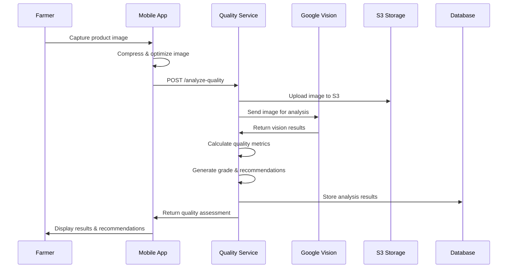
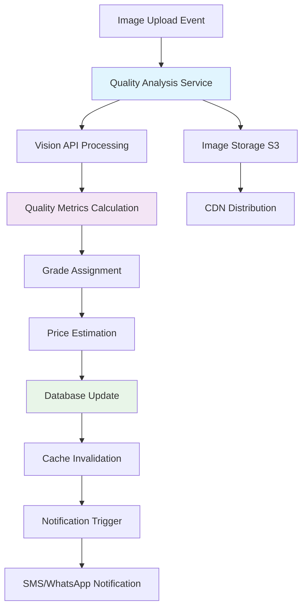

# AgriTrade AI Platform - Advanced Technical Analysis & Continuation Design

## Overview

AgriTrade AI is a revolutionary agricultural commodities trading platform that eliminates intermediaries between African farmers and buyers through artificial intelligence. The platform provides AI-powered quality assessment, predictive pricing, and intelligent logistics optimization, targeting a 30-50% increase in farmer revenues across West African markets.

### Core Mission
- **Direct Market Access**: Connect farmers directly with traders, processors, and exporters
- **AI-Driven Quality Assessment**: Instant crop evaluation through Google Vision API
- **Transparent Pricing**: Real-time market pricing based on quality and market data
- **Rural-First Design**: Optimized for low-bandwidth, mobile-first environments
- **Multilingual Support**: Voice assistance for illiterate farmers

### Target Markets
- **Primary**: Côte d'Ivoire, Senegal (MVP deployment)
- **Secondary**: Ghana, Nigeria, Mali, Cameroon
- **Commodities**: Cocoa, coffee, cotton, maize, rice, peanuts, cashew, palm oil

## Technology Stack & Dependencies

### Backend Architecture
- **Runtime Environment**: Node.js 18+ LTS with TypeScript 5.2+
- **Web Framework**: Fastify 4.24+ (high-performance alternative to Express)
- **API Gateway**: Kong Gateway with rate limiting and security
- **Authentication**: JWT with SMS OTP verification via Africa's Talking
- **Database**: MongoDB Atlas 6.0+ (primary), Redis 7.0+ (caching/sessions)
- **File Storage**: AWS S3 with CloudFront CDN for global distribution
- **Search & Analytics**: ElasticSearch for product search and analytics

### AI & External Services Integration
- **Computer Vision**: Google Cloud Vision API for image analysis
- **Weather Intelligence**: OpenWeatherMap + NASA POWER for climate data
- **Agricultural Data**: FAO GIEWS, World Bank Commodity Prices
- **Satellite Monitoring**: Sentinel Hub, Google Earth Engine for crop monitoring
- **Communication**: Africa's Talking (SMS/Voice), WhatsApp Business API
- **Geospatial**: Mapbox for logistics optimization and mapping
- **NLP Processing**: Hugging Face Transformers for multilingual chat

### Infrastructure & DevOps
- **Cloud Platform**: AWS ECS Fargate with auto-scaling groups
- **Containerization**: Docker with multi-stage builds
- **CI/CD**: GitHub Actions with automated testing and deployment
- **Monitoring**: DataDog + CloudWatch for comprehensive observability
- **Security**: Helmet.js, CORS, AES-256 encryption for sensitive data

## Architecture

### Microservices System Design

```mermaid
graph TB
    subgraph "Client Layer"
        A[Mobile App - React Native]
        B[Web Dashboard - Next.js]
        C[SMS Gateway]
        D[WhatsApp Bot]
        E[Voice Assistant]
    end
    
    subgraph "API Gateway & Security"
        F[Kong API Gateway]
        G[JWT Authentication]
        H[Rate Limiting]
        I[SSL Termination]
    end
    
    subgraph "Core Microservices"
        J[User Management Service]
        K[Product Catalog Service]
        L[AI Quality Analysis Service]
        M[Order Management Service]
        N[Payment Processing Service]
        O[Notification Service]
        P[Logistics Optimization Service]
    end
    
    subgraph "External APIs"
        Q[Google Vision API]
        R[OpenWeatherMap]
        S[FAO GIEWS Data]
        T[Africa's Talking]
        U[Mobile Money APIs]
        V[Mapbox Routing]
    end
    
    subgraph "Data & Storage Layer"
        W[MongoDB Atlas - Primary]
        X[Redis - Cache & Sessions]
        Y[AWS S3 - File Storage]
        Z[ElasticSearch - Analytics]
    end
    
    subgraph "Infrastructure"
        AA[AWS ECS Fargate]
        BB[Application Load Balancer]
        CC[CloudFront CDN]
        DD[Auto Scaling Groups]
    end
    
    A --> F
    B --> F
    C --> F
    D --> F
    E --> F
    
    F --> G
    F --> H
    F --> I
    
    F --> J
    F --> K
    F --> L
    F --> M
    F --> N
    F --> O
    F --> P
    
    L --> Q
    K --> R
    K --> S
    O --> T
    N --> U
    P --> V
    
    J --> W
    K --> W
    L --> W
    M --> W
    N --> W
    
    K --> X
    L --> X
    
    K --> Y
    L --> Y
    
    K --> Z
    M --> Z
    
    F --> BB
    BB --> AA
    Y --> CC
```



### Service Decomposition Strategy

#### User Management Service
**Responsibilities:**
- User registration and authentication
- Profile management and KYC verification
- Role-based access control (farmer/buyer/transporter)
- Multi-language preference management

**Database Schema:**
```typescript
interface User {
  _id: ObjectId;
  phoneNumber: string; // Primary identifier
  role: 'farmer' | 'buyer' | 'transporter' | 'admin';
  profile: {
    name: string;
    location: GeoLocation;
    languages: string[]; // Supported: French, English, local dialects
    verified: boolean;
    kycStatus: 'pending' | 'approved' | 'rejected';
    documentation: string[]; // S3 URLs for ID documents
  };
  preferences: {
    notifications: NotificationSettings;
    currency: 'XOF' | 'GHS' | 'NGN' | 'USD';
    units: 'metric' | 'imperial';
  };
  reputation: {
    score: number; // 0-100
    transactionCount: number;
    rating: number; // 1-5 stars
  };
  createdAt: Date;
  lastActive: Date;
}
```

#### AI Quality Analysis Service
**Core Functionality:**
- Image processing and quality assessment
- Multi-commodity analysis (cocoa, coffee, cotton, etc.)
- Grade assignment (A+ to D) with confidence scoring
- Quality improvement recommendations
- Price estimation based on quality metrics

**Analysis Workflow:**


**Quality Metrics by Commodity:**

*Cocoa Quality Assessment:*
- Bean size uniformity (25% weight)
- Color consistency (20% weight) 
- Moisture content detection (20% weight)
- Defect identification (20% weight)
- Shell-to-bean ratio (15% weight)

*Coffee Quality Assessment:*
- Bean size distribution (30% weight)
- Color uniformity (25% weight)
- Defect counting (25% weight)
- Processing method indicators (20% weight)

#### Product Catalog Service
**Features:**
- Product listing management
- Inventory tracking
- Category organization
- Search and filtering capabilities
- Image gallery management

**Product Schema:**
```typescript
interface Product {
  _id: ObjectId;
  farmerId: ObjectId;
  commodity: 'cocoa' | 'coffee' | 'cotton' | 'maize' | 'rice' | 'peanuts';
  variety: string;
  quantity: {
    available: number;
    reserved: number;
    unit: 'kg' | 'tons' | 'bags';
  };
  qualityAssessment: {
    overallScore: number; // 0-100
    grade: 'A+' | 'A' | 'B' | 'C' | 'D';
    confidence: number; // 0-1
    analysisDate: Date;
    imageUrls: string[];
    detailedMetrics: QualityMetrics;
  };
  pricing: {
    basePrice: number;
    currency: string;
    qualityMultiplier: number;
    finalPrice: number;
  };
  location: GeoLocation;
  harvestDate: Date;
  status: 'available' | 'reserved' | 'sold' | 'processing';
  certifications: {
    organic: boolean;
    fairTrade: boolean;
    rainforest: boolean;
  };
  storageConditions: {
    temperature: number;
    humidity: number;
    duration: number; // days since harvest
  };
}
```

#### Order Management Service
**Capabilities:**
- Order creation and lifecycle management
- Intelligent buyer-seller matching
- Contract generation and digital signing
- Negotiation workflow management
- Delivery tracking integration

**Matching Algorithm:**
```typescript
interface MatchingCriteria {
  location: {
    proximity: number; // km radius
    weight: 0.3;
  };
  quality: {
    minGrade: string;
    scoreRange: [number, number];
    weight: 0.25;
  };
  price: {
    range: [number, number];
    flexibility: number; // 0-1
    weight: 0.2;
  };
  timing: {
    deliveryWindow: number; // days
    urgency: 'low' | 'medium' | 'high';
    weight: 0.15;
  };
  reputation: {
    minScore: number;
    weight: 0.1;
  };
}
```

### Data Architecture & Modeling

#### Database Design Patterns

**MongoDB Collections Structure:**
```typescript
// Core business entities
collections: {
  users: User[];
  products: Product[];
  orders: Order[];
  qualityAnalyses: QualityAnalysis[];
  transactions: Transaction[];
  notifications: Notification[];
  logisticsRoutes: LogisticsRoute[];
}

// Indexing strategy for performance
indexes: {
  users: [
    { phoneNumber: 1 }, // Unique
    { "profile.location": "2dsphere" },
    { role: 1, "profile.verified": 1 }
  ];
  products: [
    { farmerId: 1, status: 1 },
    { commodity: 1, "qualityAssessment.grade": 1 },
    { "location": "2dsphere" },
    { createdAt: -1 }
  ];
  orders: [
    { buyerId: 1, status: 1 },
    { farmerId: 1, createdAt: -1 },
    { "contract.deliveryDate": 1 }
  ];
}
```

#### Data Flow Architecture

**Event-Driven Data Processing:**


## Business Logic Layer

### AI Quality Assessment Engine

#### Multi-Commodity Analysis Framework
```typescript
abstract class CommodityAnalyzer {
  abstract analyzeQuality(imageData: Buffer, metadata: ProductMetadata): Promise<QualityResult>;
  abstract calculateGrade(metrics: QualityMetrics): QualityGrade;
  abstract generateRecommendations(analysis: QualityResult): Recommendation[];
}

class CocoaAnalyzer extends CommodityAnalyzer {
  async analyzeQuality(imageData: Buffer, metadata: ProductMetadata): Promise<QualityResult> {
    const visionResults = await this.googleVisionClient.analyze(imageData);
    
    const metrics = {
      beanSizeUniformity: this.assessBeanSize(visionResults),
      colorConsistency: this.assessColor(visionResults),
      moistureContent: this.estimateMoisture(visionResults, metadata),
      defectCount: this.countDefects(visionResults),
      shellToBeanRatio: this.calculateShellRatio(visionResults)
    };
    
    const overallScore = this.calculateWeightedScore(metrics);
    const grade = this.calculateGrade(metrics);
    const confidence = this.calculateConfidence(visionResults);
    
    return {
      overallScore,
      grade,
      confidence,
      detailedMetrics: metrics,
      recommendations: this.generateRecommendations({ overallScore, grade, metrics })
    };
  }
  
  private calculateWeightedScore(metrics: CocoaQualityMetrics): number {
    const weights = {
      beanSizeUniformity: 0.25,
      colorConsistency: 0.20,
      moistureContent: 0.20,
      defectCount: 0.20,
      shellToBeanRatio: 0.15
    };
    
    return Object.entries(weights).reduce((score, [key, weight]) => {
      return score + (metrics[key] * weight);
    }, 0);
  }
}
```

### Dynamic Pricing Engine

#### Multi-Factor Pricing Model
```typescript
interface PricingFactors {
  qualityMultiplier: number; // Based on AI analysis
  marketDemand: number; // Local supply/demand
  seasonalAdjustment: number; // Historical patterns
  weatherImpact: number; // Climate predictions
  locationPremium: number; // Transport costs
  certificationBonus: number; // Organic/FairTrade
}

class PricingEngine {
  async calculatePrice(product: Product, marketConditions: MarketConditions): Promise<PriceEstimate> {
    const basePrice = await this.getBasePriceFromFAO(product.commodity);
    const factors = await this.calculatePricingFactors(product, marketConditions);
    
    const adjustedPrice = basePrice * 
      factors.qualityMultiplier * 
      factors.marketDemand * 
      factors.seasonalAdjustment * 
      (1 + factors.weatherImpact) * 
      (1 + factors.locationPremium) * 
      (1 + factors.certificationBonus);
    
    return {
      basePrice,
      adjustedPrice,
      factors,
      confidence: this.calculatePriceConfidence(factors),
      validUntil: new Date(Date.now() + 24 * 60 * 60 * 1000) // 24 hours
    };
  }
}
```

### Intelligent Matching System

#### Farmer-Buyer Matching Algorithm
```typescript
class MatchingEngine {
  async findMatches(order: BuyOrder): Promise<MatchResult[]> {
    const candidates = await this.findCandidateProducts(order);
    const scoredMatches = await Promise.all(
      candidates.map(product => this.scoreMatch(order, product))
    );
    
    return scoredMatches
      .filter(match => match.score >= 0.6) // Minimum threshold
      .sort((a, b) => b.score - a.score)
      .slice(0, 10); // Top 10 matches
  }
  
  private async scoreMatch(order: BuyOrder, product: Product): Promise<MatchResult> {
    const criteria = order.matchingCriteria;
    
    const scores = {
      location: this.calculateLocationScore(order.deliveryLocation, product.location, criteria.location),
      quality: this.calculateQualityScore(order.qualityRequirements, product.qualityAssessment, criteria.quality),
      price: this.calculatePriceScore(order.priceRange, product.pricing, criteria.price),
      timing: this.calculateTimingScore(order.deliveryDate, product.availabilityDate, criteria.timing),
      reputation: this.calculateReputationScore(order.farmerId, criteria.reputation)
    };
    
    const weightedScore = Object.entries(criteria).reduce((total, [key, config]) => {
      return total + (scores[key] * config.weight);
    }, 0);
    
    return {
      productId: product._id,
      farmerId: product.farmerId,
      score: weightedScore,
      breakdown: scores,
      estimatedDelivery: this.calculateDeliveryEstimate(order, product)
    };
  }
}
```

## API Endpoints Reference

### Authentication Endpoints
```typescript
// User registration and authentication
POST /api/v1/auth/register
{
  phoneNumber: string;
  role: 'farmer' | 'buyer' | 'transporter';
  language: string;
  location: GeoLocation;
}

POST /api/v1/auth/verify-sms
{
  phoneNumber: string;
  verificationCode: string;
}

POST /api/v1/auth/login
{
  phoneNumber: string;
  password?: string; // Optional for SMS-only auth
}

GET /api/v1/auth/refresh
Headers: { Authorization: "Bearer <refresh_token>" }
```

### AI Quality Analysis Endpoints
```typescript
// Quality analysis operations
POST /api/v1/ai/analyze-quality
Content-Type: multipart/form-data
{
  image: File;
  productType: 'cocoa' | 'coffee' | 'cotton' | 'maize' | 'rice' | 'peanuts';
  farmerId: string;
  location: GeoLocation;
  harvestDate: Date;
  metadata?: ProductMetadata;
}

GET /api/v1/ai/analysis/:analysisId
Response: QualityAnalysisResult

GET /api/v1/ai/analysis/farmer/:farmerId
Query: { limit?, offset?, productType?, dateRange? }
Response: QualityAnalysisResult[]

POST /api/v1/ai/batch-analyze
{
  images: AnalysisRequest[];
  batchId: string;
}
```

### Product Management Endpoints
```typescript
// Product catalog operations
GET /api/v1/products
Query: {
  commodity?: string;
  grade?: string;
  location?: GeoLocation;
  radius?: number;
  priceRange?: [number, number];
  available?: boolean;
  limit?: number;
  offset?: number;
}

POST /api/v1/products
{
  commodity: string;
  variety: string;
  quantity: QuantityInfo;
  location: GeoLocation;
  harvestDate: Date;
  qualityAnalysisId: string;
  askingPrice?: number;
  certifications?: Certification[];
}

PUT /api/v1/products/:productId
PATCH /api/v1/products/:productId/status
DELETE /api/v1/products/:productId
```

### Order Management Endpoints
```typescript
// Order lifecycle management
POST /api/v1/orders
{
  productId: string;
  quantity: number;
  proposedPrice: number;
  deliveryLocation: GeoLocation;
  deliveryDate: Date;
  specialRequirements?: string[];
}

GET /api/v1/orders
Query: { status?, role?, dateRange?, limit?, offset? }

PUT /api/v1/orders/:orderId/negotiate
{
  newPrice?: number;
  newQuantity?: number;
  newDeliveryDate?: Date;
  message?: string;
}

POST /api/v1/orders/:orderId/accept
POST /api/v1/orders/:orderId/reject
{
  reason?: string;
}

GET /api/v1/orders/:orderId/tracking
Response: LogisticsInfo
```

### Market Data Endpoints
```typescript
// Market intelligence and pricing
GET /api/v1/market/prices
Query: {
  commodity: string;
  location?: GeoLocation;
  timeframe?: 'day' | 'week' | 'month' | 'year';
}

GET /api/v1/market/forecast
Query: {
  commodity: string;
  location: GeoLocation;
  horizon: number; // days
}

GET /api/v1/market/demand
Query: {
  commodity: string;
  region: string;
}
```

## Middleware & Interceptors

### Security Middleware Stack
```typescript
// JWT Authentication Middleware
const authMiddleware = async (request: FastifyRequest, reply: FastifyReply) => {
  try {
    const token = request.headers.authorization?.replace('Bearer ', '');
    if (!token) {
      return reply.code(401).send({ error: 'Token required' });
    }
    
    const decoded = jwt.verify(token, process.env.JWT_SECRET);
    request.user = decoded;
  } catch (error) {
    return reply.code(401).send({ error: 'Invalid token' });
  }
};

// Rate Limiting Middleware
const rateLimitMiddleware = {
  max: 100, // requests
  timeWindow: '1 minute',
  keyGenerator: (request) => request.user?.id || request.ip,
  onExceeded: (request, reply) => {
    reply.code(429).send({ 
      error: 'Rate limit exceeded',
      retryAfter: '60 seconds'
    });
  }
};

// Input Validation Middleware
const validationMiddleware = (schema: Schema) => {
  return async (request: FastifyRequest, reply: FastifyReply) => {
    try {
      const { error } = schema.validate(request.body);
      if (error) {
        return reply.code(400).send({ 
          error: 'Validation failed',
          details: error.details 
        });
      }
    } catch (err) {
      return reply.code(500).send({ error: 'Validation error' });
    }
  };
};
```

### Error Handling & Resilience
```typescript
// Global Error Handler
const errorHandler = (error: Error, request: FastifyRequest, reply: FastifyReply) => {
  const errorId = generateErrorId();
  
  // Log error with context
  logger.error({
    errorId,
    error: error.message,
    stack: error.stack,
    request: {
      method: request.method,
      url: request.url,
      headers: request.headers,
      body: request.body
    }
  });
  
  // Determine error type and response
  if (error instanceof ValidationError) {
    reply.code(400).send({
      errorId,
      error: 'Validation failed',
      details: error.details
    });
  } else if (error instanceof AuthenticationError) {
    reply.code(401).send({
      errorId,
      error: 'Authentication failed'
    });
  } else if (error instanceof ExternalServiceError) {
    reply.code(503).send({
      errorId,
      error: 'External service unavailable',
      retryAfter: '30 seconds'
    });
  } else {
    reply.code(500).send({
      errorId,
      error: 'Internal server error'
    });
  }
};

// Circuit Breaker for External Services
class CircuitBreaker {
  private failures: number = 0;
  private state: 'closed' | 'open' | 'half-open' = 'closed';
  private lastFailureTime: Date | null = null;
  
  async execute<T>(operation: () => Promise<T>): Promise<T> {
    if (this.state === 'open') {
      if (this.shouldAttemptReset()) {
        this.state = 'half-open';
      } else {
        throw new Error('Circuit breaker is open');
      }
    }
    
    try {
      const result = await operation();
      this.onSuccess();
      return result;
    } catch (error) {
      this.onFailure();
      throw error;
    }
  }
  
  private onSuccess() {
    this.failures = 0;
    this.state = 'closed';
  }
  
  private onFailure() {
    this.failures++;
    this.lastFailureTime = new Date();
    
    if (this.failures >= 5) { // Threshold
      this.state = 'open';
    }
  }
}
```

## Testing Strategy

### Unit Testing Framework
```typescript
// Quality Analysis Service Tests
describe('QualityAnalysisService', () => {
  let service: QualityAnalysisService;
  let mockVisionClient: jest.Mocked<VisionClient>;
  let mockS3Client: jest.Mocked<S3Client>;
  
  beforeEach(() => {
    mockVisionClient = createMockVisionClient();
    mockS3Client = createMockS3Client();
    service = new QualityAnalysisService(mockVisionClient, mockS3Client);
  });
  
  describe('analyzeProductQuality', () => {
    it('should return quality analysis for valid cocoa image', async () => {
      // Arrange
      const imageBuffer = fs.readFileSync('test-assets/cocoa-sample.jpg');
      const metadata = {
        productType: 'cocoa',
        farmerId: 'farmer123',
        location: { latitude: 5.6037, longitude: -0.1870 }
      };
      
      mockVisionClient.analyze.mockResolvedValue({
        objects: [{ name: 'cocoa_bean', confidence: 0.95 }],
        colors: [{ red: 139, green: 69, blue: 19, score: 0.8 }]
      });
      
      // Act
      const result = await service.analyzeProductQuality(imageBuffer, metadata);
      
      // Assert
      expect(result.overallScore).toBeGreaterThan(0);
      expect(result.grade).toMatch(/^[A-D][+]?$/);
      expect(result.confidence).toBeGreaterThan(0.5);
      expect(result.detailedMetrics).toHaveProperty('beanSizeUniformity');
      expect(mockS3Client.upload).toHaveBeenCalledWith(
        expect.objectContaining({
          bucket: 'agritrade-images',
          key: expect.stringContaining('quality-analysis')
        })
      );
    });
    
    it('should handle low-quality images gracefully', async () => {
      // Arrange
      const blurryImageBuffer = fs.readFileSync('test-assets/blurry-image.jpg');
      
      mockVisionClient.analyze.mockResolvedValue({
        objects: [],
        confidence: 0.2
      });
      
      // Act & Assert
      await expect(
        service.analyzeProductQuality(blurryImageBuffer, metadata)
      ).rejects.toThrow('Image quality too low for analysis');
    });
  });
});

// Integration Tests for API Endpoints
describe('Quality Analysis API', () => {
  let app: FastifyInstance;
  
  beforeAll(async () => {
    app = await buildApp({ testing: true });
  });
  
  afterAll(async () => {
    await app.close();
  });
  
  describe('POST /api/v1/ai/analyze-quality', () => {
    it('should analyze uploaded image and return quality results', async () => {
      const imageFile = fs.readFileSync('test-assets/cocoa-sample.jpg');
      
      const response = await app.inject({
        method: 'POST',
        url: '/api/v1/ai/analyze-quality',
        headers: {
          'Authorization': 'Bearer valid-jwt-token',
          'Content-Type': 'multipart/form-data'
        },
        payload: {
          image: imageFile,
          productType: 'cocoa',
          farmerId: 'test-farmer-id'
        }
      });
      
      expect(response.statusCode).toBe(200);
      const result = JSON.parse(response.payload);
      expect(result).toMatchObject({
        analysisId: expect.any(String),
        overallScore: expect.any(Number),
        grade: expect.stringMatching(/^[A-D][+]?$/),
        confidence: expect.any(Number),
        detailedMetrics: expect.any(Object),
        recommendations: expect.any(Array)
      });
    });
  });
});
```

### Performance Testing
```typescript
// Load Testing Configuration
const loadTestConfig = {
  scenarios: {
    image_analysis: {
      executor: 'ramping-vus',
      startVUs: 1,
      stages: [
        { duration: '2m', target: 10 },
        { duration: '5m', target: 50 },
        { duration: '2m', target: 100 },
        { duration: '10m', target: 100 },
        { duration: '3m', target: 0 }
      ]
    }
  },
  thresholds: {
    http_req_duration: ['p(95)<2000'], // 95% under 2s
    http_req_failed: ['rate<0.1'],     // Error rate under 10%
    http_reqs: ['rate>50']             // Minimum 50 RPS
  }
};

// Performance benchmarks
export default function() {
  const imageData = open('test-assets/cocoa-sample.jpg', 'b');
  
  const response = http.post('http://localhost:3000/api/v1/ai/analyze-quality', {
    image: http.file(imageData, 'cocoa-sample.jpg'),
    productType: 'cocoa',
    farmerId: 'load-test-farmer'
  }, {
    headers: {
      'Authorization': 'Bearer load-test-token'
    }
  });
  
  check(response, {
    'status is 200': (r) => r.status === 200,
    'analysis completed': (r) => JSON.parse(r.body).analysisId !== undefined,
    'response time < 2s': (r) => r.timings.duration < 2000
  });
}
```