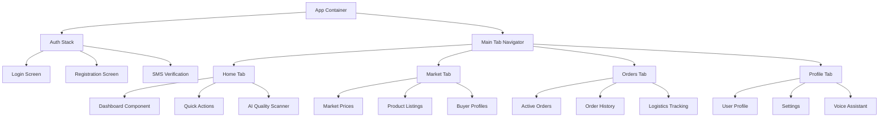
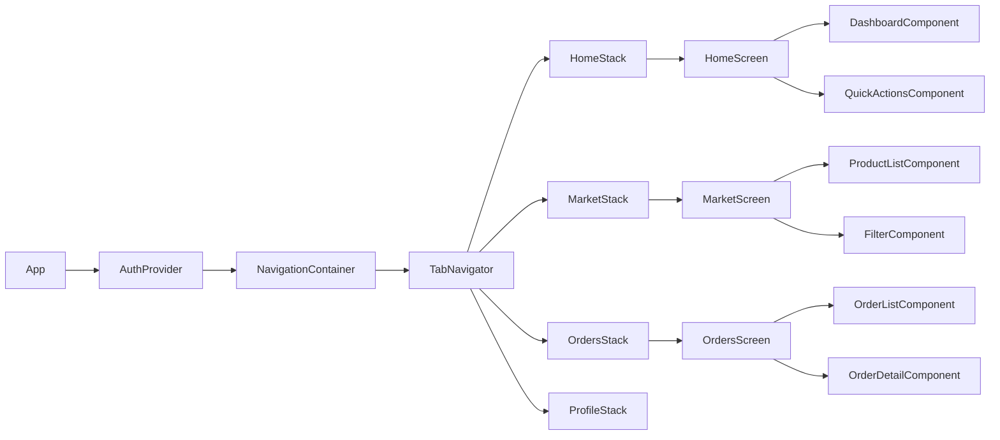
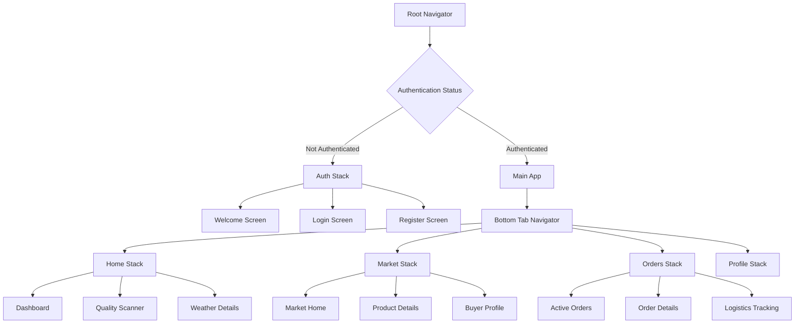

# AgriTrade AI - Agricultural Trading Platform Design

## Overview

AgriTrade AI is a revolutionary digital platform that connects African farmers directly to buyers (traders, processors, exporters) by eliminating intermediaries through artificial intelligence. The platform provides AI-powered product quality estimation, predictive pricing, multilingual voice assistance, and intelligent logistics optimization to increase farmer revenues by 30-50%.

### Core Value Proposition
- **AI Quality Assessment** via image analysis (Google Vision API)
- **Predictive Pricing** based on FAO data, weather, and international markets
- **Harvest Forecasting** using satellite and meteorological data
- **Multilingual Voice Assistant** for illiterate farmers
- **Intelligent Logistics** optimization (grouping, routing)
- **SMS/WhatsApp Notifications** for low connectivity areas

### Target Market
- **Primary**: Small-scale African farmers (cocoa, coffee, cotton, peanuts)
- **Secondary**: Agricultural buyers, traders, processors, exporters
- **Geographic Focus**: West Africa (Côte d'Ivoire, Senegal, Mali)

## Technology Stack & Dependencies

### Frontend Architecture
- **Mobile Application**: React Native (Android priority)
- **Web Platform**: Next.js + React + TypeScript
- **UI Framework**: Tamagui (optimized for mobile performance)
- **State Management**: Redux Toolkit + RTK Query
- **Navigation**: React Navigation v6
- **Offline Support**: React Native Async Storage + Redux Persist

### Backend Architecture
- **API Framework**: Node.js + Fastify + TypeScript
- **Database**: MongoDB Atlas (primary) + Redis (caching/sessions)
- **File Storage**: AWS S3 + CloudFront CDN
- **Authentication**: JWT + bcryptjs
- **Validation**: Joi schema validation
- **Rate Limiting**: Express Rate Limit

### AI & External Services
- **Computer Vision**: Google Cloud Vision API
- **NLP Processing**: Hugging Face Transformers
- **Weather Data**: OpenWeatherMap + NASA POWER
- **Geospatial**: Mapbox APIs
- **Communications**: Africa's Talking (SMS/Voice/WhatsApp)
- **Payment**: Mobile Money APIs (Orange Money, MTN Mobile Money)

### Infrastructure
- **Cloud Platform**: AWS (ECS Fargate, auto-scaling)
- **Containerization**: Docker + Docker Compose
- **CI/CD**: GitHub Actions
- **Monitoring**: DataDog + CloudWatch
- **Security**: Kong Gateway, Helmet.js, CORS

## Component Architecture

### Mobile Application Components



#### Core Component Definitions

**Authentication Components**
- `LoginScreen`: Multi-language login with SMS/voice options
- `RegistrationScreen`: Farmer/buyer registration with document upload
- `SMSVerificationScreen`: Phone number verification via Africa's Talking
- `VoiceAuthComponent`: Voice-based authentication for illiterate users

**Dashboard Components**
- `FarmerDashboard`: Crop status, weather alerts, price updates
- `BuyerDashboard`: Available products, quality reports, logistics
- `WeatherWidget`: Real-time weather data and forecasts
- `PriceAlertComponent`: Market price notifications and trends

**AI Quality Assessment Components**
- `QualityScannerCamera`: Camera interface for product photography
- `QualityAnalysisResults`: Display AI analysis results and grading
- `QualityHistoryComponent`: Track quality improvements over time
- `RecommendationsPanel`: AI-generated farming recommendations

**Marketplace Components**
- `ProductListingCard`: Individual product display with quality metrics
- `BuyerProfileCard`: Buyer information, ratings, and transaction history
- `NegotiationInterface`: Real-time price negotiation between parties
- `ContractGenerationComponent`: Automated contract creation

### Component Hierarchy



### Props/State Management

**Global State Structure (Redux)**
```typescript
interface RootState {
  auth: {
    user: User | null;
    token: string | null;
    isLoading: boolean;
  };
  market: {
    products: Product[];
    filters: MarketFilters;
    selectedProduct: Product | null;
  };
  orders: {
    activeOrders: Order[];
    orderHistory: Order[];
    currentOrder: Order | null;
  };
  ai: {
    qualityAnalysis: QualityResult | null;
    isAnalyzing: boolean;
    analysisHistory: QualityResult[];
  };
  offline: {
    syncQueue: Action[];
    lastSync: Date;
  };
}
```

**Component Props Examples**
```typescript
interface ProductListingCardProps {
  product: Product;
  onPress: (productId: string) => void;
  showQualityBadge?: boolean;
  compactView?: boolean;
}

interface QualityScannerProps {
  productType: 'cocoa' | 'coffee' | 'cotton' | 'peanuts';
  onAnalysisComplete: (result: QualityResult) => void;
  onError: (error: string) => void;
}
```

### Lifecycle Methods/Hooks

**Custom Hooks**
```typescript
// Quality analysis hook
const useQualityAnalysis = () => {
  const [isAnalyzing, setIsAnalyzing] = useState(false);
  const [result, setResult] = useState<QualityResult | null>(null);
  
  const analyzeProduct = useCallback(async (imageUri: string, productType: string) => {
    setIsAnalyzing(true);
    try {
      const analysis = await qualityAnalysisAPI.analyze(imageUri, productType);
      setResult(analysis);
    } catch (error) {
      console.error('Quality analysis failed:', error);
    } finally {
      setIsAnalyzing(false);
    }
  }, []);

  return { analyzeProduct, isAnalyzing, result };
};

// Offline sync hook
const useOfflineSync = () => {
  const dispatch = useAppDispatch();
  const { syncQueue } = useAppSelector(state => state.offline);
  
  useEffect(() => {
    const syncData = async () => {
      if (syncQueue.length > 0) {
        await dispatch(syncOfflineActions());
      }
    };
    
    const interval = setInterval(syncData, 30000); // Sync every 30 seconds
    return () => clearInterval(interval);
  }, [dispatch, syncQueue.length]);
};
```

## Routing & Navigation

### Navigation Structure


### Route Configuration
```typescript
// Navigation types
type RootStackParamList = {
  Auth: undefined;
  Main: undefined;
};

type AuthStackParamList = {
  Welcome: undefined;
  Login: undefined;
  Register: { userType: 'farmer' | 'buyer' };
  SMSVerification: { phoneNumber: string };
};

type MainTabParamList = {
  Home: undefined;
  Market: undefined;
  Orders: undefined;
  Profile: undefined;
};

// Deep linking configuration
const linking: LinkingOptions<RootStackParamList> = {
  prefixes: ['agritrade://'],
  config: {
    screens: {
      Main: {
        screens: {
          Market: {
            screens: {
              ProductDetails: 'product/:productId',
              BuyerProfile: 'buyer/:buyerId',
            },
          },
          Orders: {
            screens: {
              OrderDetails: 'order/:orderId',
            },
          },
        },
      },
    },
  },
};
```

## Styling Strategy

### Design System
- **Color Palette**: Earth tones (greens, browns) reflecting agricultural theme
- **Typography**: Inter font family with multiple weights
- **Spacing**: 8px base unit system (8, 16, 24, 32, 40)
- **Component Variants**: Optimized for rural usage (large touch targets)

### Tamagui Configuration
```typescript
// Design tokens
const tokens = {
  color: {
    primary: '#2E7D32',      // Forest Green
    secondary: '#8BC34A',     // Light Green
    accent: '#FF9800',        // Orange
    background: '#F5F5F5',    // Light Gray
    surface: '#FFFFFF',       // White
    error: '#D32F2F',         // Red
    warning: '#F57C00',       // Amber
    success: '#388E3C',       // Green
  },
  space: {
    xs: 4,
    sm: 8,
    md: 16,
    lg: 24,
    xl: 32,
    xxl: 40,
  },
  size: {
    buttonHeight: 48,
    inputHeight: 56,
    headerHeight: 64,
    tabBarHeight: 80,
  },
};

// Component themes for rural optimization
const themes = {
  light: {
    background: tokens.color.background,
    surface: tokens.color.surface,
    primary: tokens.color.primary,
    text: '#212121',
    textSecondary: '#757575',
  },
  dark: {
    background: '#121212',
    surface: '#1E1E1E',
    primary: tokens.color.primary,
    text: '#FFFFFF',
    textSecondary: '#AAAAAA',
  },
};
```

## State Management

### Redux Store Configuration
```typescript
// Store setup with RTK Query
export const store = configureStore({
  reducer: {
    auth: authSlice.reducer,
    market: marketSlice.reducer,
    orders: ordersSlice.reducer,
    ai: aiSlice.reducer,
    offline: offlineSlice.reducer,
    api: api.reducer,
  },
  middleware: (getDefaultMiddleware) =>
    getDefaultMiddleware({
      serializableCheck: {
        ignoredActions: [FLUSH, REHYDRATE, PAUSE, PERSIST, PURGE, REGISTER],
      },
    }).concat(api.middleware),
});

// Offline persistence configuration
const persistConfig = {
  key: 'root',
  storage: AsyncStorage,
  whitelist: ['auth', 'offline'],
  transforms: [
    encryptTransform({
      secretKey: 'agritrade-encryption-key',
      onError: function (error) {
        console.error('Redux persist encryption error:', error);
      },
    }),
  ],
};
```

### API Layer with RTK Query
```typescript
// API service definitions
export const api = createApi({
  reducerPath: 'api',
  baseQuery: fetchBaseQuery({
    baseUrl: '/api/v1/',
    prepareHeaders: (headers, { getState }) => {
      const token = (getState() as RootState).auth.token;
      if (token) {
        headers.set('authorization', `Bearer ${token}`);
      }
      return headers;
    },
  }),
  tagTypes: ['Product', 'Order', 'User', 'QualityAnalysis'],
  endpoints: (builder) => ({
    // Product endpoints
    getProducts: builder.query<Product[], MarketFilters>({
      query: (filters) => ({
        url: 'products',
        params: filters,
      }),
      providesTags: ['Product'],
    }),
    
    // Quality analysis endpoints
    analyzeProductQuality: builder.mutation<QualityResult, QualityAnalysisRequest>({
      query: (data) => ({
        url: 'ai/analyze-quality',
        method: 'POST',
        body: data,
      }),
      invalidatesTags: ['QualityAnalysis'],
    }),
    
    // Order endpoints
    createOrder: builder.mutation<Order, CreateOrderRequest>({
      query: (order) => ({
        url: 'orders',
        method: 'POST',
        body: order,
      }),
      invalidatesTags: ['Order'],
    }),
  }),
});
```

## API Integration Layer

### REST API Client
```typescript
// API client configuration
class AgriTradeAPIClient {
  private baseURL: string;
  private token?: string;
  
  constructor(baseURL: string) {
    this.baseURL = baseURL;
  }
  
  setAuthToken(token: string) {
    this.token = token;
  }
  
  private async request<T>(
    endpoint: string, 
    options: RequestInit = {}
  ): Promise<T> {
    const url = `${this.baseURL}${endpoint}`;
    const headers = {
      'Content-Type': 'application/json',
      ...(this.token && { Authorization: `Bearer ${this.token}` }),
      ...options.headers,
    };
    
    const response = await fetch(url, { ...options, headers });
    
    if (!response.ok) {
      throw new Error(`API Error: ${response.statusText}`);
    }
    
    return response.json();
  }
  
  // Market API methods
  async getMarketPrices(productType: string): Promise<MarketPrice[]> {
    return this.request(`/market/prices/${productType}`);
  }
  
  // AI API methods
  async analyzeProductQuality(
    imageData: FormData, 
    productType: string
  ): Promise<QualityResult> {
    return this.request('/ai/analyze-quality', {
      method: 'POST',
      body: imageData,
      headers: {}, // Let browser set Content-Type for FormData
    });
  }
  
  // Order API methods
  async createOrder(orderData: CreateOrderRequest): Promise<Order> {
    return this.request('/orders', {
      method: 'POST',
      body: JSON.stringify(orderData),
    });
  }
}
```

### Offline Support & Sync
```typescript
// Offline action queue
interface OfflineAction {
  id: string;
  type: string;
  payload: any;
  timestamp: Date;
  retryCount: number;
}

class OfflineManager {
  private queue: OfflineAction[] = [];
  private maxRetries = 3;
  
  async addToQueue(action: Omit<OfflineAction, 'id' | 'timestamp' | 'retryCount'>) {
    const offlineAction: OfflineAction = {
      ...action,
      id: uuid(),
      timestamp: new Date(),
      retryCount: 0,
    };
    
    this.queue.push(offlineAction);
    await this.saveQueue();
  }
  
  async syncQueue() {
    const actionsToSync = [...this.queue];
    
    for (const action of actionsToSync) {
      try {
        await this.executeAction(action);
        this.removeFromQueue(action.id);
      } catch (error) {
        action.retryCount++;
        if (action.retryCount >= this.maxRetries) {
          this.removeFromQueue(action.id);
          console.error(`Failed to sync action after ${this.maxRetries} retries:`, action);
        }
      }
    }
    
    await this.saveQueue();
  }
  
  private async executeAction(action: OfflineAction) {
    switch (action.type) {
      case 'CREATE_ORDER':
        await apiClient.createOrder(action.payload);
        break;
      case 'UPDATE_PROFILE':
        await apiClient.updateProfile(action.payload);
        break;
      // Add more action types as needed
    }
  }
}
```

## Testing Strategy

### Unit Testing with Jest
```typescript
// Component testing example
describe('QualityScannerComponent', () => {
  beforeEach(() => {
    jest.clearAllMocks();
  });
  
  it('should capture and analyze product image', async () => {
    const mockAnalysisResult = {
      qualityScore: 85,
      grade: 'A',
      confidence: 0.92,
    };
    
    const mockAnalyzeQuality = jest.fn().mockResolvedValue(mockAnalysisResult);
    jest.spyOn(qualityAPI, 'analyzeProductQuality').mockImplementation(mockAnalyzeQuality);
    
    const onAnalysisComplete = jest.fn();
    const { getByTestId } = render(
      <QualityScannerComponent 
        productType="cocoa" 
        onAnalysisComplete={onAnalysisComplete} 
      />
    );
    
    const captureButton = getByTestId('capture-button');
    fireEvent.press(captureButton);
    
    await waitFor(() => {
      expect(mockAnalyzeQuality).toHaveBeenCalledWith(
        expect.any(String), 
        'cocoa'
      );
      expect(onAnalysisComplete).toHaveBeenCalledWith(mockAnalysisResult);
    });
  });
  
  it('should handle analysis errors gracefully', async () => {
    const mockError = new Error('Analysis failed');
    jest.spyOn(qualityAPI, 'analyzeProductQuality').mockRejectedValue(mockError);
    
    const onError = jest.fn();
    const { getByTestId } = render(
      <QualityScannerComponent 
        productType="cocoa" 
        onError={onError} 
      />
    );
    
    const captureButton = getByTestId('capture-button');
    fireEvent.press(captureButton);
    
    await waitFor(() => {
      expect(onError).toHaveBeenCalledWith('Analysis failed');
    });
  });
});
```

### Integration Testing
```typescript
// API integration tests
describe('AgriTrade API Integration', () => {
  let apiClient: AgriTradeAPIClient;
  
  beforeEach(() => {
    apiClient = new AgriTradeAPIClient(process.env.TEST_API_URL);
  });
  
  it('should authenticate user and return valid token', async () => {
    const credentials = {
      phoneNumber: '+225123456789',
      password: 'testpassword',
    };
    
    const response = await apiClient.login(credentials);
    
    expect(response.token).toBeDefined();
    expect(response.user).toMatchObject({
      phoneNumber: credentials.phoneNumber,
      userType: expect.oneOf(['farmer', 'buyer']),
    });
  });
  
  it('should analyze product quality and return results', async () => {
    const mockImageData = new FormData();
    mockImageData.append('image', mockImageBlob);
    
    const result = await apiClient.analyzeProductQuality(mockImageData, 'cocoa');
    
    expect(result).toMatchObject({
      qualityScore: expect.any(Number),
      grade: expect.stringMatching(/^[A-D][+]?$/),
      confidence: expect.any(Number),
      recommendations: expect.any(Array),
    });
  });
});
```

### End-to-End Testing with Detox
```typescript
// E2E test scenarios
describe('Farmer Quality Analysis Flow', () => {
  beforeEach(async () => {
    await device.reloadReactNative();
    await element(by.id('login-screen')).tap();
    await loginAsFarmer();
  });
  
  it('should complete full quality analysis workflow', async () => {
    // Navigate to quality scanner
    await element(by.id('home-quality-scanner-button')).tap();
    await expect(element(by.id('camera-view'))).toBeVisible();
    
    // Take photo
    await element(by.id('capture-button')).tap();
    await expect(element(by.id('image-preview'))).toBeVisible();
    
    // Confirm and analyze
    await element(by.id('analyze-button')).tap();
    await expect(element(by.id('loading-indicator'))).toBeVisible();
    
    // Wait for results
    await waitFor(element(by.id('quality-results')))
      .toBeVisible()
      .withTimeout(10000);
    
    // Verify results display
    await expect(element(by.id('quality-score'))).toBeVisible();
    await expect(element(by.id('quality-grade'))).toBeVisible();
    await expect(element(by.id('recommendations'))).toBeVisible();
    
    // Save to history
    await element(by.id('save-analysis-button')).tap();
    await expect(element(by.text('Analysis saved successfully'))).toBeVisible();
  });
});
```