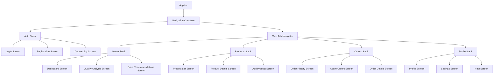
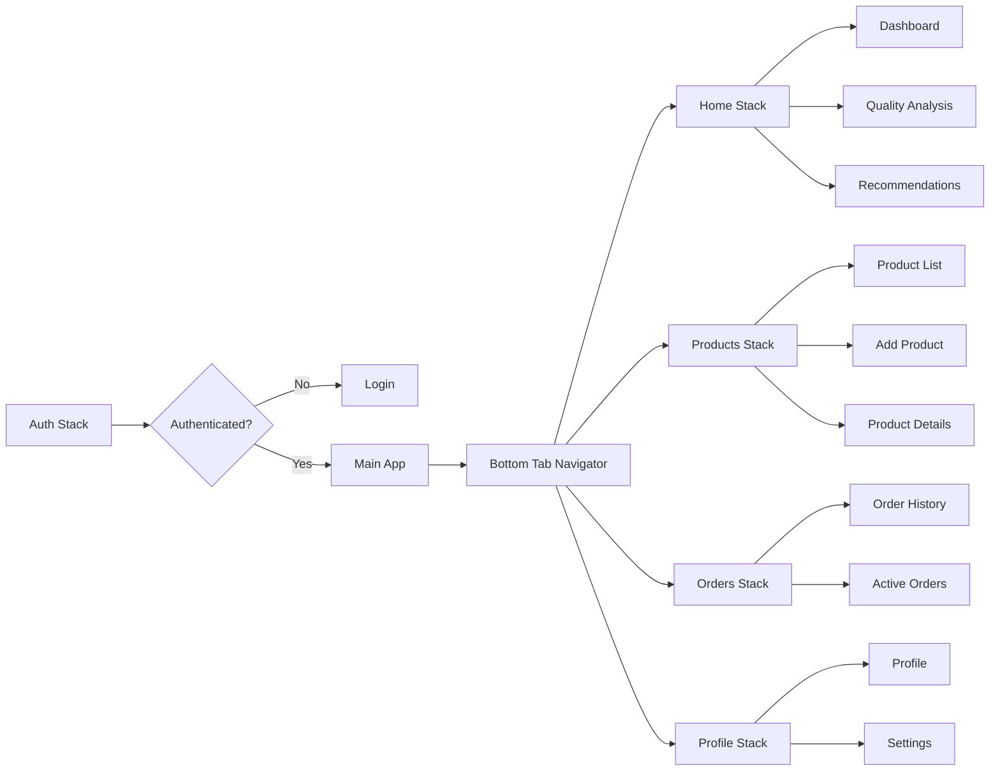
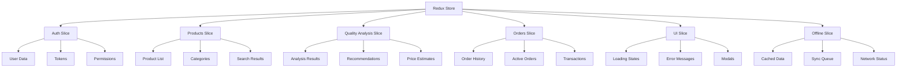

# Frontend Mobile Application Design - Agritrade AI Platform

## Overview

The Agritrade mobile application is a React Native-based solution designed to connect African smallholder farmers with buyers through AI-powered agricultural trade. The app serves as the primary interface for farmers to upload product images, receive quality assessments, get pricing recommendations, and connect with potential buyers.

### Target Users
- **Primary**: Smallholder farmers with limited digital literacy
- **Secondary**: Buyers (traders, processors, exporters)
- **Tertiary**: Administrative users and market coordinators

### Key Features
- AI-powered product quality analysis via image upload
- Real-time price estimation and recommendations
- Multilingual voice assistant for accessibility
- SMS/WhatsApp integration for low-connectivity scenarios
- Buyer-farmer matching system
- Transaction history and farmer profiling

## Technology Stack & Dependencies

### Core Framework
- **React Native**: v0.81.0 (Android-first approach)
- **TypeScript**: For type safety and better development experience
- **Node.js**: v18+ for development tools

### UI Framework & Design System
- **Tamagui**: Optimized for mobile performance and React Native
- **React Native Vector Icons**: For consistent iconography
- **React Native Animatable**: For smooth animations and transitions

### Navigation & Routing
- **React Navigation v6**: Stack, Tab, and Drawer navigation
- **React Navigation Material Top Tabs**: For farmer/buyer role switching

### State Management
- **Redux Toolkit**: For global state management
- **React Query/TanStack Query**: For server state and caching
- **AsyncStorage**: For local data persistence

### Media & Camera
- **React Native Image Picker**: Camera and gallery access
- **React Native Image Crop Picker**: Image cropping and optimization
- **React Native Fast Image**: Optimized image loading and caching

### Communication & Connectivity
- **React Native Voice**: Voice recording and speech-to-text
- **React Native Sound**: Audio playback for voice assistant
- **React Native Network Info**: Network connectivity detection
- **React Native SMS**: SMS integration for offline scenarios

### Maps & Location
- **React Native Maps**: Map integration with Mapbox
- **React Native Geolocation**: Location services
- **React Native Permissions**: Runtime permissions management

### API Integration
- **Axios**: HTTP client for API communication
- **React Native Keychain**: Secure token storage

## Component Architecture

### Component Hierarchy



### Core Components

#### Authentication Components
- `LoginForm`: User authentication with phone/SMS verification
- `RegistrationForm`: Farmer/buyer registration with role selection
- `OnboardingCarousel`: Feature introduction and tutorial
- `LanguageSelector`: Multi-language support initialization

#### Product Management Components
- `ProductCard`: Product listing with image, quality score, and price
- `ImageUploader`: Camera integration with crop and optimization
- `QualityIndicator`: Visual quality score representation
- `PriceEstimator`: Real-time price calculation display

#### AI Analysis Components
- `QualityAnalysisModal`: Step-by-step quality assessment flow
- `RecommendationList`: AI-generated improvement suggestions
- `LoadingAnalysis`: Analysis progress with visual feedback
- `ResultsDisplay`: Quality metrics and pricing breakdown

#### Communication Components
- `VoiceAssistant`: Multilingual voice interaction
- `ChatInterface`: Text-based communication with buyers
- `NotificationCenter`: SMS/WhatsApp integration status
- `OfflineIndicator`: Network status and offline mode

#### Navigation Components
- `CustomTabBar`: Role-aware navigation (farmer/buyer views)
- `HeaderWithProfile`: User profile and settings access
- `FloatingActionButton`: Quick product upload access

### Component Props & State Management

#### Product Card Component
```typescript
interface ProductCardProps {
  product: {
    id: string;
    name: string;
    images: string[];
    qualityScore: number;
    estimatedPrice: number;
    location: string;
    harvestDate: Date;
  };
  onPress: (productId: string) => void;
  showActions?: boolean;
}
```

#### Quality Analysis Component
```typescript
interface QualityAnalysisState {
  images: ImageData[];
  analysisResults: QualityResult | null;
  isAnalyzing: boolean;
  recommendations: Recommendation[];
  priceEstimate: PriceEstimate | null;
}
```

## Routing & Navigation

### Navigation Structure



### Screen Definitions

#### Authentication Flow
- `WelcomeScreen`: Language selection and role choice
- `PhoneVerificationScreen`: SMS-based authentication
- `ProfileSetupScreen`: Complete registration with location
- `OnboardingScreen`: Feature tutorial with voice assistance

#### Main Application Screens
- `DashboardScreen`: Personalized farmer/buyer dashboard
- `QualityAnalysisScreen`: Camera integration and AI analysis
- `ProductListScreen`: Grid/list view of products
- `ProductDetailsScreen`: Detailed product information
- `OrderManagementScreen`: Transaction tracking
- `ProfileScreen`: User settings and preferences

## Styling Strategy

### Design System Implementation

#### Color Palette
```typescript
const Colors = {
  primary: {
    main: '#2E7D32',      // Agricultural green
    light: '#4CAF50',
    dark: '#1B5E20'
  },
  secondary: {
    main: '#FF8F00',      // Harvest orange
    light: '#FFB74D',
    dark: '#E65100'
  },
  background: {
    default: '#F5F5F5',
    paper: '#FFFFFF',
    disabled: '#E0E0E0'
  },
  text: {
    primary: '#212121',
    secondary: '#757575',
    disabled: '#BDBDBD'
  },
  status: {
    success: '#4CAF50',
    warning: '#FF9800',
    error: '#F44336',
    info: '#2196F3'
  }
};
```

#### Typography Scale
```typescript
const Typography = {
  h1: { fontSize: 32, fontWeight: '700', lineHeight: 40 },
  h2: { fontSize: 28, fontWeight: '600', lineHeight: 36 },
  h3: { fontSize: 24, fontWeight: '600', lineHeight: 32 },
  body1: { fontSize: 16, fontWeight: '400', lineHeight: 24 },
  body2: { fontSize: 14, fontWeight: '400', lineHeight: 20 },
  caption: { fontSize: 12, fontWeight: '400', lineHeight: 16 }
};
```

#### Responsive Design
- **Mobile-first approach**: Optimized for 5-6 inch screens
- **Accessibility**: High contrast ratios and large touch targets
- **Offline-friendly**: Cached images and content
- **Low-connectivity optimization**: Compressed images and minimal data usage

### Component Styling with Tamagui

#### Themed Components
```typescript
// Button component with theme variants
const StyledButton = styled(Button, {
  name: 'AgriButton',
  variants: {
    type: {
      primary: {
        backgroundColor: '$primary',
        color: '$white'
      },
      secondary: {
        backgroundColor: '$secondary',
        color: '$white'
      },
      outline: {
        borderColor: '$primary',
        color: '$primary'
      }
    },
    size: {
      small: { paddingVertical: 8, paddingHorizontal: 16 },
      medium: { paddingVertical: 12, paddingHorizontal: 20 },
      large: { paddingVertical: 16, paddingHorizontal: 24 }
    }
  }
});
```

## State Management

### Redux Store Structure



### State Slices

#### Authentication Slice
```typescript
interface AuthState {
  user: User | null;
  token: string | null;
  isAuthenticated: boolean;
  isLoading: boolean;
  error: string | null;
  permissions: Permission[];
}
```

#### Products Slice
```typescript
interface ProductsState {
  items: Product[];
  categories: Category[];
  filters: ProductFilters;
  searchQuery: string;
  pagination: PaginationState;
  isLoading: boolean;
}
```

#### Quality Analysis Slice
```typescript
interface QualityAnalysisState {
  currentAnalysis: AnalysisSession | null;
  results: QualityResult[];
  recommendations: Recommendation[];
  isAnalyzing: boolean;
  progress: number;
}
```

### React Query Integration

#### API Queries
- `useProducts`: Product listing with pagination and filters
- `useQualityAnalysis`: Real-time analysis results
- `useOrders`: Order history and tracking
- `useRecommendations`: AI-generated suggestions
- `useMarketPrices`: Current market pricing data

#### Offline Sync Strategy
- **Optimistic Updates**: Immediate UI feedback for user actions
- **Background Sync**: Automatic sync when connectivity is restored
- **Conflict Resolution**: Server-side conflict resolution for data consistency

## API Integration Layer

### API Client Configuration

```typescript
// API client with authentication and error handling
const apiClient = axios.create({
  baseURL: process.env.API_BASE_URL,
  timeout: 15000,
  headers: {
    'Content-Type': 'application/json',
    'Accept': 'application/json'
  }
});

// Request interceptor for authentication
apiClient.interceptors.request.use((config) => {
  const token = store.getState().auth.token;
  if (token) {
    config.headers.Authorization = `Bearer ${token}`;
  }
  return config;
});
```

### Service Layer

#### Quality Analysis Service
```typescript
class QualityAnalysisService {
  async analyzeProduct(imageData: FormData, metadata: ProductMetadata): Promise<QualityResult> {
    const response = await apiClient.post('/api/quality/analyze', imageData, {
      headers: { 'Content-Type': 'multipart/form-data' }
    });
    return response.data;
  }

  async getRecommendations(productId: string): Promise<Recommendation[]> {
    const response = await apiClient.get(`/api/quality/recommendations/${productId}`);
    return response.data;
  }
}
```

#### Product Service
```typescript
class ProductService {
  async getProducts(filters: ProductFilters): Promise<PaginatedResponse<Product>> {
    const response = await apiClient.get('/api/products', { params: filters });
    return response.data;
  }

  async createProduct(productData: CreateProductRequest): Promise<Product> {
    const response = await apiClient.post('/api/products', productData);
    return response.data;
  }
}
```

### Real-time Updates

#### WebSocket Integration
```typescript
// WebSocket connection for real-time updates
class RealtimeService {
  private socket: WebSocket | null = null;

  connect(userId: string) {
    this.socket = new WebSocket(`${WS_URL}?userId=${userId}`);
    
    this.socket.onmessage = (event) => {
      const data = JSON.parse(event.data);
      store.dispatch(handleRealtimeUpdate(data));
    };
  }

  subscribeToAnalysis(analysisId: string) {
    this.socket?.send(JSON.stringify({
      type: 'subscribe',
      channel: `analysis:${analysisId}`
    }));
  }
}
```

## Testing Strategy

### Unit Testing

#### Component Testing with Jest & React Native Testing Library
```typescript
// Example test for ProductCard component
describe('ProductCard Component', () => {
  const mockProduct = {
    id: '1',
    name: 'Premium Coffee Beans',
    qualityScore: 8.5,
    estimatedPrice: 1200,
    images: ['image1.jpg']
  };

  it('renders product information correctly', () => {
    const { getByText, getByTestId } = render(
      <ProductCard product={mockProduct} onPress={jest.fn()} />
    );
    
    expect(getByText('Premium Coffee Beans')).toBeTruthy();
    expect(getByTestId('quality-score')).toHaveTextContent('8.5');
    expect(getByText('$1,200')).toBeTruthy();
  });

  it('calls onPress when tapped', () => {
    const onPressMock = jest.fn();
    const { getByTestId } = render(
      <ProductCard product={mockProduct} onPress={onPressMock} />
    );
    
    fireEvent.press(getByTestId('product-card'));
    expect(onPressMock).toHaveBeenCalledWith('1');
  });
});
```

#### Service Layer Testing
```typescript
// API service testing
describe('QualityAnalysisService', () => {
  beforeEach(() => {
    jest.clearAllMocks();
  });

  it('should analyze product quality successfully', async () => {
    const mockResponse = { qualityScore: 8.5, recommendations: [] };
    mockedAxios.post.mockResolvedValue({ data: mockResponse });

    const formData = new FormData();
    const result = await QualityAnalysisService.analyzeProduct(formData, {});

    expect(result).toEqual(mockResponse);
    expect(mockedAxios.post).toHaveBeenCalledWith('/api/quality/analyze', formData, {
      headers: { 'Content-Type': 'multipart/form-data' }
    });
  });
});
```

### Integration Testing

#### End-to-End Testing with Detox
```typescript
// E2E test for quality analysis flow
describe('Quality Analysis Flow', () => {
  beforeAll(async () => {
    await device.launchApp();
  });

  it('should complete quality analysis workflow', async () => {
    // Navigate to quality analysis
    await element(by.id('quality-analysis-tab')).tap();
    
    // Upload image
    await element(by.id('upload-image-button')).tap();
    await element(by.text('Camera')).tap();
    
    // Wait for analysis to complete
    await waitFor(element(by.id('analysis-results')))
      .toBeVisible()
      .withTimeout(30000);
    
    // Verify results are displayed
    await expect(element(by.id('quality-score'))).toBeVisible();
    await expect(element(by.id('price-estimate'))).toBeVisible();
  });
});
```

### Performance Testing

#### Bundle Size Analysis
- **Metro Bundle Analyzer**: Monitor bundle size and dependencies
- **Flipper Integration**: Real-time performance monitoring
- **Image Optimization**: Automated image compression and caching

#### Memory Management
- **React DevTools Profiler**: Component render optimization
- **Memory Leak Detection**: Automated testing for memory leaks
- **Background Task Management**: Efficient handling of long-running tasks