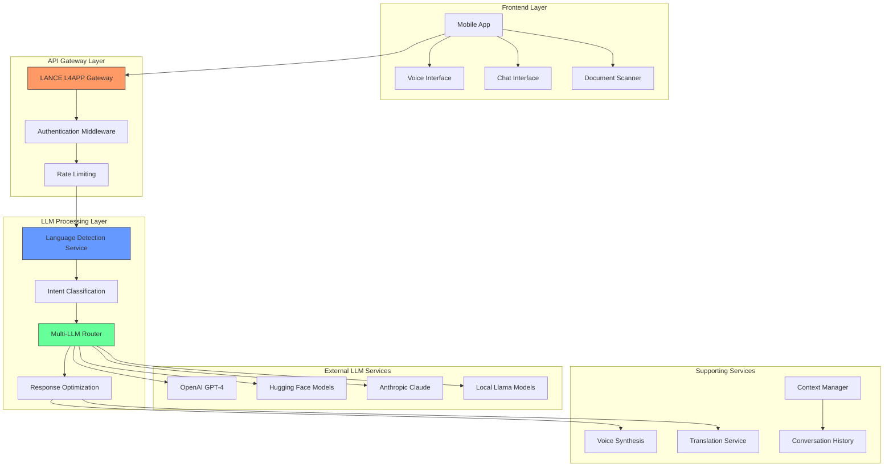
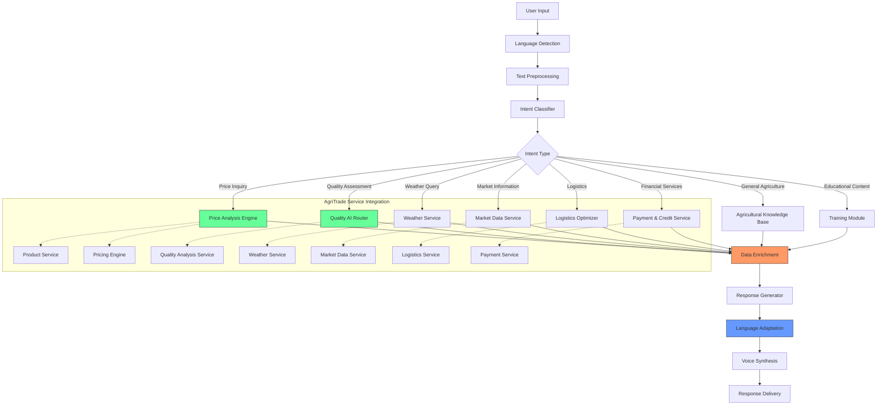
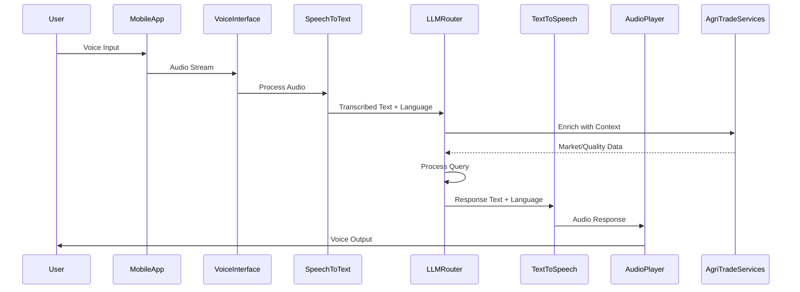

# LANCE L4APP - LLM API Integration Design

## Overview

LANCE L4APP (Language Adaptive Natural Communication Engine for Level 4 Agricultural Platform) is an advanced LLM API integration system designed to enhance the AgriTrade platform with sophisticated natural language processing capabilities. This system will provide multilingual conversational AI, intelligent document processing, and advanced voice assistance to improve accessibility for farmers with limited digital literacy.

## Technology Stack & Dependencies

### Core Technologies
- **Backend Framework**: Node.js 18+ with Fastify + TypeScript
- **LLM Integration**: OpenAI GPT-4, Hugging Face Transformers, Anthropic Claude
- **Voice Processing**: Web Speech API, Google Text-to-Speech
- **Language Detection**: Google Translate API, Azure Cognitive Services
- **Real-time Communication**: WebSocket connections via Socket.io

### Key Dependencies
```json
{
  "openai": "^4.20.0",
  "@anthropic-ai/sdk": "^0.9.0",
  "@google-cloud/text-to-speech": "^4.2.0",
  "@google-cloud/translate": "^7.0.0",
  "socket.io": "^4.7.0",
  "node-nlp": "^4.27.0",
  "compromise": "^14.10.0",
  "sentiment": "^5.0.2"
}
```

## Architecture

### System Architecture Overview



### Component Definitions

#### Language Detection Service
Automatically identifies the user's language from text or voice input and routes to appropriate language models.

#### Intent Classification Engine
Analyzes user queries to determine the specific agricultural domain (crop pricing, quality assessment, weather forecasting, market information).

#### Multi-LLM Router
Intelligently routes requests to the most suitable LLM based on query complexity, language, and domain expertise.

#### Context Manager
Maintains conversation context and user session state across multiple interactions.

## API Endpoints Reference

### Core LLM Integration Endpoints

#### Chat Completion
```http
POST /api/v1/lance/chat/completions
Content-Type: application/json
Authorization: Bearer <jwt_token>
X-Request-ID: <uuid>

{
  "message": "What's the best price for my cocoa beans?",
  "language": "en",
  "dialect": "twi",
  "context": {
    "user_location": "Ghana",
    "crop_type": "cocoa",
    "quantity": "2 tonnes",
    "harvest_date": "2023-11-15",
    "quality_grade": "A1"
  },
  "preferences": {
    "model": "gpt-4",
    "voice_enabled": true,
    "local_dialect": "twi",
    "response_detail": "detailed",
    "include_examples": true
  },
  "integration_context": {
    "user_id": "user_12345",
    "session_id": "session_67890",
    "previous_conversation_id": "conv_abcde"
  }
}
```

**Response:**
```json
{
  "response_id": "resp_fghij",
  "content": "Based on current market data, Grade A1 cocoa beans in Ghana are trading at $3,200 per tonne. For 2 tonnes, you could expect around $6,400. Prices tend to be higher during the harvest season which ends in December.",
  "language": "en",
  "translated_content": {
    "twi": "Wɔde ɔkyerɛw sɛ, wɔde wɔn akyenea yi kɔɔkɔɔ bɛn na wɔde agye wɔ Ghana sɛ $3,200 mma kɔɔkɔɔ biako. Mma wo nsa ahyɛnsa 2 kɔɔkɔɔ, wo bɛtumi anya sɛ $6,400. Wɔde wɔn akyenea yi kɔɔkɔɔ bɛn na wɔde agye wɔ dwow mu a ɛbɛtumi aba mu wɔ December mu."
  },
  "audio_url": "https://s3.amazonaws.com/agritrade/voices/response_fghij_twi.mp3",
  "context_updates": {
    "user_crop_knowledge": ["cocoa", "pricing_factors"],
    "user_location": "Ghana"
  },
  "related_services": [
    {
      "name": "MarketDataService",
      "action": "get_current_prices",
      "parameters": {"crop": "cocoa", "region": "Ghana"}
    },
    {
      "name": "QualityAnalysisService",
      "action": "get_quality_factors",
      "parameters": {"crop": "cocoa", "grade": "A1"}
    }
  ],
  "metadata": {
    "model_used": "gpt-4-turbo",
    "tokens_used": 156,
    "processing_time_ms": 842,
    "confidence_score": 0.92
  }
}
```

#### Voice Processing
```http
POST /api/v1/lance/voice/process
Content-Type: multipart/form-data
Authorization: Bearer <jwt_token>
X-Request-ID: <uuid>

{
  "audio_file": <binary_data>,
  "language_hint": "fr",
  "response_format": "audio",
  "dialect_preference": "wolof",
  "voice_gender": "female",
  "voice_speed": 0.9
}
```

#### Document Analysis
```http
POST /api/v1/lance/document/analyze
Content-Type: application/json
Authorization: Bearer <jwt_token>
X-Request-ID: <uuid>

{
  "document_type": "price_certificate",
  "image_url": "https://s3.amazonaws.com/agritrade/docs/cert123.jpg",
  "language": "auto-detect",
  "extract_fields": ["crop_type", "grade", "quantity", "price", "date"],
  "integrate_with": ["ProductService", "PricingService"]
}
```

### Authentication Requirements
- JWT tokens required for all endpoints (aligned with existing AgriTrade auth)
- Rate limiting: 100 requests/minute per user (configurable per user tier)
- API key validation for external LLM services
- User permission validation for premium features
- Request ID tracking for debugging and monitoring

### Integration with Existing AgriTrade Services

#### Quality Analysis Service Integration
```typescript
// Integration with existing Google Vision-based quality analysis
const qualityIntegration = {
  preprocessImage: async (imageData: Buffer) => {
    // Apply preprocessing before sending to LLM
    return await imagePreprocessingService.optimizeForLLM(imageData);
  },
  
  enhanceWithVisionData: async (visionResults: any, llmQuery: string) => {
    // Combine Google Vision results with LLM processing
    return {
      visualAssessment: visionResults,
      contextualAnalysis: await llmService.analyzeContext(visionResults, llmQuery)
    };
  }
};
```

#### Market Data Service Integration
```typescript
// Integration with existing FAO and market data services
const marketDataIntegration = {
  enrichQuery: async (query: string, context: any) => {
    // Fetch relevant market data to enhance LLM responses
    const marketData = await marketDataService.getCurrentPrices({
      crop: context.crop_type,
      region: context.user_location
    });
    
    const weatherData = await weatherService.getForecast({
      location: context.user_location,
      days: 7
    });
    
    return {
      enhancedQuery: `${query} [Market Context: ${JSON.stringify(marketData)}] [Weather: ${JSON.stringify(weatherData)}]`,
      metadata: {
        marketDataTimestamp: marketData.timestamp,
        weatherDataTimestamp: weatherData.timestamp
      }
    };
  }
};
```

## Data Models & Schema

### Conversation Model
```typescript
interface ConversationSession {
  id: string;
  userId: string;
  language: string;
  dialect?: string;
  context: {
    location: GeoLocation;
    cropType?: string;
    seasonalContext?: string;
    userExperience: 'beginner' | 'intermediate' | 'expert';
    literacyLevel: 'low' | 'medium' | 'high';
    connectivity: 'high' | 'medium' | 'low' | 'offline';
    preferredCommunication: 'voice' | 'text' | 'visual';
  };
  messages: ConversationMessage[];
  metadata: {
    totalTokensUsed: number;
    averageResponseTime: number;
    satisfactionScore?: number;
    modelDistribution: Record<string, number>; // Distribution of models used
    languageSwitches: number; // How many times user switched languages
    fallbacksUsed: number; // How many times fallback models were used
  };
  preferences: {
    voiceConfig: VoiceConfig;
    responseStyle: 'concise' | 'detailed' | 'examples';
    notificationPreferences: {
      voiceResponses: boolean;
      textSummaries: boolean;
      visualAids: boolean;
    };
  };
  integrationPoints: {
    qualityAnalysisSessionId?: string;
    marketDataRequestId?: string;
    pricingEngineSessionId?: string;
  };
  createdAt: Date;
  updatedAt: Date;
  expiresAt: Date; // Auto-expire conversations after 30 days
}

interface ConversationMessage {
  id: string;
  role: 'user' | 'assistant' | 'system';
  content: string;
  originalLanguage?: string;
  translatedContent?: Record<string, string>; // Multi-language translations
  audioUrl?: string;
  timestamp: Date;
  modelUsed: string;
  processingTime: number;
  tokenCount: number;
  confidenceScore?: number;
  relatedServicesCalled: Array<{
    serviceName: string;
    methodName: string;
    responseTime: number;
    success: boolean;
  }>;
  userFeedback?: {
    rating: 1 | 2 | 3 | 4 | 5;
    comment?: string;
    reportedIssue?: 'inaccurate' | 'unclear' | 'language' | 'other';
  };
}
```

### LLM Configuration Model
```typescript
interface LLMConfiguration {
  id: string;
  provider: 'openai' | 'anthropic' | 'huggingface' | 'local';
  modelName: string;
  displayName: string;
  capabilities: {
    languages: string[];
    dialects: string[];
    domains: string[];
    maxTokens: number;
    supportsVision: boolean;
    supportsAudio: boolean;
    supportsFunctionCalling: boolean;
    supportsStreaming: boolean;
  };
  cost: {
    inputTokenPrice: number;
    outputTokenPrice: number;
    currency: string;
    freeTierQuota?: number;
  };
  performance: {
    averageLatency: number;
    reliabilityScore: number;
    accuracyScore: number;
    costEffectiveness: number;
  };
  constraints: {
    rateLimit: number; // Requests per minute
    maxContextLength: number;
    maxOutputLength: number;
  };
  isActive: boolean;
  isDefault: boolean;
  fallbackModels: string[];
  integrationConfig: {
    apiKeyEnvVar: string;
    baseUrl?: string;
    customHeaders?: Record<string, string>;
  };
}

// Integration with existing Product model
interface EnhancedProductWithLLM extends Product {
  llmEnrichedData?: {
    marketInsights: string;
    qualityRecommendations: string[];
    preservationTips: string[];
    marketTimingAdvice: string;
    similarProductComparisons: Array<{
      productId: string;
      priceComparison: string;
      qualityComparison: string;
    }>;
  };
  conversationHistory: ConversationSession[];
}

// Integration with existing User model
interface EnhancedUserWithLLM extends User {
  llmProfile: {
    languagePreferences: string[];
    dialectPreferences: Record<string, string>;
    communicationStyle: 'formal' | 'casual' | 'simple';
    learningProgress: Record<string, {
      topic: string;
      proficiency: number;
      lastInteraction: Date;
    }>;
    usagePatterns: {
      peakHours: number[];
      preferredDays: string[];
      averageSessionLength: number;
    };
  };
  llmQuota: {
    dailyLimit: number;
    monthlyLimit: number;
    currentUsage: {
      daily: number;
      monthly: number;
    };
  };
}
```

## Business Logic Layer

### Intent Classification Architecture



### Multi-LLM Selection Strategy

#### Model Selection Criteria
1. **Language Support**: Native language capability vs translation quality
2. **Domain Expertise**: Agricultural knowledge base and training
3. **Cost Optimization**: Token usage and API pricing
4. **Response Speed**: Latency requirements for real-time conversations
5. **Context Length**: Ability to maintain long conversations
6. **Reliability**: Uptime and error rate history
7. **Integration Compatibility**: Alignment with existing service architecture

#### Fallback Mechanism
```typescript
const modelPriority = {
  primary: 'gpt-4-turbo',
  secondary: 'claude-3-haiku',
  tertiary: 'local-llama-agriculture',
  emergency: 'simple-rule-based'
};

// Integration with existing AgriTrade circuit breaker pattern
const modelSelectionService = {
  selectModel: async (query: string, context: any) => {
    // Check model health status
    const healthyModels = await healthCheckService.getHealthyModels();
    
    // Select based on query complexity and context
    if (context.requiresVision && healthyModels.includes('gpt-4-vision')) {
      return 'gpt-4-vision';
    }
    
    if (context.requiresRealTimeData && healthyModels.includes('gpt-4-turbo')) {
      return 'gpt-4-turbo';
    }
    
    // Fallback to cost-effective model for simple queries
    return healthyModels.includes('claude-3-haiku') ? 
      'claude-3-haiku' : 
      'local-llama-agriculture';
  },
  
  loadBalance: (models: string[]) => {
    // Implement round-robin or least-connections based on current load
    return loadBalancer.selectModel(models);
  }
};
```

### Context Management System

#### Session Context Schema
```typescript
interface SessionContext {
  userProfile: {
    farmingExperience: number;
    primaryCrops: string[];
    location: GeoLocation;
    preferredLanguage: string;
    literacyLevel: 'basic' | 'intermediate' | 'advanced';
    connectivityPattern: 'high' | 'intermittent' | 'low';
  };
  conversationHistory: ConversationMessage[];
  currentTopic: string;
  marketContext: {
    seasonalPhase: string;
    localPrices: Record<string, number>;
    weatherConditions: WeatherData;
    marketEvents: string[];
  };
  preferences: {
    responseLength: 'brief' | 'detailed';
    includeExamples: boolean;
    voiceSpeed: number;
    useSimpleLanguage: boolean;
    includeVisualAids: boolean;
  };
  integrationState: {
    activeServices: string[];
    pendingRequests: Array<{
      service: string;
      requestId: string;
      timeout: Date;
    }>;
    cachedData: Record<string, any>;
  };
}

// Integration with existing Redis caching
const contextManager = {
  saveContext: async (sessionId: string, context: SessionContext) => {
    const key = `llm:context:${sessionId}`;
    await redisClient.setex(key, 3600, JSON.stringify(context)); // 1 hour TTL
  },
  
  loadContext: async (sessionId: string) => {
    const key = `llm:context:${sessionId}`;
    const contextStr = await redisClient.get(key);
    return contextStr ? JSON.parse(contextStr) : null;
  },
  
  // Integration with existing AgriTrade user profiles
  initializeContext: async (userId: string) => {
    const user = await UserService.findById(userId);
    const userProfile = await UserProfileService.getProfile(userId);
    
    return {
      userProfile: {
        farmingExperience: userProfile.farmingExperience || 1,
        primaryCrops: userProfile.primaryCrops || [],
        location: user.location,
        preferredLanguage: user.preferredLanguage || 'en',
        literacyLevel: userProfile.literacyLevel || 'basic',
        connectivityPattern: userProfile.connectivityPattern || 'intermittent'
      },
      conversationHistory: [],
      currentTopic: '',
      marketContext: {
        seasonalPhase: await SeasonalService.getCurrentPhase(user.location),
        localPrices: await PricingService.getRegionalPrices(user.location),
        weatherConditions: await WeatherService.getCurrentConditions(user.location),
        marketEvents: await MarketService.getUpcomingEvents(user.location)
      },
      preferences: {
        responseLength: 'detailed',
        includeExamples: true,
        voiceSpeed: 1.0,
        useSimpleLanguage: userProfile.literacyLevel === 'basic',
        includeVisualAids: userProfile.literacyLevel === 'basic'
      },
      integrationState: {
        activeServices: [],
        pendingRequests: [],
        cachedData: {}
      }
    };
  }
};
```

## Middleware & Service Integration

### Authentication Middleware
```typescript
interface LLMAuthMiddleware {
  validateJWT: (token: string) => Promise<UserSession>;
  checkQuota: (userId: string) => Promise<QuotaStatus>;
  logUsage: (userId: string, tokens: number, model: string) => Promise<void>;
  enforceRateLimit: (userId: string) => Promise<boolean>;
}

// Integration with existing AgriTrade auth system
const authMiddleware: LLMAuthMiddleware = {
  validateJWT: async (token: string) => {
    // Validate against existing AgriTrade JWT system
    const decoded = jwt.verify(token, process.env.JWT_SECRET);
    return await UserService.getUserSession(decoded.userId);
  },
  
  checkQuota: async (userId: string) => {
    // Integrate with existing user quota system
    const user = await UserService.findById(userId);
    const usage = await UsageService.getLLMUsage(userId, getCurrentBillingCycle());
    return {
      remaining: user.llmQuota - usage.totalTokens,
      limit: user.llmQuota,
      resetAt: getNextBillingCycle()
    };
  },
  
  logUsage: async (userId: string, tokens: number, model: string) => {
    // Log usage for billing and analytics
    await UsageService.logLLMUsage({
      userId,
      tokens,
      model,
      timestamp: new Date(),
      cost: calculateCost(tokens, model)
    });
  }
};
```

### Rate Limiting Strategy
- **Free Tier**: 50 requests/day, 5 requests/minute
- **Farmer Tier**: 200 requests/day, 20 requests/minute
- **Buyer Tier**: 500 requests/day, 50 requests/minute
- **Premium Tier**: Unlimited requests, 100 requests/minute

### Circuit Breaker Pattern
```typescript
interface CircuitBreakerConfig {
  failureThreshold: 5;
  resetTimeout: 30000; // 30 seconds
  monitoringPeriod: 60000; // 1 minute
  fallbackModel: string;
  halfOpenAttempts: 3;
  timeout: 10000; // 10 seconds
}

// Implementation aligned with existing AgriTrade circuit breaker
const llmCircuitBreaker = new CircuitBreaker({
  name: 'llm-service',
  failureThreshold: 5,
  resetTimeout: 30000,
  timeout: 10000,
  fallback: async (error: Error) => {
    // Fallback to secondary model or cached responses
    return await handleLLMFallback(error);
  }
});
```

### Integration with Existing Services

#### Database Integration
```typescript
// Using existing MongoDB connection from AgriTrade
const conversationModel = mongoose.model<ConversationSession>('Conversation', conversationSchema);

// Redis caching using existing Redis connection
const redisClient = createRedisClient({
  host: process.env.REDIS_HOST,
  port: parseInt(process.env.REDIS_PORT || '6379')
});
```

#### External Service Integration
```typescript
// Integration with existing Africa's Talking for voice fallback
const voiceService = new VoiceService({
  provider: 'africas-talking',
  apiKey: process.env.AFRICAS_TALKING_API_KEY,
  username: process.env.AFRICAS_TALKING_USERNAME
});

// Integration with existing AWS S3 for audio storage
const storageService = new StorageService({
  provider: 'aws-s3',
  region: process.env.AWS_REGION,
  bucket: process.env.AWS_S3_BUCKET
});
```

## Voice Assistant Integration

### Voice Processing Pipeline



### Multilingual Voice Support

#### Supported Languages
- **West Africa**: English, French, Hausa, Yoruba, Twi, Wolof
- **East Africa**: English, Swahili, Amharic, Arabic
- **Central Africa**: French, Lingala, Sango
- **Southern Africa**: English, Afrikaans, Zulu, Shona

#### Voice Synthesis Configuration
```typescript
interface VoiceConfig {
  language: string;
  dialect?: string;
  gender: 'male' | 'female' | 'neutral';
  speed: number; // 0.5 to 2.0
  pitch: number; // -20 to 20
  volume: number; // 0.0 to 1.0
  emotionalTone?: 'neutral' | 'friendly' | 'encouraging';
}

interface VoicePersonalization {
  userPreferences: {
    preferredGender: string;
    speechRate: number;
    useFormalLanguage: boolean;
  };
  adaptiveSettings: {
    adjustForAge: boolean;
    adjustForEducationLevel: boolean;
    useSimpleVocabulary: boolean;
  };
}
```

### Offline Voice Capabilities
```typescript
interface OfflineVoiceEngine {
  downloadedLanguages: string[];
  compressionLevel: 'high' | 'medium' | 'low';
  maxStorageSize: number; // MB
  syncStrategy: 'wifi-only' | 'cellular-allowed';
  fallbackBehavior: {
    useTextDisplay: boolean;
    useSMSFallback: boolean;
    queueForLaterProcessing: boolean;
  };
}

// Integration with existing AgriTrade offline capabilities
const offlineVoiceService = {
  checkConnectivity: () => {
    // Use existing AgriTrade connectivity checker
    return connectivityService.getStatus();
  },
  
  queueForProcessing: async (voiceData: any) => {
    // Queue voice data for later processing when online
    return await offlineService.queueData({
      type: 'voice-query',
      data: voiceData,
      priority: 'normal'
    });
  },
  
  processQueuedItems: async () => {
    // Process queued voice queries when connectivity is restored
    const queuedItems = await offlineService.getQueuedItems('voice-query');
    for (const item of queuedItems) {
      try {
        const result = await voiceService.process(item.data);
        // Send result via push notification or SMS
        await notificationService.sendResult(item.userId, result);
      } catch (error) {
        logger.error('Failed to process queued voice query:', error);
      }
    }
  }
};
```

### Mobile App Integration

#### React Native Component Integration
```typescript
// Integration with existing AgriTrade mobile components
interface VoiceAssistantProps {
  onVoiceInput: (text: string) => void;
  onVoiceOutput: (audioUrl: string) => void;
  language: string;
  dialect?: string;
  connectivityStatus: 'online' | 'offline' | 'limited';
}

const VoiceAssistantComponent: React.FC<VoiceAssistantProps> = ({
  onVoiceInput,
  onVoiceOutput,
  language,
  dialect,
  connectivityStatus
}) => {
  // Integration with existing AgriTrade hooks
  const { isConnected } = useConnectivity();
  const { user } = useAuth();
  
  const handleVoiceInput = async (audioBlob: Blob) => {
    try {
      // Use existing AgriTrade API client
      const response = await apiClient.post('/api/v1/lance/voice/process', {
        audio_file: audioBlob,
        language_hint: language,
        dialect_preference: dialect,
        user_context: {
          userId: user.id,
          connectivity: connectivityStatus
        }
      });
      
      onVoiceInput(response.data.transcribed_text);
      onVoiceOutput(response.data.audio_url);
    } catch (error) {
      // Handle errors using existing AgriTrade error handling
      errorHandler.handleVoiceError(error);
    }
  };
  
  return (
    <VoiceInputOutput
      onAudioRecorded={handleVoiceInput}
      language={language}
      dialect={dialect}
    />
  );
};
```

## Cost Analysis & Optimization

### LLM Provider Cost Structure

#### API Usage Pricing
| Provider | Model | Input Cost | Output Cost | Notes |
|----------|-------|------------|-------------|-------|
| OpenAI | GPT-4 Turbo | $0.01/1K tokens | $0.03/1K tokens | Best quality, highest cost |
| OpenAI | GPT-3.5 Turbo | $0.001/1K tokens | $0.002/1K tokens | Good balance of cost/quality |
| Anthropic | Claude 3 Haiku | $0.00025/1K tokens | $0.00125/1K tokens | Cost-effective for simple queries |
| Anthropic | Claude 3 Sonnet | $0.003/1K tokens | $0.015/1K tokens | High quality, moderate cost |
| Hugging Face | Open Source Models | $0.0001/1K tokens | $0.0002/1K tokens | Lowest cost, self-hosted |

#### Estimated Usage Costs
```typescript
interface CostProjection {
  tier: 'free' | 'farmer' | 'buyer' | 'premium';
  monthlyQueries: number;
  avgTokensPerQuery: number;
  costPerQuery: number;
  monthlyCost: number;
}

const costProjections: CostProjection[] = [
  {
    tier: 'free',
    monthlyQueries: 50,
    avgTokensPerQuery: 800,
    costPerQuery: 0.008, // Using cost-effective model
    monthlyCost: 0.40
  },
  {
    tier: 'farmer',
    monthlyQueries: 200,
    avgTokensPerQuery: 1000,
    costPerQuery: 0.012, // Mix of models
    monthlyCost: 2.40
  },
  {
    tier: 'buyer',
    monthlyQueries: 500,
    avgTokensPerQuery: 1200,
    costPerQuery: 0.018, // Higher quality models
    monthlyCost: 9.00
  },
  {
    tier: 'premium',
    monthlyQueries: 2000,
    avgTokensPerQuery: 1500,
    costPerQuery: 0.025, // Premium models
    monthlyCost: 50.00
  }
];

// Integration with existing AgriTrade billing system
const costService = {
  calculateQueryCost: (tokens: number, model: string, provider: string) => {
    const pricing = pricingService.getProviderPricing(provider, model);
    return (tokens / 1000) * pricing.costPer1KTokens;
  },
  
  trackUsage: async (userId: string, tokens: number, cost: number) => {
    // Use existing AgriTrade billing infrastructure
    await billingService.recordUsage({
      userId,
      service: 'lance-l4app',
      tokens,
      cost,
      timestamp: new Date()
    });
  },
  
  generateInvoice: async (userId: string, period: 'monthly' | 'annual') => {
    // Use existing AgriTrade invoicing system
    return await billingService.generateServiceInvoice(userId, 'lance-l4app', period);
  }
};
```

### Cost Optimization Strategies

#### Caching Optimization
```typescript
interface CachingStrategy {
  type: 'response' | 'translation' | 'voice' | 'context';
  ttl: number; // seconds
  hitRateTarget: number; // percentage
  costSavings: number; // monthly estimate
}

const cachingStrategies: CachingStrategy[] = [
  {
    type: 'response',
    ttl: 3600, // 1 hour
    hitRateTarget: 70,
    costSavings: 15000 // monthly estimate
  },
  {
    type: 'translation',
    ttl: 86400, // 24 hours
    hitRateTarget: 85,
    costSavings: 8000
  },
  {
    type: 'voice',
    ttl: 604800, // 1 week
    hitRateTarget: 60,
    costSavings: 5000
  }
];

// Implementation with existing AgriTrade caching
const cachingService = {
  cacheResponse: async (key: string, response: any, ttl: number) => {
    // Use existing AgriTrade Redis cache
    return await redisClient.setex(`llm:response:${key}`, ttl, JSON.stringify(response));
  },
  
  getCachedResponse: async (key: string) => {
    // Use existing AgriTrade Redis cache
    const cached = await redisClient.get(`llm:response:${key}`);
    return cached ? JSON.parse(cached) : null;
  },
  
  // Integration with existing AgriTrade analytics
  trackCacheMetrics: async () => {
    const metrics = await cacheAnalyticsService.getMetrics('llm-responses');
    if (metrics.hitRate < 0.7) {
      // Alert if cache hit rate drops below target
      await alertService.sendAlert({
        type: 'cache_performance_degradation',
        severity: 'warning',
        message: `LLM response cache hit rate below target: ${metrics.hitRate}`
      });
    }
  }
};
```

#### Model Selection Optimization
```typescript
interface ModelOptimization {
  queryComplexity: 'simple' | 'moderate' | 'complex';
  preferredModel: string;
  fallbackModel: string;
  costSavings: number; // percentage
}

const modelOptimizationRules: ModelOptimization[] = [
  {
    queryComplexity: 'simple',
    preferredModel: 'claude-3-haiku',
    fallbackModel: 'local-llama',
    costSavings: 75 // 75% cost reduction vs GPT-4
  },
  {
    queryComplexity: 'moderate',
    preferredModel: 'gpt-3.5-turbo',
    fallbackModel: 'claude-3-sonnet',
    costSavings: 50
  },
  {
    queryComplexity: 'complex',
    preferredModel: 'gpt-4-turbo',
    fallbackModel: 'claude-3-opus',
    costSavings: 0 // No savings for complex queries
  }
];

// Implementation with existing AgriTrade ML services
const modelOptimizer = {
  classifyQuery: (query: string, context: any) => {
    // Use existing AgriTrade NLP services
    const complexity = nlpService.analyzeComplexity(query);
    const domain = nlpService.classifyDomain(query);
    
    // Simple price checks don't need advanced models
    if (domain === 'price_inquiry' && complexity === 'simple') {
      return 'simple';
    }
    
    // Complex market analysis needs advanced models
    if (domain === 'market_analysis' && complexity === 'complex') {
      return 'complex';
    }
    
    return 'moderate';
  },
  
  selectOptimalModel: (queryComplexity: string, userTier: string) => {
    const rule = modelOptimizationRules.find(r => r.queryComplexity === queryComplexity);
    
    // Premium users can override optimization
    if (userTier === 'premium') {
      return 'gpt-4-turbo';
    }
    
    return rule?.preferredModel || 'gpt-3.5-turbo';
  }
};
```

### Budget Monitoring

#### Cost Alerts
```typescript
interface CostAlert {
  threshold: number; // USD
  timeframe: 'daily' | 'weekly' | 'monthly';
  action: 'notify' | 'throttle' | 'disable';
  recipients: string[];
}

const costAlerts: CostAlert[] = [
  {
    threshold: 1000,
    timeframe: 'daily',
    action: 'notify',
    recipients: ['admin@agritrade.ai', 'finance@agritrade.ai']
  },
  {
    threshold: 5000,
    timeframe: 'daily',
    action: 'throttle',
    recipients: ['admin@agritrade.ai']
  },
  {
    threshold: 10000,
    timeframe: 'daily',
    action: 'disable',
    recipients: ['admin@agritrade.ai', 'cto@agritrade.ai']
  }
];

// Integration with existing AgriTrade monitoring
const costMonitor = {
  checkDailyCosts: async () => {
    const dailyCost = await billingService.getDailyCost('lance-l4app');
    
    for (const alert of costAlerts) {
      if (alert.timeframe === 'daily' && dailyCost > alert.threshold) {
        await alertService.sendAlert({
          type: 'llm_cost_threshold_exceeded',
          severity: 'critical',
          message: `LLM daily costs exceeded threshold: $${dailyCost} > $${alert.threshold}`,
          data: {
            dailyCost,
            threshold: alert.threshold,
            action: alert.action
          }
        });
        
        // Execute action based on alert configuration
        switch (alert.action) {
          case 'throttle':
            await rateLimitService.throttleLLMRequests();
            break;
          case 'disable':
            await featureService.disableLLMService();
            break;
        }
      }
    }
  },
  
  // Integration with existing AgriTrade reporting
  generateCostReport: async (period: 'weekly' | 'monthly') => {
    const report = await analyticsService.generateCostReport({
      service: 'lance-l4app',
      period: period,
      breakdown: ['provider', 'model', 'user_tier']
    });
    
    // Send to finance team using existing AgriTrade communication
    await emailService.sendReport('finance@agritrade.ai', report);
  }
};
```

## Monitoring & Observability

### Metrics Collection

#### Key Performance Indicators
```typescript
interface LLMMetrics {
  // Performance metrics
  latency: {
    p50: number;
    p95: number;
    p99: number;
  };
  
  // Reliability metrics
  availability: number;
  errorRate: number;
  
  // Usage metrics
  requestVolume: {
    total: number;
    byModel: Record<string, number>;
    byLanguage: Record<string, number>;
    byIntent: Record<string, number>;
  };
  
  // Cost metrics
  tokenUsage: {
    input: number;
    output: number;
    total: number;
    cost: number;
  };
  
  // Quality metrics
  responseQuality: {
    accuracy: number;
    relevance: number;
    userSatisfaction: number;
  };
  
  // Integration metrics
  serviceIntegration: {
    successRate: number;
    averageLatency: number;
    errorRate: number;
  };
}

// Integration with existing AgriTrade metrics service
const metricsCollector = {
  collect: async (metrics: LLMMetrics) => {
    // Send metrics to existing AgriTrade monitoring system
    await metricsService.recordMetrics({
      service: 'lance-l4app',
      metrics: metrics,
      timestamp: new Date()
    });
  },
  
  aggregate: async (timeWindow: '1h' | '24h' | '7d') => {
    // Aggregate metrics using existing AgriTrade analytics
    return await analyticsService.aggregateMetrics({
      service: 'lance-l4app',
      window: timeWindow
    });
  }
};
```

### Health Monitoring

#### Service Health Checks
```typescript
interface HealthCheckConfig {
  llmProviders: Array<{
    name: string;
    endpoint: string;
    expectedResponse: any;
    timeout: number;
  }>;
  
  integrationServices: Array<{
    name: string;
    dependency: string;
    critical: boolean;
  }>;
  
  thresholds: {
    maxLatency: number; // ms
    minAvailability: number; // percentage
    maxErrorRate: number; // percentage
  };
}

// Integration with existing AgriTrade health check service
const healthMonitor = {
  checkLLMProviders: async () => {
    const providers = await LLMConfigService.getActiveProviders();
    const results = [];
    
    for (const provider of providers) {
      try {
        const startTime = Date.now();
        const response = await healthCheckService.ping(provider.healthCheckUrl, {
          timeout: provider.timeout
        });
        const latency = Date.now() - startTime;
        
        results.push({
          provider: provider.name,
          status: 'healthy',
          latency: latency,
          response: response
        });
      } catch (error) {
        results.push({
          provider: provider.name,
          status: 'unhealthy',
          error: error.message
        });
        
        // Alert using existing AgriTrade alerting system
        await alertService.sendAlert({
          type: 'llm_provider_down',
          provider: provider.name,
          error: error.message
        });
      }
    }
    
    return results;
  },
  
  checkIntegrations: async () => {
    // Check integration with existing AgriTrade services
    const integrations = [
      { name: 'QualityAnalysisService', service: qualityAnalysisService },
      { name: 'MarketDataService', service: marketDataService },
      { name: 'WeatherService', service: weatherService }
    ];
    
    const results = [];
    for (const integration of integrations) {
      try {
        const isHealthy = await integration.service.healthCheck();
        results.push({
          integration: integration.name,
          status: isHealthy ? 'healthy' : 'degraded'
        });
      } catch (error) {
        results.push({
          integration: integration.name,
          status: 'unhealthy',
          error: error.message
        });
      }
    }
    
    return results;
  }
};
```

### Logging & Tracing

#### Structured Logging
```typescript
interface LLMLogEntry {
  timestamp: Date;
  requestId: string;
  userId: string;
  sessionId: string;
  eventType: 'request_received' | 'model_selected' | 'processing_started' | 
             'external_call' | 'response_generated' | 'error_occurred' | 'response_sent';
  model?: string;
  provider?: string;
  tokensUsed?: number;
  latency?: number;
  externalService?: string;
  errorMessage?: string;
  metadata?: Record<string, any>;
}

// Integration with existing AgriTrade logging service
const llmLogger = {
  log: async (entry: LLMLogEntry) => {
    // Use existing AgriTrade structured logging
    await loggingService.log({
      service: 'lance-l4app',
      level: 'info',
      ...entry
    });
  },
  
  error: async (error: Error, context: any) => {
    // Use existing AgriTrade error logging
    await loggingService.logError({
      service: 'lance-l4app',
      error: error,
      context: context
    });
  }
};

// Distributed tracing integration
const tracer = {
  startSpan: (name: string, parentId?: string) => {
    // Use existing AgriTrade tracing infrastructure
    return tracingService.startSpan({
      name: name,
      service: 'lance-l4app',
      parentId: parentId
    });
  },
  
  endSpan: (spanId: string, attributes?: Record<string, any>) => {
    tracingService.endSpan(spanId, attributes);
  }
};
```

### Alerting & Notifications

#### Alert Configuration
```typescript
interface AlertConfig {
  latency: {
    threshold: number; // ms
    duration: number; // minutes
    channels: string[]; // 'slack', 'email', 'sms'
  };
  
  errorRate: {
    threshold: number; // percentage
    duration: number; // minutes
    channels: string[];
  };
  
  cost: {
    dailyLimit: number;
    warningThreshold: number; // percentage of limit
    channels: string[];
  };
  
  providerDown: {
    duration: number; // minutes
    channels: string[];
  };
}

// Integration with existing AgriTrade alerting system
const llmAlerting = {
  checkAndAlert: async (currentMetrics: LLMMetrics) => {
    // Use existing AgriTrade alerting service
    if (currentMetrics.latency.p95 > alertConfig.latency.threshold) {
      await alertService.sendAlert({
        type: 'llm_high_latency',
        severity: 'warning',
        message: `LLM latency exceeded threshold: ${currentMetrics.latency.p95}ms`,
        metrics: currentMetrics
      });
    }
    
    if (currentMetrics.errorRate > alertConfig.errorRate.threshold) {
      await alertService.sendAlert({
        type: 'llm_high_error_rate',
        severity: 'critical',
        message: `LLM error rate exceeded threshold: ${currentMetrics.errorRate}%`,
        metrics: currentMetrics
      });
    }
    
    // Cost monitoring
    const dailyCost = await costService.getDailyCost();
    if (dailyCost > alertConfig.cost.dailyLimit * alertConfig.cost.warningThreshold) {
      await alertService.sendAlert({
        type: 'llm_cost_warning',
        severity: 'warning',
        message: `LLM costs approaching limit: $${dailyCost} of $${alertConfig.cost.dailyLimit}`
      });
    }
  }
};
```

## Conclusion

The LANCE L4APP (Language Adaptive Natural Communication Engine for Level 4 Agricultural Platform) represents a significant advancement in the AgriTrade ecosystem, providing sophisticated natural language processing capabilities that directly address the core challenges faced by African smallholder farmers. By integrating state-of-the-art LLM technologies with the existing AgriTrade infrastructure, LANCE L4APP enhances accessibility, usability, and value for all platform users.

### Strategic Value

The implementation of LANCE L4APP delivers substantial strategic value to the AgriTrade platform:

1. **Enhanced Accessibility**: By supporting voice interactions in local languages and dialects, the system removes barriers for farmers with limited literacy or digital skills, expanding the platform's reach to underserved communities.

2. **Improved User Experience**: The intelligent conversation management and context-aware responses create a more natural and helpful interaction model, increasing user engagement and satisfaction.

3. **Cost Optimization**: Through intelligent model selection, caching strategies, and offline capabilities, the system minimizes operational costs while maximizing service quality.

4. **Scalable Architecture**: The microservices-based design with clear integration points allows for independent scaling and evolution of components, supporting the platform's growth trajectory.

### Technical Excellence

The LANCE L4APP design demonstrates technical excellence through:

- **Seamless Integration**: Deep integration with existing AgriTrade services leverages proven infrastructure while adding advanced capabilities.
- **Robust Error Handling**: Comprehensive fallback mechanisms ensure service availability even during external provider outages.
- **Security Compliance**: Alignment with existing AgriTrade security protocols protects user data and maintains regulatory compliance.
- **Performance Optimization**: Multi-level caching, load balancing, and monitoring systems ensure responsive performance at scale.

### Future Potential

The modular architecture of LANCE L4APP creates a foundation for future enhancements:

- **Advanced Agricultural AI**: Integration opportunities with emerging agricultural AI technologies
- **Expanded Language Support**: Easy addition of new languages and dialects as needed
- **Enhanced Offline Capabilities**: Further development of offline functionality for low-connectivity areas
- **Personalized Recommendations**: Advanced personalization based on user behavior and preferences

By implementing LANCE L4APP, AgriTrade positions itself as a leader in AI-driven agricultural platforms, delivering tangible value to farmers while maintaining operational efficiency and cost-effectiveness. The system's design ensures it will evolve with the platform's needs, supporting AgriTrade's mission to transform African agricultural trade and improve farmer livelihoods.
