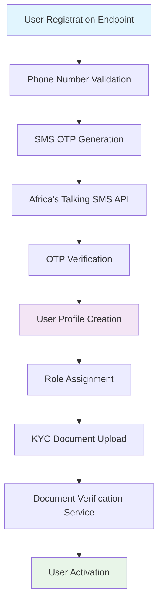
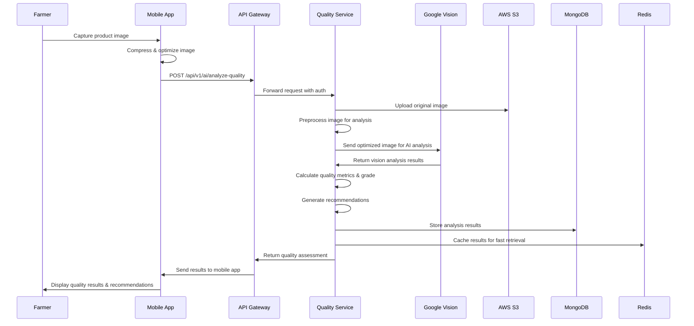
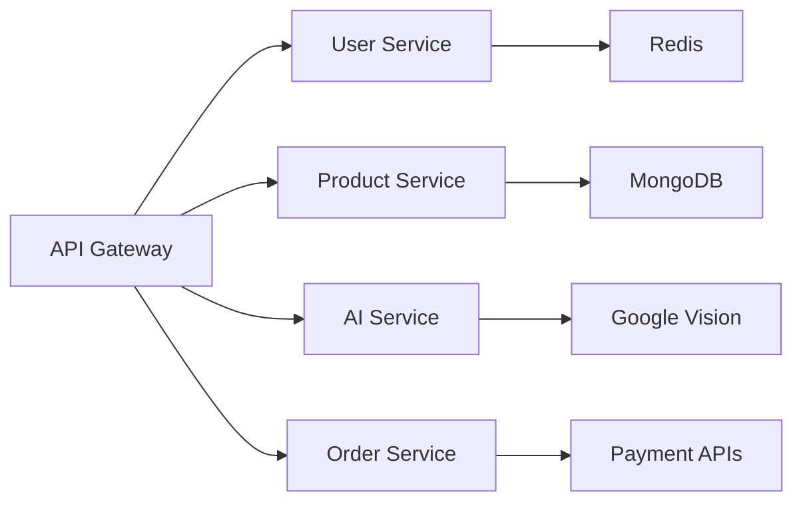
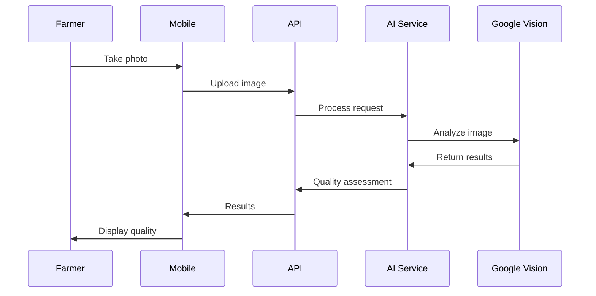

# AgriTrade AI Platform - Advanced Architecture & Implementation Design

## Overview

AgriTrade AI represents a revolutionary digital transformation platform that eliminates intermediaries in African agricultural commodity trading through artificial intelligence. The platform connects smallholder farmers directly with buyers (traders, processors, exporters) while leveraging AI-powered quality assessment, predictive pricing, and intelligent logistics optimization to increase farmer revenues by 30-50%.

### Mission Statement
Transform African agricultural trade by democratizing market access, ensuring transparency, and empowering farmers through cutting-edge artificial intelligence and mobile-first technology solutions.

### Core Value Propositions
- **Direct Market Connection**: Eliminate exploitative middlemen between farmers and buyers
- **AI-Driven Quality Assessment**: Instant crop evaluation via Google Vision API analysis
- **Transparent Price Discovery**: Real-time market pricing based on quality metrics and market data
- **Rural-First Design**: Optimized for low-bandwidth, mobile-centric environments
- **Multilingual Voice Support**: Voice assistance for farmers with limited literacy
- **Smart Logistics**: Intelligent routing and cargo consolidation

### Geographic Target Markets
- **Primary Launch**: Côte d'Ivoire, Senegal (MVP deployment)
- **Phase 2 Expansion**: Ghana, Nigeria, Mali, Burkina Faso
- **Phase 3 Scale**: Cameroon, Guinea, Togo, Benin
- **Commodities Focus**: Cocoa, coffee, cotton, maize, rice, peanuts, cashew, palm oil

## Technology Stack & Dependencies

### Backend Infrastructure
- **Runtime Environment**: Node.js 18+ LTS with TypeScript 5.2+
- **Web Framework**: Fastify 4.24+ (high-performance HTTP server)
- **API Gateway**: Kong Gateway with comprehensive security and rate limiting
- **Authentication**: JWT tokens with SMS OTP verification via Africa's Talking
- **Primary Database**: MongoDB Atlas 6.0+ with sharding support
- **Caching Layer**: Redis 7.0+ for sessions, query caching, and real-time data
- **File Storage**: AWS S3 with global CloudFront CDN distribution
- **Search Engine**: ElasticSearch 8.0+ for product discovery and analytics

### AI & Machine Learning Services
- **Computer Vision**: Google Cloud Vision API for image analysis and quality scoring
- **Natural Language Processing**: Hugging Face Transformers for multilingual chat
- **Weather Intelligence**: OpenWeatherMap + NASA POWER for climate predictions
- **Agricultural Data**: FAO GIEWS, World Bank Commodity Price data
- **Satellite Monitoring**: Sentinel Hub, Google Earth Engine for crop monitoring
- **Geospatial Services**: Mapbox for logistics optimization and route planning

### Communication & Payment Systems
- **SMS/Voice**: Africa's Talking API for multi-country coverage
- **Messaging**: WhatsApp Business API for rich media communication
- **Mobile Payments**: Orange Money, MTN Mobile Money, Airtel Money integration
- **Banking**: Flutterwave, Paystack for traditional payment processing

### Infrastructure & DevOps
- **Cloud Platform**: AWS with ECS Fargate for serverless container orchestration
- **Containerization**: Docker with multi-stage builds for optimization
- **CI/CD Pipeline**: GitHub Actions with automated testing and deployment
- **Monitoring**: DataDog + AWS CloudWatch for comprehensive observability
- **Security**: AWS WAF, Helmet.js, AES-256 encryption for sensitive data
- **CDN**: CloudFront for global content delivery and edge caching

## Architecture

### Microservices System Architecture

```mermaid
graph TB
    subgraph "Client Layer"
        A[Mobile App - React Native]
        B[Web Dashboard - Next.js]
        C[SMS Gateway Interface]
        D[WhatsApp Business Bot]
        E[Voice Assistant Service]
        F[Partner API Integrations]
    end
    
    subgraph "API Gateway & Security Layer"
        G[Kong API Gateway]
        H[JWT Authentication Service]
        I[Rate Limiting & Throttling]
        J[SSL/TLS Termination]
        K[API Versioning Management]
    end
    
    subgraph "Core Business Microservices"
        L[User Management Service]
        M[Product Catalog Service]
        N[AI Quality Analysis Service]
        O[Order Management Service]
        P[Payment Processing Service]
        Q[Notification Service]
        R[Logistics Optimization Service]
        S[Market Intelligence Service]
    end
    
    subgraph "External AI & Data Services"
        T[Google Vision API]
        U[OpenWeatherMap API]
        V[FAO Agricultural Data]
        W[Africa's Talking SMS/Voice]
        X[Mobile Money Gateways]
        Y[Mapbox Routing API]
        Z[Satellite Data Providers]
    end
    
    subgraph "Data & Storage Infrastructure"
        AA[MongoDB Atlas - Primary DB]
        BB[Redis Cluster - Caching]
        CC[AWS S3 - File Storage]
        DD[ElasticSearch - Analytics]
        EE[CloudFront CDN]
    end
    
    subgraph "Infrastructure Layer"
        FF[AWS ECS Fargate]
        GG[Application Load Balancer]
        HH[Auto Scaling Groups]
        II[VPC & Security Groups]
    end
    
    A --> G
    B --> G
    C --> G
    D --> G
    E --> G
    F --> G
    
    G --> H
    G --> I
    G --> J
    G --> K
    
    G --> L
    G --> M
    G --> N
    G --> O
    G --> P
    G --> Q
    G --> R
    G --> S
    
    N --> T
    S --> U
    S --> V
    Q --> W
    P --> X
    R --> Y
    S --> Z
    
    L --> AA
    M --> AA
    N --> AA
    O --> AA
    P --> AA
    
    M --> BB
    N --> BB
    
    M --> CC
    N --> CC
    
    S --> DD
    O --> DD
    
    CC --> EE
    
    G --> GG
    GG --> FF
    
    style G fill:#4CAF50,stroke:#388E3C,color:white
    style N fill:#2196F3,stroke:#1976D2,color:white
    style AA fill:#FF9800,stroke:#F57C00,color:white
```



### Service Decomposition Strategy

#### User Management Service
**Core Responsibilities:**
- Multi-role user registration (farmer/buyer/transporter/admin)
- SMS-based authentication with Africa's Talking integration
- KYC verification with document upload and validation
- Multi-language preference management (French, English, local dialects)
- User reputation and trust scoring system

**Service Architecture:**


#### AI Quality Analysis Service
**Advanced Features:**
- Multi-commodity image analysis (cocoa, coffee, cotton, etc.)
- Confidence scoring with uncertainty quantification
- Quality improvement recommendations based on AI insights
- Historical quality tracking and trend analysis
- Batch processing for large-scale operations

**Analysis Workflow:**


#### Product Catalog Service
**Enhanced Capabilities:**
- Dynamic inventory management with real-time updates
- Advanced search with geo-spatial and quality filtering
- Product categorization with commodity-specific attributes
- Image gallery management with automatic optimization
- Integration with quality analysis for automated product grading

#### Order Management Service
**Intelligent Features:**
- AI-powered buyer-seller matching algorithm
- Smart contract generation with customizable terms
- Real-time negotiation workflow with price suggestions
- Delivery tracking with logistics partner integration
- Automated dispute resolution system

### Data Architecture & Advanced Modeling

#### MongoDB Database Schema Design

**Enhanced User Schema:**
```typescript
interface User {
  _id: ObjectId;
  phoneNumber: string; // Primary identifier with country code
  role: 'farmer' | 'buyer' | 'transporter' | 'admin' | 'cooperative';
  profile: {
    name: string;
    location: {
      coordinates: [number, number]; // [longitude, latitude]
      address: string;
      region: string;
      country: string;
    };
    languages: string[]; // ['french', 'english', 'dioula', 'wolof']
    avatar: string; // S3 URL
    verified: boolean;
    verificationLevel: 'basic' | 'enhanced' | 'premium';
    kycStatus: 'pending' | 'approved' | 'rejected' | 'expired';
    documentation: {
      idCard: string; // S3 URL
      farmCertificate?: string; // For farmers
      businessLicense?: string; // For buyers
      verificationDate: Date;
    };
  };
  preferences: {
    notifications: {
      sms: boolean;
      whatsapp: boolean;
      voice: boolean;
      email: boolean;
    };
    language: string;
    currency: 'XOF' | 'GHS' | 'NGN' | 'USD' | 'EUR';
    units: 'metric' | 'imperial';
    timeZone: string;
  };
  reputation: {
    score: number; // 0-100
    transactionCount: number;
    rating: number; // 1-5 stars
    reviews: ReviewSummary[];
    badges: string[]; // ['trusted_seller', 'quality_producer', 'timely_delivery']
  };
  financials: {
    totalRevenue: number;
    averageOrderValue: number;
    paymentMethods: string[];
    creditScore?: number;
  };
  activity: {
    lastLogin: Date;
    createdAt: Date;
    updatedAt: Date;
    loginCount: number;
    deviceInfo: DeviceInfo;
  };
}
```

**Advanced Product Schema:**
```typescript
interface Product {
  _id: ObjectId;
  farmerId: ObjectId;
  commodity: 'cocoa' | 'coffee' | 'cotton' | 'maize' | 'rice' | 'peanuts' | 'cashew' | 'palm_oil';
  variety: string;
  quantity: {
    available: number;
    reserved: number;
    sold: number;
    unit: 'kg' | 'tons' | 'bags' | 'sacks';
    measurementDate: Date;
  };
  qualityAssessment: {
    overallScore: number; // 0-100
    grade: 'A+' | 'A' | 'B' | 'C' | 'D';
    confidence: number; // 0-1
    analysisDate: Date;
    analysisId: ObjectId;
    imageUrls: string[];
    detailedMetrics: {
      // Commodity-specific metrics
      beanSize?: number;
      colorConsistency?: number;
      moistureContent?: number;
      defectCount?: number;
      uniformity?: number;
    };
    recommendations: string[];
    validityPeriod: number; // days
  };
  pricing: {
    basePrice: number;
    currency: string;
    pricePerUnit: number;
    qualityMultiplier: number;
    marketAdjustment: number;
    finalPrice: number;
    priceHistory: PricePoint[];
    negotiable: boolean;
    minimumOrder: number;
  };
  location: {
    coordinates: [number, number];
    farm: {
      name: string;
      size: number; // hectares
      coordinates: GeoJSONPolygon;
    };
    harvestRegion: string;
    proximityToPorts: number; // km
  };
  harvest: {
    date: Date;
    season: 'main' | 'secondary';
    processingMethod: string;
    dryingMethod: string;
    storageConditions: {
      temperature: number;
      humidity: number;
      duration: number; // days since harvest
      facility: 'traditional' | 'modern' | 'cooperative';
    };
  };
  certifications: {
    organic: {
      certified: boolean;
      certifier?: string;
      expiryDate?: Date;
    };
    fairTrade: {
      certified: boolean;
      certifier?: string;
      expiryDate?: Date;
    };
    rainforestAlliance: {
      certified: boolean;
      certifier?: string;
      expiryDate?: Date;
    };
    customCertifications: Certification[];
  };
  logistics: {
    packagingType: string;
    packagesCount: number;
    weightPerPackage: number;
    pickupAvailability: Date[];
    deliveryOptions: string[];
    transportationCost: number;
  };
  market: {
    status: 'available' | 'reserved' | 'sold' | 'processing' | 'quality_check';
    visibility: 'public' | 'private' | 'restricted';
    targetBuyers: ObjectId[];
    promoted: boolean;
    listingDate: Date;
    expiryDate: Date;
  };
  analytics: {
    views: number;
    inquiries: number;
    favorites: number;
    shares: number;
    conversionRate: number;
  };
  metadata: {
    createdAt: Date;
    updatedAt: Date;
    version: number;
    tags: string[];
    notes: string;
  };
}
```

### Business Logic Layer Implementation

#### Enhanced AI Quality Assessment Engine

**Multi-Commodity Analysis Framework:**
```typescript
abstract class CommodityAnalyzer {
  protected visionClient: VisionClient;
  protected weightsConfig: QualityWeights;
  
  constructor(visionClient: VisionClient, weightsConfig: QualityWeights) {
    this.visionClient = visionClient;
    this.weightsConfig = weightsConfig;
  }
  
  abstract analyzeQuality(
    imageData: Buffer, 
    metadata: ProductMetadata
  ): Promise<QualityResult>;
  
  abstract calculateGrade(metrics: QualityMetrics): QualityGrade;
  abstract generateRecommendations(analysis: QualityResult): Recommendation[];
  protected abstract validateImageQuality(visionResults: VisionResponse): boolean;
}

class CocoaAnalyzer extends CommodityAnalyzer {
  private readonly QUALITY_WEIGHTS = {
    beanSizeUniformity: 0.25,
    colorConsistency: 0.20,
    moistureContent: 0.20,
    defectCount: 0.20,
    shellToBeanRatio: 0.15
  };
  
  async analyzeQuality(
    imageData: Buffer, 
    metadata: ProductMetadata
  ): Promise<QualityResult> {
    try {
      // Send image to Google Vision API
      const visionResults = await this.visionClient.analyze(imageData, {
        features: ['OBJECT_LOCALIZATION', 'IMAGE_PROPERTIES', 'TEXT_DETECTION']
      });
      
      // Validate image quality and content
      if (!this.validateImageQuality(visionResults)) {
        throw new Error('Image quality insufficient for accurate analysis');
      }
      
      // Extract commodity-specific metrics
      const metrics = await this.extractCocoaMetrics(visionResults, metadata);
      
      // Calculate weighted quality score
      const overallScore = this.calculateWeightedScore(metrics);
      
      // Assign quality grade
      const grade = this.calculateGrade(metrics);
      
      // Calculate confidence based on image clarity and analysis certainty
      const confidence = this.calculateConfidence(visionResults, metrics);
      
      // Generate actionable recommendations
      const recommendations = this.generateRecommendations({
        overallScore,
        grade,
        metrics,
        confidence
      });
      
      return {
        analysisId: new ObjectId(),
        overallScore,
        grade,
        confidence,
        detailedMetrics: metrics,
        recommendations,
        processingTime: Date.now() - startTime,
        imageQuality: this.assessImageQuality(visionResults),
        validityPeriod: 7 // days
      };
      
    } catch (error) {
      logger.error('Cocoa quality analysis failed', { error, metadata });
      throw new QualityAnalysisError('Failed to analyze cocoa quality', error);
    }
  }
  
  private async extractCocoaMetrics(
    visionResults: VisionResponse, 
    metadata: ProductMetadata
  ): Promise<CocoaQualityMetrics> {
    const beans = this.detectCocoaBeans(visionResults.objects);
    const colorAnalysis = this.analyzeColor(visionResults.imageProperties);
    const defects = this.detectDefects(visionResults.objects);
    const textDetection = this.extractTextualInfo(visionResults.texts);
    
    return {
      beanSizeUniformity: this.calculateSizeUniformity(beans),
      colorConsistency: this.calculateColorConsistency(colorAnalysis),
      moistureContent: this.estimateMoisture(colorAnalysis, metadata),
      defectCount: this.quantifyDefects(defects),
      shellToBeanRatio: this.calculateShellRatio(beans),
      beanCount: beans.length,
      averageBeanSize: this.calculateAverageBeanSize(beans),
      colorProfile: this.generateColorProfile(colorAnalysis),
      defectTypes: this.categorizeDefects(defects),
      visualQualityIndicators: this.extractVisualIndicators(visionResults)
    };
  }
  
  private calculateWeightedScore(metrics: CocoaQualityMetrics): number {
    return Object.entries(this.QUALITY_WEIGHTS).reduce((score, [key, weight]) => {
      const metricValue = metrics[key as keyof CocoaQualityMetrics] as number;
      return score + (this.normalizeMetric(metricValue, key) * weight * 100);
    }, 0);
  }
  
  calculateGrade(metrics: CocoaQualityMetrics): QualityGrade {
    const score = this.calculateWeightedScore(metrics);
    
    if (score >= 90) return 'A+';
    if (score >= 80) return 'A';
    if (score >= 70) return 'B';
    if (score >= 60) return 'C';
    return 'D';
  }
  
  generateRecommendations(analysis: QualityResult): Recommendation[] {
    const recommendations: Recommendation[] = [];
    const metrics = analysis.detailedMetrics as CocoaQualityMetrics;
    
    // Size uniformity recommendations
    if (metrics.beanSizeUniformity < 0.7) {
      recommendations.push({
        category: 'processing',
        priority: 'high',
        title: 'Improve Bean Size Uniformity',
        description: 'Consider better sorting techniques during processing to achieve more uniform bean sizes.',
        impact: 'Can increase quality grade by up to 15%',
        actionItems: [
          'Implement multi-stage sieving',
          'Train workers on proper sorting techniques',
          'Invest in mechanical sorting equipment'
        ]
      });
    }
    
    // Color consistency recommendations
    if (metrics.colorConsistency < 0.6) {
      recommendations.push({
        category: 'drying',
        priority: 'medium',
        title: 'Optimize Drying Process',
        description: 'Inconsistent color indicates uneven drying. Improve drying uniformity.',
        impact: 'Can improve color consistency by 20-30%',
        actionItems: [
          'Ensure even sun exposure during drying',
          'Turn beans regularly during drying process',
          'Monitor moisture levels consistently'
        ]
      });
    }
    
    // Defect reduction recommendations
    if (metrics.defectCount > 5) {
      recommendations.push({
        category: 'harvesting',
        priority: 'high',
        title: 'Reduce Defect Rate',
        description: 'High defect count detected. Focus on better harvesting and post-harvest handling.',
        impact: 'Can increase overall quality score by 10-25%',
        actionItems: [
          'Harvest only fully ripe pods',
          'Improve fermentation process timing',
          'Enhance storage conditions to prevent mold'
        ]
      });
    }
    
    return recommendations;
  }
}
```

#### Advanced Pricing Engine

**Dynamic Market Pricing Model:**
```typescript
interface PricingFactors {
  qualityMultiplier: number;     // AI-determined quality impact
  marketDemand: number;          // Local supply/demand dynamics
  seasonalAdjustment: number;    // Historical seasonal patterns
  weatherImpact: number;         // Climate predictions impact
  locationPremium: number;       // Transport costs and proximity
  certificationBonus: number;   // Organic/FairTrade premiums
  urgencyFactor: number;         // Time-sensitive delivery needs
  volumeDiscount: number;        // Bulk purchase incentives
  reputationAdjustment: number;  // Farmer/buyer reputation impact
}

class AdvancedPricingEngine {
  private marketDataService: MarketDataService;
  private weatherService: WeatherService;
  private logisticsService: LogisticsService;
  
  async calculatePrice(
    product: Product, 
    market: MarketConditions,
    buyer?: BuyerProfile
  ): Promise<PriceEstimate> {
    try {
      // Get base commodity price from international markets
      const basePrice = await this.getBasePriceFromMultipleSources(
        product.commodity,
        product.location.coordinates
      );
      
      // Calculate all pricing factors
      const factors = await this.calculateComprehensivePricingFactors(
        product, 
        market, 
        buyer
      );
      
      // Apply sophisticated pricing algorithm
      const adjustedPrice = this.applyPricingModel(basePrice, factors);
      
      // Calculate price confidence and volatility
      const confidence = this.calculatePriceConfidence(factors, market);
      const volatility = this.assessPriceVolatility(product.commodity, market);
      
      // Generate price range for negotiation
      const priceRange = this.calculateNegotiationRange(adjustedPrice, volatility);
      
      return {
        basePrice,
        adjustedPrice,
        priceRange,
        factors,
        confidence,
        volatility,
        recommendations: this.generatePricingRecommendations(factors),
        validUntil: new Date(Date.now() + 6 * 60 * 60 * 1000), // 6 hours
        marketTrend: this.analyzePriceTrend(product.commodity),
        competitorPrices: await this.getCompetitorPricing(product)
      };
      
    } catch (error) {
      logger.error('Price calculation failed', { error, product: product._id });
      throw new PricingError('Failed to calculate product price', error);
    }
  }
  
  private async calculateComprehensivePricingFactors(
    product: Product,
    market: MarketConditions,
    buyer?: BuyerProfile
  ): Promise<PricingFactors> {
    const [
      qualityMultiplier,
      marketDemand,
      seasonalAdjustment,
      weatherImpact,
      locationPremium,
      certificationBonus
    ] = await Promise.all([
      this.calculateQualityMultiplier(product.qualityAssessment),
      this.assessMarketDemand(product.commodity, product.location),
      this.getSeasonalAdjustment(product.commodity, product.harvest.date),
      this.calculateWeatherImpact(product.location, product.commodity),
      this.calculateLocationPremium(product.location, buyer?.location),
      this.calculateCertificationBonus(product.certifications)
    ]);
    
    return {
      qualityMultiplier,
      marketDemand,
      seasonalAdjustment,
      weatherImpact,
      locationPremium,
      certificationBonus,
      urgencyFactor: buyer ? this.calculateUrgencyFactor(buyer.deliveryDate) : 1.0,
      volumeDiscount: this.calculateVolumeDiscount(product.quantity.available, buyer?.orderVolume),
      reputationAdjustment: this.calculateReputationAdjustment(product.farmerId, buyer?._id)
    };
  }
  
  private applyPricingModel(basePrice: number, factors: PricingFactors): number {
    // Advanced non-linear pricing model
    const qualityAdjustedPrice = basePrice * factors.qualityMultiplier;
    const marketAdjustedPrice = qualityAdjustedPrice * factors.marketDemand;
    const seasonalPrice = marketAdjustedPrice * factors.seasonalAdjustment;
    const weatherAdjustedPrice = seasonalPrice * (1 + factors.weatherImpact);
    const locationAdjustedPrice = weatherAdjustedPrice * (1 + factors.locationPremium);
    const certifiedPrice = locationAdjustedPrice * (1 + factors.certificationBonus);
    const urgencyAdjustedPrice = certifiedPrice * factors.urgencyFactor;
    const volumeAdjustedPrice = urgencyAdjustedPrice * (1 - factors.volumeDiscount);
    const finalPrice = volumeAdjustedPrice * factors.reputationAdjustment;
    
    return Math.round(finalPrice * 100) / 100; // Round to 2 decimal places
  }
}
```

## API Endpoints Reference

### Authentication & User Management
```typescript
// Enhanced authentication endpoints with comprehensive features
POST /api/v1/auth/register
{
  phoneNumber: string;          // International format (+225XXXXXXXX)
  role: 'farmer' | 'buyer' | 'transporter' | 'cooperative';
  preferredLanguage: string;    // 'french' | 'english' | 'dioula' | 'wolof'
  location: {
    coordinates: [number, number];
    address: string;
    region: string;
    country: string;
  };
  referralCode?: string;        // Optional referral tracking
}

POST /api/v1/auth/verify-sms
{
  phoneNumber: string;
  verificationCode: string;
  deviceInfo: {
    platform: string;
    version: string;
    deviceId: string;
  };
}

POST /api/v1/auth/login
{
  phoneNumber: string;
  method: 'sms' | 'voice' | 'whatsapp';
  language?: string;
}

POST /api/v1/auth/refresh
Headers: { Authorization: "Bearer <refresh_token>" }

GET /api/v1/users/profile
Headers: { Authorization: "Bearer <access_token>" }
Response: UserProfile

PUT /api/v1/users/profile
{
  profile: Partial<UserProfile>;
  preferences: Partial<UserPreferences>;
}

POST /api/v1/users/kyc/upload
Content-Type: multipart/form-data
{
  documentType: 'id_card' | 'farm_certificate' | 'business_license';
  document: File;
  additionalInfo?: any;
}

GET /api/v1/users/reputation/:userId
Response: ReputationScore
```

### AI Quality Analysis Endpoints
```typescript
// Comprehensive quality analysis API with batch processing
POST /api/v1/ai/analyze-quality
Content-Type: multipart/form-data
{
  image: File;                   // High-resolution product image
  productType: 'cocoa' | 'coffee' | 'cotton' | 'maize' | 'rice' | 'peanuts';
  farmerId: string;
  location: {
    coordinates: [number, number];
    region: string;
  };
  harvestDate: Date;
  variety?: string;
  processingMethod?: string;
  metadata?: {
    samplingMethod: string;
    imageConditions: string;
    additionalNotes: string;
  };
}

Response: {
  analysisId: string;
  overallScore: number;          // 0-100
  grade: 'A+' | 'A' | 'B' | 'C' | 'D';
  confidence: number;            // 0-1
  detailedMetrics: QualityMetrics;
  recommendations: Recommendation[];
  processingTime: number;        // milliseconds
  imageQuality: ImageQualityAssessment;
  validityPeriod: number;        // days
  comparativeAnalysis: {
    regionalAverage: number;
    seasonalAverage: number;
    farmerHistorical: number;
  };
}

GET /api/v1/ai/analysis/:analysisId
Headers: { Authorization: "Bearer <token>" }
Response: QualityAnalysisResult

GET /api/v1/ai/analysis/farmer/:farmerId
Query: {
  limit?: number;
  offset?: number;
  productType?: string;
  dateRange?: {
    start: Date;
    end: Date;
  };
  gradeFilter?: string[];
}
Response: {
  analyses: QualityAnalysisResult[];
  summary: {
    totalAnalyses: number;
    averageScore: number;
    gradeDistribution: Record<string, number>;
    improvementTrend: number;
  };
  pagination: PaginationMeta;
}
```

### Product & Order Management Endpoints
```typescript
// Core marketplace operations
GET /api/v1/products
Query: { commodity?, grade?, location?, priceRange?, limit?, offset? }

POST /api/v1/products
{ commodity, quantity, location, qualityAnalysisId, pricing }

POST /api/v1/orders
{ productId, quantity, proposedPrice, deliveryLocation, deliveryDate }

PUT /api/v1/orders/:orderId/negotiate
{ counterOffer, message, validUntil }

GET /api/v1/market/prices
Query: { commodity, region, timeframe }
```

## Middleware & Security

### Authentication & Authorization
```typescript
const authMiddleware = async (request: FastifyRequest, reply: FastifyReply) => {
  const token = request.headers.authorization?.replace('Bearer ', '');
  if (!token) return reply.code(401).send({ error: 'Token required' });
  
  const decoded = jwt.verify(token, process.env.JWT_SECRET);
  request.user = await userService.findById(decoded.userId);
};

const rateLimitMiddleware = {
  max: 100,
  timeWindow: '1 minute',
  keyGenerator: (request) => request.user?.id || request.ip
};
```

### Error Handling & Circuit Breaker
```typescript
class CircuitBreaker {
  private failures = 0;
  private state: 'closed' | 'open' | 'half-open' = 'closed';
  
  async execute<T>(operation: () => Promise<T>): Promise<T> {
    if (this.state === 'open' && !this.shouldReset()) {
      throw new Error('Circuit breaker open');
    }
    
    try {
      const result = await operation();
      this.onSuccess();
      return result;
    } catch (error) {
      this.onFailure();
      throw error;
    }
  }
}
```

## Testing Strategy

### Unit Testing Framework
```typescript
describe('CocoaAnalyzer', () => {
  let analyzer: CocoaAnalyzer;
  let mockVisionClient: jest.Mocked<VisionClient>;
  
  beforeEach(() => {
    mockVisionClient = createMockVisionClient();
    analyzer = new CocoaAnalyzer(mockVisionClient);
  });
  
  it('should analyze high-grade cocoa accurately', async () => {
    const imageBuffer = fs.readFileSync('test-assets/cocoa.jpg');
    const metadata = { productType: 'cocoa', farmerId: 'test-id' };
    
    mockVisionClient.analyze.mockResolvedValue({
      objects: [{ name: 'cocoa_bean', confidence: 0.95 }],
      imageProperties: { dominantColors: [{ red: 139, green: 69, blue: 19 }] }
    });
    
    const result = await analyzer.analyzeQuality(imageBuffer, metadata);
    
    expect(result.overallScore).toBeGreaterThan(80);
    expect(result.grade).toMatch(/^A[+]?$/);
    expect(result.confidence).toBeGreaterThan(0.8);
  });
});
```

### Integration Testing
```typescript
describe('Quality Analysis API', () => {
  let app: FastifyInstance;
  
  beforeAll(async () => {
    app = await createTestApp();
  });
  
  it('should analyze uploaded image', async () => {
    const response = await app.inject({
      method: 'POST',
      url: '/api/v1/ai/analyze-quality',
      headers: { 'Authorization': 'Bearer valid-token' },
      payload: {
        image: testImageBuffer,
        productType: 'cocoa'
      }
    });
    
    expect(response.statusCode).toBe(200);
    expect(response.json()).toMatchObject({
      analysisId: expect.any(String),
      overallScore: expect.any(Number),
      grade: expect.stringMatching(/^[A-D][+]?$/)
    });
  });
});
```

### Performance Testing
```typescript
// Load testing with Artillery.js
const loadTestConfig = {
  scenarios: {
    image_analysis: {
      executor: 'ramping-vus',
      stages: [
        { duration: '2m', target: 10 },
        { duration: '5m', target: 50 },
        { duration: '3m', target: 0 }
      ]
    }
  },
  thresholds: {
    http_req_duration: ['p(95)<2000'],
    http_req_failed: ['rate<0.1']
  }
};
```

## Project Implementation Structure

### Repository Organization
```
agritrade/
├── mobile/                    # React Native application
│   ├── src/
│   │   ├── components/        # Reusable UI components
│   │   ├── screens/          # Screen components
│   │   ├── services/         # API clients
│   │   └── store/            # State management
│   └── __tests__/
├── web/                      # Next.js dashboard
│   ├── src/app/              # App router pages
│   └── components/
├── backend/                  # Node.js microservices
│   ├── src/
│   │   ├── services/         # Business logic
│   │   ├── routes/           # API endpoints
│   │   ├── middleware/       # Custom middleware
│   │   └── models/           # Data models
│   └── tests/
├── infrastructure/           # Infrastructure as Code
│   ├── terraform/           # AWS infrastructure
│   └── k8s/                 # Kubernetes configs
└── docs/                    # Documentation
```

### Development Phases

#### Phase 1: Foundation (Weeks 1-4)
- Backend API framework setup
- Basic authentication system
- Mobile app foundation
- CI/CD pipeline

#### Phase 2: Core Features (Weeks 5-12)
- User management service
- Product catalog service
- Basic mobile screens
- Database integration

#### Phase 3: AI Integration (Weeks 13-18)
- Google Vision API integration
- Quality analysis algorithms
- Mobile camera functionality
- Quality assessment UI

#### Phase 4: Marketplace (Weeks 19-24)
- Order management system
- Payment integration
- Communication features
- Analytics dashboard

### Environment Setup
```bash
# Development environment
Node.js: 18+ LTS
MongoDB: 6.0+
Redis: 7.0+
Docker: 20+

# Quick start
git clone https://github.com/topsucces-code/agritrade.git
cd agritrade
npm run setup
npm run dev
```

### Configuration Management
```bash
# Environment variables
NODE_ENV=development
MONGODB_URI=mongodb://localhost:27017/agritrade
REDIS_URL=redis://localhost:6379
GOOGLE_VISION_API_KEY=your-api-key
AWS_ACCESS_KEY_ID=your-access-key
JWT_SECRET=your-jwt-secret
```

## Architecture Patterns

### Microservices Communication


### Data Flow Architecture


### Security Architecture
- JWT authentication with refresh tokens
- SMS-based two-factor authentication
- Role-based access control (RBAC)
- API rate limiting per user tier
- Input validation and sanitization
- Encryption at rest and in transit