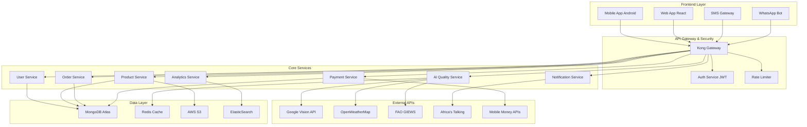
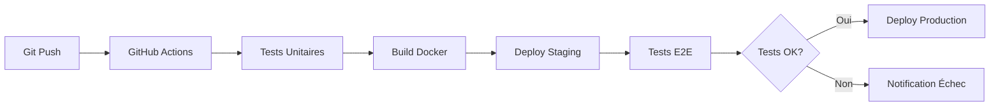

# AgriTrade AI - Architecture Technique Complète

## 1. Vue d'Ensemble Architecture

### 1.1 Principes Architecturaux
- **Microservices**: Services découplés et scalables indépendamment
- **API-First**: APIs RESTful documentées (OpenAPI/Swagger)
- **Cloud-Native**: Infrastructure AWS avec auto-scaling
- **Sécurité par design**: Chiffrement, authentication, auditing
- **Résilience**: Haute disponibilité, recovery automatique

### 1.2 Architecture Système Global



## 2. Services Core Détaillés

### 2.1 User Service
**Responsabilités**:
- Gestion profils (agriculteurs, acheteurs, transporteurs)
- Authentication/Authorization (JWT)
- KYC (Know Your Customer) workflow
- Géolocalisation et vérification identité

**APIs principales**:
```
POST /api/v1/users/register
POST /api/v1/users/verify-sms
GET /api/v1/users/profile
PUT /api/v1/users/profile
POST /api/v1/users/kyc-upload
```

### 2.2 Product Service  
**Responsabilités**:
- Catalogue produits agricoles (cacao, café, coton)
- Gestion inventaire agriculteur
- Upload et traitement images
- Métadonnées qualité et géolocalisation

**APIs principales**:
```
GET /api/v1/products?location=abidjan&type=cocoa
POST /api/v1/products
PUT /api/v1/products/:id
DELETE /api/v1/products/:id
POST /api/v1/products/:id/images
```

### 2.3 AI Quality Service
**Responsabilités**:
- Intégration Google Vision API
- Algorithmes estimation qualité spécialisés
- Machine Learning prix prédictifs
- Assistant conversationnel multilingue

**APIs principales**:
```
POST /api/v1/ai/analyze-quality
GET /api/v1/ai/price-prediction
POST /api/v1/ai/chat
POST /api/v1/ai/voice-to-text
```

### 2.4 Order Service
**Responsabilités**:
- Marketplace (offres/demandes)  
- Matching intelligent vendeur/acheteur
- Workflow négociation et contrat
- Suivi statuts livraison

**APIs principales**:
```
POST /api/v1/orders
GET /api/v1/orders/matches?productId=:id
PUT /api/v1/orders/:id/negotiate
POST /api/v1/orders/:id/accept
```

### 2.5 Payment Service
**Responsabilités**:
- Intégration Mobile Money (Orange Money, MTN)
- Système escrow sécurisé
- Commission calculation automatique
- Facturation et reporting financier

**APIs principales**:
```
POST /api/v1/payments/initiate
GET /api/v1/payments/status/:id
POST /api/v1/payments/escrow-release
GET /api/v1/payments/history
```

## 3. Stack Technologique Détaillé

### 3.1 Frontend
**Mobile (React Native)**:
- React Native 0.72+, TypeScript
- Navigation: React Navigation 6
- State: Zustand + React Query
- UI: Tamagui (performance optimisée)
- Offline: Redux Offline + AsyncStorage

**Web (React)**:
- Next.js 13 (App Router)
- TypeScript, Tailwind CSS
- Authentication: NextAuth.js
- Deployment: Vercel

### 3.2 Backend
**Runtime & Framework**:
- Node.js 18 LTS, TypeScript
- Fastify (haute performance)
- Validation: Joi
- Documentation: Swagger/OpenAPI

**Base de Données**:
- MongoDB Atlas 6.0+ (document store)
- Redis 7.0 (cache + sessions)
- ElasticSearch (analytics + search)

### 3.3 Infrastructure AWS
**Compute**:
- ECS Fargate (containers sans serveur)
- Auto Scaling Groups
- Application Load Balancer

**Storage**:
- S3 (images, documents)
- CloudFront CDN (distribution globale)
- EBS (données persistantes)

**Monitoring**:
- CloudWatch (métriques + logs)
- X-Ray (tracing distribué)  
- DataDog (APM avancé)

## 4. Sécurité & Conformité

### 4.1 Authentification & Autorisation
- **JWT tokens**: Expiration 24h, refresh tokens sécurisés
- **2FA SMS**: Obligatoire comptes acheteurs >$1000/mois
- **RBAC**: Rôles granulaires (farmer, buyer, admin, support)
- **API Keys**: Rate limiting par clé (1000 req/h)

### 4.2 Chiffrement & Protection Données
- **HTTPS**: TLS 1.3 obligatoire, certificats Let's Encrypt
- **Chiffrement DB**: AES-256 champs sensibles (paiements, KYC)
- **Backup**: Chiffré S3 avec rotation 7-30-90 jours
- **GDPR Compliance**: Droit effacement, portabilité données

### 4.3 Sécurité Paiements
- **PCI DSS Level 1**: Certification annual
- **Tokenisation**: Pas de stockage données bancaires
- **Fraud Detection**: ML algorithmes transactions suspectes
- **Audit Logs**: Immutables, rétention 7 ans

## 5. Performance & Scalabilité

### 5.1 Benchmarks Cibles
- **Latence API**: <200ms (95e percentile)
- **Throughput**: 5000 req/sec pic
- **Disponibilité**: 99.9% SLA
- **Temps démarrage app**: <3 secondes

### 5.2 Stratégies d'Optimisation
- **Caching multi-niveau**: Redis, CDN, browser cache
- **Database indexing**: Queries <50ms
- **Image optimization**: WebP, compression adaptative  
- **API pagination**: Limite 100 items/page

### 5.3 Auto-Scaling
- **Horizontal**: 2-50 instances selon charge
- **Vertical**: CPU/RAM adaptés dynamiquement
- **Database**: Read replicas automatiques
- **CDN**: Edge locations Afrique

## 6. Monitoring & Observabilité

### 6.1 Métriques Business
- **Transactions/minute** en temps réel
- **Revenus par service** (commission, abonnements)
- **Conversion funnel** (inscription → première vente)
- **Churn rate** utilisateurs actifs

### 6.2 Métriques Techniques  
- **Error rate** par service (<1%)
- **Response time** percentiles P50, P95, P99
- **Database performance** (slow queries)
- **External APIs** availability et latence

### 6.3 Alerting
- **PagerDuty**: Incidents critiques (indisponibilité)
- **Slack**: Alertes business (revenus, nouveaux users)
- **Email**: Rapports quotidiens/hebdomadaires
- **SMS**: Urgences infrastructure (CEO, CTO)

## 7. Déploiement & DevOps

### 7.1 CI/CD Pipeline


### 7.2 Environments
- **Development**: Locale (Docker Compose)
- **Staging**: AWS ECS (données test)
- **Production**: AWS ECS (multi-AZ)
- **DR (Disaster Recovery)**: Standby région EU

### 7.3 Backup & Recovery
- **RTO (Recovery Time)**: <1 heure
- **RPO (Recovery Point)**: <15 minutes
- **Backup fréquence**: Continue (CDC) + snapshots quotidiens
- **Tests recovery**: Mensuel automatisé

## 8. Intégrations APIs Externes

### 8.1 Google Cloud Vision
- **Quota**: 20,000 requêtes/mois (MVP)
- **Coût**: $1.50 per 1000 après quota gratuit
- **SLA**: 99.9% disponibilité
- **Fallback**: Estimation qualité par métadonnées

### 8.2 OpenWeatherMap  
- **Plan**: Professional ($40/mois)
- **Données**: Météo actuelle + prévisions 5 jours
- **Fréquence**: Mise à jour toutes les 3 heures
- **Coverage**: Côte d'Ivoire complète

### 8.3 Africa's Talking
- **SMS**: $0.05/SMS Côte d'Ivoire  
- **Voice**: $0.20/minute appels
- **USSD**: $0.01/session (menus offline)
- **WhatsApp**: $0.15/message (Business API)

## 9. Plan Migration & Évolution

### 9.1 Roadmap Technique 12 mois
**Q1 2024**: MVP Core (Users, Products, Basic AI)
**Q2 2024**: Payments + Mobile Money intégration  
**Q3 2024**: Advanced AI (prix prédictifs, assistant vocal)
**Q4 2024**: Analytics avancés + Business Intelligence

### 9.2 Évolutions Prévues
- **Blockchain**: Traçabilité supply chain (Hyperledger)  
- **IoT**: Capteurs humidité/température (LoRaWAN)
- **Satellite**: Imagerie crop monitoring (Planet Labs)
- **Mobile**: Extension iOS + Progressive Web App

---

**Contacts Techniques**:
- **Architecture**: tech-lead@agritrade-ai.com
- **DevOps**: devops@agritrade-ai.com  
- **Sécurité**: security@agritrade-ai.com