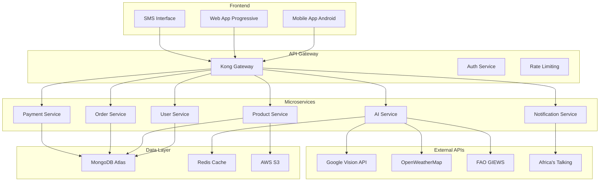

# AgriTrade AI - Cahier des Charges Technique MVP

## 1. Vue d'Ensemble du Projet

### 1.1 Objectif du MVP
Développer une plateforme de négoce agricole connectant directement agriculteurs et acheteurs en Côte d'Ivoire, avec fonctionnalités IA intégrées pour l'estimation de qualité et la prédiction des prix.

### 1.2 Périmètre du MVP
- **Utilisateurs cibles**: 50 producteurs de cacao + 10 acheteurs
- **Zone géographique**: Côte d'Ivoire (régions San Pedro, Abidjan)
- **Produits**: Cacao uniquement (extension future: café, coton)
- **Durée de développement**: 6 mois
- **Budget technique**: $300K

## 2. Architecture Système

### 2.1 Architecture Générale



### 2.2 Stack Technologique

**Frontend**
- **Mobile**: React Native 0.72+ (Android prioritaire)
- **Web**: React 18 + Next.js 13
- **UI Library**: Tamagui (optimisé performance mobile)
- **State Management**: Zustand
- **Navigation**: React Navigation 6

**Backend**
- **Runtime**: Node.js 18 LTS
- **Framework**: Fastify (performance élevée)
- **Base de données**: MongoDB Atlas 6.0+
- **Cache**: Redis 7.0
- **File Storage**: AWS S3
- **API Gateway**: Kong Gateway

**DevOps & Infrastructure**
- **Cloud Provider**: AWS (région eu-west-1)
- **Container**: Docker + Docker Compose
- **CI/CD**: GitHub Actions
- **Monitoring**: DataDog
- **Deployment**: AWS ECS Fargate

## 3. Spécifications Fonctionnelles

### 3.1 Modules Core MVP

#### Module 1: Authentification & Profils
**User Stories**
- En tant qu'agriculteur, je veux créer un compte avec mon numéro de téléphone
- En tant qu'acheteur, je veux m'inscrire avec mes informations d'entreprise
- En tant qu'utilisateur, je veux me connecter avec SMS OTP

**Fonctionnalités**
- Inscription/connexion par numéro mobile
- Vérification SMS (Africa's Talking API)
- Profils différenciés (Agriculteur/Acheteur/Transporteur)
- KYC simplifié (photo ID + géolocalisation ferme)

**Critères d'acceptation**
- Inscription complète en < 3 minutes
- Support français + langues locales (Baoulé, Dioula)
- Mode offline pour création profil

#### Module 2: Gestion des Produits
**User Stories**
- En tant qu'agriculteur, je veux lister mes produits avec photos
- En tant qu'acheteur, je veux voir la qualité estimée par IA
- En tant qu'utilisateur, je veux consulter les prix du marché

**Fonctionnalités**
- Catalogue produits (variétés cacao, grades qualité)
- Upload photos produits (compression automatique)
- Estimation qualité IA via Google Vision
- Prix de référence temps réel (FAO GIEWS)
- Géolocalisation GPS des parcelles

**Critères d'acceptation**
- Estimation qualité en < 10 secondes
- Précision IA > 85% (validation terrain)
- Fonctionnement avec connectivité 2G/3G

#### Module 3: Marketplace & Transactions
**User Stories**  
- En tant qu'agriculteur, je veux publier une offre de vente
- En tant qu'acheteur, je veux négocier et passer commande
- En tant qu'utilisateur, je veux suivre mes transactions

**Fonctionnalités**
- Publication offres avec prix/quantité/qualité
- Système d'enchères inversées (acheteurs soumissionnent)
- Chat intégré (texte + vocal)
- Matching intelligent offre/demande
- Contrats digitaux avec signature électronique

**Critères d'acceptation**
- Matching automatique en < 5 minutes
- Interface chat responsive
- Contrats légalement valides (droit ivoirien)

#### Module 4: Paiements & Escrow
**User Stories**
- En tant qu'acheteur, je veux payer de manière sécurisée
- En tant qu'agriculteur, je veux recevoir le paiement à la livraison
- En tant qu'utilisateur, je veux un historique des paiements

**Fonctionnalités**
- Intégration Mobile Money (Orange Money, MTN Money)
- Système escrow (paiement bloqué jusqu'à livraison)
- Virement bancaire (partenariat banques locales)
- Facturation automatisée
- Commission plateforme (3% par défaut)

**Critères d'acceptation**
- Paiements Mobile Money en < 2 minutes
- Escrow sécurisé (audit externe)
- Commissions transparentes

### 3.2 Modules IA Avancés

#### Module 5: IA Estimation Qualité
**Algorithme**
- **API**: Google Cloud Vision API
- **Modèles**: Object Detection + Classification
- **Critères évalués**:
  - Taille et forme des fèves
  - Couleur et uniformité  
  - Présence défauts (moisissures, insectes)
  - Humidité apparente

**Pipeline technique**
```javascript
// Workflow estimation qualité
1. Upload photo → Compression → Stockage S3
2. Appel Google Vision API (Object Detection)
3. Analyse pixels + métadonnées EXIF
4. Score qualité A/B/C (0-100)
5. Recommandations amélioration
6. Stockage résultat + historique
```

**Critères de performance**
- Précision > 85% vs expertise humaine
- Temps traitement < 10 secondes
- Coût < $0.10 par analyse

#### Module 6: Prix Prédictifs
**Sources de données**
- FAO GIEWS (prix commodités internationales)
- Marchés locaux (Abidjan, San Pedro)
- OpenWeatherMap (conditions météo)
- Données historiques plateforme

**Algorithme ML**
```python
# Modèle de prédiction prix
import pandas as pd
from sklearn.ensemble import RandomForestRegressor

features = [
    'prix_international_cacao',
    'production_prevue_tonnage', 
    'conditions_meteo_score',
    'demande_locale_estimee',
    'stocks_disponibles',
    'saison_recolte_phase'
]

# Prédiction prix J+7, J+30, J+90
model = RandomForestRegressor(n_estimators=100)
```

**Critères de performance**
- Précision prédiction ±10% (horizon 7 jours)
- Mise à jour quotidienne automatique
- Corrélation > 0.8 avec prix réels

#### Module 7: Assistant Vocal Multilingue
**Fonctionnalités**
- Reconnaissance vocale (Speech-to-Text)
- NLP en français + langues locales
- Réponses contextuelles sur prix/météo/conseils
- Synthèse vocale (Text-to-Speech)

**Stack technique**
- **STT**: Google Speech API
- **NLP**: Hugging Face Transformers
- **TTS**: Google Text-to-Speech
- **Langues supportées**: Français, Baoulé, Dioula

**Interface utilisateur**
- Bouton micro intégré app
- SMS commandes (#PRIX, #METEO)
- WhatsApp Business API

## 4. Spécifications Techniques Détaillées

### 4.1 APIs Externes & Intégrations

#### Google Cloud Vision API
```javascript
// Configuration estimation qualité
const vision = require('@google-cloud/vision');
const client = new vision.ImageAnnotatorClient();

async function analyzeQuality(imageBuffer) {
  const [result] = await client.objectLocalization(imageBuffer);
  const objects = result.localizedObjectAnnotations;
  
  // Logique analyse qualité cacao
  const qualityScore = calculateCocoaQuality(objects);
  return qualityScore;
}
```

**Quotas & Coûts**
- 1000 requêtes/mois gratuites
- $1.50 per 1000 requêtes suivantes  
- Budget estimé: $150/mois (MVP)

#### Africa's Talking SMS/Voice API
```javascript
// Configuration notifications
const AfricasTalking = require('africastalking');
const sms = AfricasTalking({
  apiKey: process.env.AT_API_KEY,
  username: process.env.AT_USERNAME
}).SMS;

async function sendPriceAlert(phoneNumber, product, price) {
  const message = `Prix ${product}: ${price} FCFA/kg. Vendez maintenant! agritrade.ci/vendre`;
  
  await sms.send({
    to: phoneNumber,
    message: message,
    from: 'AgriTrade'
  });
}
```

**Configuration**
- Sender ID: "AgriTrade"  
- Tarif: $0.05/SMS en Côte d'Ivoire
- Budget: $500/mois (10,000 SMS)

#### FAO GIEWS API
```javascript
// Récupération prix commodités
async function getFAOPrices() {
  const response = await fetch(
    'http://www.fao.org/giews/pricetool/api/prices?country=CI&commodity=cocoa'
  );
  const data = await response.json();
  return processPriceData(data);
}
```

### 4.2 Base de Données - Modèles de Données

#### Collection: Users
```javascript
{
  _id: ObjectId,
  phoneNumber: String, // +225XXXXXXXX
  userType: String, // "farmer", "buyer", "transporter"
  profile: {
    firstName: String,
    lastName: String,
    language: String, // "fr", "baoule", "dioula"
    location: {
      type: "Point",
      coordinates: [longitude, latitude]
    },
    verified: Boolean,
    kycLevel: Number // 1-3
  },
  farmDetails: { // Si farmer
    farmSize: Number, // hectares
    crops: [String], // ["cocoa", "coffee"]
    cooperativeId: ObjectId
  },
  companyDetails: { // Si buyer  
    companyName: String,
    tradeNumber: String,
    monthlyVolume: Number
  },
  createdAt: Date,
  lastLoginAt: Date
}
```

#### Collection: Products
```javascript
{
  _id: ObjectId,
  farmerId: ObjectId,
  productType: String, // "cocoa"
  variety: String, // "trinitario", "forastero"
  quantity: Number, // kg
  qualityGrade: String, // "A", "B", "C"
  qualityScore: Number, // 0-100 (IA)
  priceAsked: Number, // FCFA/kg
  images: [String], // URLs S3
  location: {
    type: "Point", 
    coordinates: [longitude, latitude]
  },
  harvestDate: Date,
  availableUntil: Date,
  status: String, // "available", "reserved", "sold"
  aiAnalysis: {
    visionApiResults: Object,
    estimatedMoisture: Number,
    defectsDetected: [String],
    confidence: Number
  },
  createdAt: Date,
  updatedAt: Date
}
```

#### Collection: Orders
```javascript
{
  _id: ObjectId,
  productId: ObjectId,
  buyerId: ObjectId,
  farmerId: ObjectId,
  quantity: Number,
  priceAgreed: Number, // FCFA/kg
  totalAmount: Number, // FCFA
  commission: Number, // 3% plateforme
  status: String, // "pending", "accepted", "paid", "delivered", "completed"
  paymentMethod: String, // "mobile_money", "bank_transfer"
  escrowStatus: String, // "pending", "locked", "released"
  deliveryDetails: {
    address: String,
    scheduledDate: Date,
    transporterId: ObjectId,
    trackingNumber: String
  },
  contractSigned: Boolean,
  disputeStatus: String, // "none", "raised", "resolved"
  createdAt: Date,
  completedAt: Date
}
```

### 4.3 APIs REST - Endpoints Principaux

#### Authentication API
```
POST /api/v1/auth/register
POST /api/v1/auth/verify-sms  
POST /api/v1/auth/login
POST /api/v1/auth/refresh-token
```

#### Products API  
```
GET /api/v1/products?type=cocoa&location=abidjan&quality=A
POST /api/v1/products
PUT /api/v1/products/:id
DELETE /api/v1/products/:id
POST /api/v1/products/:id/analyze-quality
GET /api/v1/products/:id/price-history
```

#### Orders API
```
POST /api/v1/orders
GET /api/v1/orders/my-orders
PUT /api/v1/orders/:id/accept
POST /api/v1/orders/:id/payment
PUT /api/v1/orders/:id/delivery-confirm
```

#### AI Services API
```
POST /api/v1/ai/analyze-image
GET /api/v1/ai/price-prediction?product=cocoa&horizon=7d
POST /api/v1/ai/chat-assistant
POST /api/v1/ai/voice-to-text
```

## 5. Spécifications UX/UI

### 5.1 Design System

**Couleurs Principales**
- Primary: #2E7D32 (Vert agriculture)
- Secondary: #8BC34A (Vert clair) 
- Accent: #FF9800 (Orange économique)
- Background: #F5F5F5
- Text: #212121

**Typography**
- Headers: Roboto Bold
- Body: Roboto Regular  
- Taille minimale: 16px (lisibilité mobile)

**Iconographie**
- Material Design Icons
- Pictogrammes agricoles custom
- Couleurs contrastées (accessibilité)

### 5.2 Wireframes Écrans Clés

#### Écran 1: Accueil Agriculteur
```
+---------------------------+
| [Photo Profil] Bonjour    |
| Kofi, bienvenue!          |
+---------------------------+
| 📸 Vendre mes produits    |
| 📊 Prix du jour           |
| 💬 Messages (3)           |
| 🌤️ Météo semaine         |
+---------------------------+
| Mes produits actifs:      |
| [Cacao 200kg] [Grade A]  |
| [Prix: 850 FCFA/kg]      |
| [3 offres reçues] 👁️      |
+---------------------------+
```

#### Écran 2: Estimation Qualité IA
```  
+---------------------------+
| 📸 Analyse qualité        |
+---------------------------+
| [Zone capture photo]      |
| [Bouton: Prendre photo]   |
+---------------------------+
| Résultat analyse:         |
| 🎯 Grade: A (87/100)      |
| ✅ Fèves uniformes        |
| ⚠️ Humidité: 8% (OK)      |
| 💰 Prix suggéré: 900 FCFA |
+---------------------------+
| [Publier l'offre]         |
+---------------------------+
```

### 5.3 User Experience Mobile

**Optimisations Zone Rurale**
- Interface simple 3-4 boutons max par écran
- Navigation gestuelle intuitive  
- Mode offline pour consultation produits
- Compression images automatique (2G/3G)
- Feedback vocal pour actions importantes

**Accessibilité**
- Support TalkBack (Android)
- Contraste élevé pour malvoyants
- Boutons larges (min 44px)
- Texte redimensionnable

## 6. Sécurité & Conformité

### 6.1 Sécurité Technique

**Authentication & Authorization**
- JWT tokens (expiration 24h)
- Refresh tokens sécurisés
- 2FA par SMS pour comptes acheteurs
- Rate limiting (100 req/min/IP)

**Protection des Données**
- Chiffrement AES-256 (données sensibles)  
- HTTPS obligatoire (certificats Let's Encrypt)
- Backup chiffré quotidien (AWS S3)
- GDPR compliance (droit à l'effacement)

**Sécurité Paiements**  
- Validation PCI DSS Level 1
- Tokenisation données bancaires
- Audit logs immutables
- Monitoring transactions suspectes

### 6.2 Conformité Légale

**Côte d'Ivoire**
- Licence négoce électronique (ARTCI)
- Conformité loi sur les données personnelles
- Contrats conformes Code Civil ivoirien
- Déclarations fiscales automatisées

**Protection Consommateurs**
- Conditions générales validées avocat
- Système de réclamations intégré
- Médiation disputes (partenariat CGECI)
- Assurance responsabilité civile

## 7. Performance & Scalabilité

### 7.1 Benchmarks Performance

**Mobile App**
- Temps démarrage: < 3 secondes
- Navigation fluide: 60 FPS
- Taille APK: < 50 MB
- Consommation RAM: < 200 MB

**API Backend**
- Latence moyenne: < 200ms
- Disponibilité: 99.5% SLA
- Throughput: 1000 req/sec
- Auto-scaling: 2-20 instances

### 7.2 Architecture Scalable

**Microservices**
- Déploiement indépendant par service
- Load balancing automatique
- Circuit breakers (Hystrix)
- Monitoring distribué (Jaeger)

**Base de Données**
- MongoDB Atlas (cluster M10)
- Réplication multi-région
- Sharding horizontal prévu
- Backup point-in-time

## 8. Plan de Développement

### 8.1 Phases de Développement

**Phase 1: Foundation (Mois 1-2)**
- Setup infrastructure AWS
- APIs authentication + users
- Interface mobile de base
- Intégration SMS (Africa's Talking)

**Phase 2: Core Features (Mois 3-4)**  
- Module produits + photos
- Google Vision API intégration
- Marketplace basique
- Chat entre utilisateurs

**Phase 3: AI & Payments (Mois 5-6)**
- Prix prédictifs (ML model)
- Mobile Money intégration
- Assistant vocal
- Tests utilisateurs terrain

### 8.2 Équipe de Développement

**Rôles Requis**
- 1x Tech Lead/Architect (senior)
- 1x Développeur React Native  
- 1x Développeur Backend Node.js
- 1x Data Scientist (IA/ML)
- 1x DevOps Engineer
- 1x UI/UX Designer
- 1x QA Engineer

**Budget Équipe 6 mois**: $180K

### 8.3 Outils & Méthodologie

**Développement**
- Git (GitHub) + GitFlow
- Jira (gestion projet)
- Scrum (sprints 2 semaines)
- Code review obligatoire

**Testing**  
- Jest (tests unitaires)
- Cypress (tests E2E)
- Postman (tests API)
- Device farm (tests mobiles)

## 9. Monitoring & Analytics

### 9.1 Métriques Business

**KPIs Utilisateurs**
- Utilisateurs actifs mensuels (MAU)
- Taux rétention (jour 1, 7, 30)
- Temps moyen session
- Nombre transactions/utilisateur

**KPIs Économiques** 
- Chiffre d'affaires mensuel
- Commission moyenne par transaction
- Coût acquisition client (CAC)
- Lifetime Value (LTV)

### 9.2 Monitoring Technique

**Infrastructure**
- DataDog (APM + logs)
- AWS CloudWatch (métriques)
- PagerDuty (alertes)
- Sentry (error tracking)

**Analytics**
- Google Analytics (web)
- Firebase Analytics (mobile)
- Amplitude (product analytics)
- Hotjar (UX analytics)

## 10. Budget & Planning

### 10.1 Budget Technique Détaillé

| Poste | Durée | Coût Mensuel | Total 6 mois |
|-------|-------|--------------|--------------|
| **Équipe Dev** | 6 mois | $30K | $180K |
| **Infrastructure AWS** | 6 mois | $2K | $12K |
| **APIs Externes** | 6 mois | $1K | $6K |
| **Outils & Licences** | 6 mois | $500 | $3K |
| **Tests & QA** | 6 mois | $3K | $18K |
| **Design UI/UX** | 3 mois | $5K | $15K |
| **Sécurité & Audit** | 1 fois | - | $10K |
| **Contingence 15%** | - | - | $37K |
| **TOTAL** | | | **$281K** |

### 10.2 Planning Détaillé

**Mois 1: Architecture & Setup**
- Sem 1-2: Infrastructure AWS + CI/CD
- Sem 3-4: APIs de base + authentication

**Mois 2: Core Backend**  
- Sem 1-2: Modules Users + Products
- Sem 3-4: Intégration Google Vision

**Mois 3: Mobile App**
- Sem 1-2: UI/UX + navigation
- Sem 3-4: Formulaires + upload photos

**Mois 4: Marketplace**
- Sem 1-2: Système offres/demandes  
- Sem 3-4: Chat + notifications

**Mois 5: IA & Paiements**
- Sem 1-2: Prix prédictifs + ML
- Sem 3-4: Mobile Money + escrow

**Mois 6: Finalisation**
- Sem 1-2: Tests utilisateurs + bugs
- Sem 3-4: Déploiement + formation

### 10.3 Livrables Finaux

**Techniques**
- Application mobile Android (APK)
- Interface web responsive  
- APIs REST documentées (Swagger)
- Infrastructure cloud opérationnelle

**Documentation**
- Manuel utilisateur (français + local)
- Guide admin/support
- Documentation technique
- Procédures déploiement

**Tests & Validation**
- Tests utilisateurs (50 agriculteurs)
- Audit sécurité (pentest)
- Performance benchmarks
- Conformité légale validée

---

## Contacts Équipe Projet

**Product Owner**: product@agritrade-ai.com  
**Tech Lead**: tech@agritrade-ai.com  
**Project Manager**: pm@agritrade-ai.com

**Repository**: github.com/agritrade-ai/platform-mvp  
**Documentation**: docs.agritrade-ai.com  
**Status Dashboard**: status.agritrade-ai.com