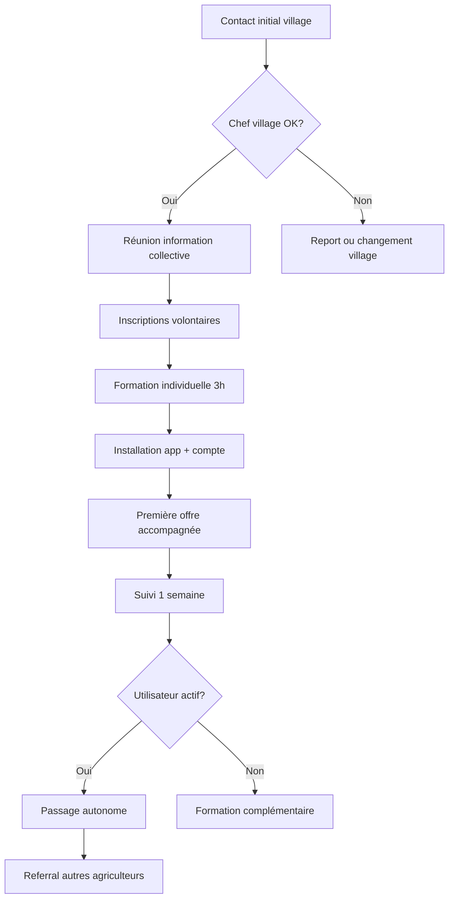

# AgriTrade AI - Stratégie de Déploiement Terrain

## 1. Vue d'Ensemble Stratégique

### 1.1 Objectifs de Déploiement
- **Phase pilote**: Valider le product-market fit avec 50 agriculteurs + 10 acheteurs
- **Zone cible**: Côte d'Ivoire (régions San Pedro, Soubré, Abidjan)
- **Durée**: 6 mois (lancement post-développement MVP)
- **Budget**: $150K (marketing + opérations terrain)

### 1.2 Défis Spécifiques Terrain
- **Connectivité limitée**: 60% zones rurales avec 2G/3G intermittent
- **Alphabétisation**: 40% agriculteurs avec faible niveau de lecture
- **Résistance au changement**: Méfiance vis-à-vis nouvelles technologies
- **Diversité linguistique**: Français + 5 langues locales dominantes
- **Infrastructure**: Accès électricité irrégulier (60% zones rurales)

## 2. Stratégie d'Entrée sur le Marché

### 2.1 Approche "Villages Champions"

**Concept**: Identification et formation intensive de villages pilotes qui serviront de modèles de réussite pour l'expansion.

#### Critères de Sélection Villages
1. **Accessibilité physique**: Routes praticables en toute saison
2. **Connectivité mobile**: Couverture 3G minimum
3. **Organisation sociale**: Présence coopérative ou association structurée
4. **Production**: Volume cacao > 100 tonnes/an
5. **Leadership**: Chef village/président coopérative influent et ouvert au changement

#### Villages Pilotes Identifiés
| Village | Région | Population | Production Cacao | Coopérative | Connectivité |
|---------|--------|------------|------------------|-------------|--------------|
| **Méagui** | San Pedro | 8,000 hab | 350 tonnes/an | SCEB (200 membres) | 3G Orange |
| **Sassako** | Soubré | 5,000 hab | 180 tonnes/an | URECOSCI (150 membres) | 3G MTN |
| **Grand-Béréby** | San Pedro | 12,000 hab | 500 tonnes/an | COPROSEM (400 membres) | 3G/4G |

### 2.2 Partenariats Stratégiques Locaux

#### Coopératives Agricoles
**Partenaire #1: COPROSEM (Coopérative de Production et de Services de Méagui)**
- 400 producteurs membres
- 500 tonnes cacao/an
- Infrastructure: entrepôts, balance certifiée
- **Accord de principe**: Formation + équipement 50 premiers utilisateurs

**Partenaire #2: URECOSCI (Union Régionale des Coopératives du Sud-Ouest de CI)**
- 15 coopératives affiliées (2000+ membres)
- Réseau de collecte existant
- **Négociation en cours**: Pilotage 3 coopératives membres

#### Acheteurs & Exportateurs
**CEMOI Côte d'Ivoire**
- Engagement achat 200 tonnes cacao traçable/mois
- Prime qualité +50 FCFA/kg pour grade A+
- Assistance technique post-récolte

**OLAM International**  
- Programme durabilité existant
- Besoin traçabilité blockchain
- Co-financement potentiel formation agriculteurs

#### Institutions d'Appui
**CNRA (Centre National de Recherche Agronomique)**
- Expertise technique post-récolte
- Formation sur bonnes pratiques
- Validation scientifique algorithmes IA

**ANADER (Agence Nationale d'Appui au Développement Rural)**
- Réseau 1200 conseillers agricoles
- Formations techniques gratuites
- Canal de distribution formation

## 3. Plan de Déploiement Phase par Phase

### 3.1 Phase 1: Préparation & Formation (Mois 1-2)

#### Semaine 1-2: Reconnaissance Terrain
- **Mission exploratoire**: Équipe 3 personnes (CEO, Ops Manager, Développeur)
- **Rencontres institutionnelles**: MINADER, ANADER, FIRCA
- **Validation partenariats**: Signature MoU avec COPROSEM et URECOSCI
- **Étude connectivité**: Tests réseau dans 10 villages cibles

#### Semaine 3-4: Recrutement Équipe Locale
**Postes à pourvoir**:
- 1x **Field Manager** (terrain permanent)
- 3x **Animateurs agricoles** (formation utilisateurs)
- 1x **Coordinateur logistique** (transport équipements)
- 2x **Agents support technique** (hotline locale)

**Profils recherchés**:
- Expérience secteur agricole (min 3 ans)
- Langues locales (Baoulé, Dioula, Bété)
- Permis conduire + moto
- Base en informatique

#### Semaine 5-8: Formation Équipe & Matériel
**Programme de formation intensive (40h)**:
- Utilisation plateforme AgriTrade AI
- Techniques pédagogiques pour adultes analphabètes
- Bonnes pratiques post-récolte cacao
- Maintenance de base smartphones/tablettes

**Matériel déployé**:
- 10 smartphones Android (formation)
- 5 tablettes 10" (démonstrations)
- 2 balances numériques portables
- 1 générateur solaire portable
- Kit connectivity (antennes 4G mobiles)

### 3.2 Phase 2: Lancement Pilote (Mois 3-4)

#### Stratégie de Recrutement Utilisateurs

**Approche "Cercles Concentriques"**
1. **Noyau dur (10 agriculteurs)**: Leaders d'opinion, alphabétisés, smartphones
2. **Première vague (20 agriculteurs)**: Membres influents coopératives
3. **Adoption massive (20+ agriculteurs)**: Bouche-à-oreille, formations collectives

#### Processus d'Onboarding Agriculteurs

**Étape 1: Séance d'Information Collective (2h)**
- Présentation plateforme (démonstration live)
- Témoignages utilisateurs alpha-testeurs
- Session Q&R en langue locale
- Inscription volontaire

**Étape 2: Formation Individuelle (3h)**
- Installation app + création compte
- Formation estimation qualité (Google Vision)
- Première publication offre accompagnée
- Configuration SMS/WhatsApp notifications

**Étape 3: Accompagnement Première Transaction (1 semaine)**
- Suivi quotidien première offre
- Assistance négociation acheteur
- Support logistique livraison
- Formation utilisation paiement Mobile Money

#### KPIs Phase Pilote
- **50 agriculteurs actifs** (au moins 1 offre/mois)
- **10 acheteurs inscrits** (au moins 1 achat/mois)  
- **100 transactions** (volume min 50 tonnes)
- **Satisfaction > 4/5** (enquête post-transaction)

### 3.3 Phase 3: Optimisation & Expansion (Mois 5-6)

#### Collecte de Feedback & Amélioration
**Méthodologie**:
- Interviews semi-directifs (20 utilisateurs)
- Focus groups par village (3 sessions)
- Analyse données usage (analytics)
- Tests A/B nouvelles fonctionnalités

#### Corrections Prioritaires Identifiées
1. **Interface simplifiée**: Réduction 50% des écrans
2. **Mode offline renforcé**: Cache 48h prix/offres
3. **Assistant vocal amélioré**: Support dialectes locaux
4. **Formation continue**: Webinaires hebdomadaires

#### Préparation Expansion
- Formation 5 nouveaux animateurs
- Partenariats 3 nouvelles coopératives
- Extension zone géographique (rayon 50km)
- Recrutement 20 nouveaux acheteurs

## 4. Stratégie Marketing & Communication

### 4.1 Positionnement & Messaging

#### Message Principal
**"Vendre votre cacao au meilleur prix, directement aux vrais acheteurs"**

#### Messages Secondaires par Cible
**Agriculteurs**:
- "Fini les intermédiaires qui réduisent vos bénéfices"
- "Connaissez le vrai prix de votre cacao en temps réel"
- "Vendez quand ÇA vous arrange, où ÇA vous arrange"

**Acheteurs**:
- "Achetez en direct, qualité garantie par l'IA"
- "Traçabilité complète de la ferme à l'export"
- "Réduisez vos coûts d'approvisionnement"

**Coopératives**:
- "Augmentez la valeur ajoutée pour vos membres"
- "Outils de gestion digitaux gratuits"
- "Formation technique incluse"

### 4.2 Mix Marketing Terrain

#### Communication de Masse
**Radio Locale**
- Spot 30" en français + langues locales
- 3 diffusions/jour pendant 2 mois
- Partenariat Radio Côte d'Ivoire (stations régionales)
- Budget: $15K/mois

**Affichage Rural**
- 100 panneaux 4x3m (entrées villages, marchés)
- QR codes pour téléchargement app
- Maintenance mensuelle
- Budget: $25K (installation + 6 mois)

#### Marketing de Proximité
**Événements Villages**
- Tournées démonstration (1 village/semaine)
- Stands marchés hebdomadaires
- Partenariat festivals locaux (Fête Cacao)
- Animation griots/conteurs traditionnels

**Ambassadeurs Locaux**
- Rémunération chefs villages (50 FCFA/inscription)
- Prime présidents coopératives (performance)
- Concours "Village le plus connecté"

#### Digital & Mobile
**SMS Marketing**
- Base 50,000 numéros agriculteurs (achat légal)
- 2 SMS/semaine (prix, conseils, promo)
- Opt-in obligatoire + STOP simple
- Budget: $2K/mois

**WhatsApp Business**
- Groupes par village (max 50 membres)
- Diffusion quotidienne prix
- Support client 7j/7 (9h-18h)
- Formation usage WhatsApp Business

### 4.3 Outils de Conversion & Rétention

#### Incentives Acquisition
- **Bonus inscription**: +100 FCFA crédit communication
- **Prime première vente**: Réduction 50% commission (1 mois)
- **Parrainage**: 500 FCFA par agriculteur référé actif
- **Formation gratuite**: Session post-récolte (valeur 10,000 FCFA)

#### Fidélisation
- **Programme VIP**: 0 commission après 10 transactions
- **Assurance récolte**: Partenariat ALLIANZ (tarif préférentiel)  
- **Microcrédit**: Scoring basé historique transactions
- **Formations avancées**: Certification bio, équitable

## 5. Opérations & Logistique Terrain

### 5.1 Infrastructure Déploiement

#### Centres Opérationnels
**Hub Principal - Abidjan**
- Bureaux équipe (8 personnes)
- Stock matériel (smartphones, tablettes)
- Serveurs backup (redondance cloud)
- Formation salle (capacité 30 personnes)

**Antennes Terrain (3 sites)**
- San Pedro: 2 animateurs + 1 logistique
- Soubré: 2 animateurs  
- Méagui: 1 animateur résident

#### Équipements Mobiles
**Véhicules**
- 2x pickup 4x4 (routes difficiles)
- 4x motos trail (accès villages enclavés)
- Équipement sécurité + GPS tracking

**Matériel Technique**  
- 100x smartphones Android (prêt utilisateurs)
- 20x tablettes démonstration
- 10x balances numériques certifiées
- 5x kits connectivité satellite (zones blanches)
- 2x générateurs solaires mobiles

### 5.2 Processus Opérationnels

#### Workflow Installation Utilisateur

#### Support Utilisateur Multi-Canal
**Niveau 1: Auto-Service**
- FAQ intégrée app (vocal + texte)
- Tutoriels vidéo (langues locales)
- Chatbot SMS basique (#HELP, #PRIX)

**Niveau 2: Support Humain Local**
- Hotline téléphonique (français + local)
- WhatsApp support (réponse < 2h)
- Visite terrain (sur RDV)

**Niveau 3: Support Technique**
- Escalation équipe dev (bugs)
- Intervention spécialisée (connectivité)
- Formation avancée (power users)

### 5.3 Gestion Qualité & Conformité

#### Validation Continue Algorithmes IA
- Tests qualité hebdomadaires (échantillons physiques)
- Calibrage avec experts CNRA
- Mise à jour modèles selon feedback terrain
- Documentation traçabilité analyses

#### Conformité Réglementaire
- Enregistrement ARTCI (autorité télécoms)
- Licence négoce électronique (MINADER)
- Conformité protection données (CNIL CI)
- Audit financier trimestriel (Mobile Money)

## 6. Métriques & KPIs de Réussite

### 6.1 KPIs Adoption Utilisateurs

#### Métriques Acquisition
- **Taux conversion événement → inscription**: 20%
- **Coût acquisition client (CAC)**: < $50/agriculteur
- **Temps moyen onboarding**: < 7 jours
- **Taux activation (première offre)**: > 70%

#### Métriques Engagement  
- **Utilisateurs actifs mensuels (MAU)**: > 80% base
- **Fréquence utilisation**: 2.5 sessions/semaine
- **Temps session moyen**: > 8 minutes
- **Taux rétention J30**: > 60%

### 6.2 KPIs Business & Impact

#### Métriques Économiques
- **Volume transactions mensuel**: 50 tonnes (mois 6)
- **Revenus commission**: $15K/mois
- **Marge brute**: > 70%
- **Lifetime Value (LTV)**: > $300/agriculteur

#### Métriques Impact Social
- **Augmentation revenus agriculteurs**: +35% (vs circuit traditionnel)
- **Réduction intermédiaires**: Passage 4 → 1 niveau
- **Amélioration qualité**: 60% produits grade A+ (vs 30% avant)
- **Inclusion financière**: 40% agriculteurs = première transaction digitale

### 6.3 Métriques Opérationnelles

#### Performance Technique
- **Disponibilité plateforme**: > 99%
- **Temps réponse API**: < 500ms (95e percentile)
- **Précision IA qualité**: > 85% vs expert
- **Taux succès paiements**: > 95%

#### Efficacité Terrain
- **Coût support/utilisateur/mois**: < $10
- **Résolution tickets < 24h**: > 90%
- **Satisfaction support**: > 4.2/5
- **Turnover équipe terrain**: < 15%/an

## 7. Gestion des Risques & Mitigation

### 7.1 Risques Techniques

#### Connectivité Insuffisante
**Risque**: Zones 2G avec coupures fréquentes (40% territoire)
**Mitigation**: 
- Mode offline robuste (cache 72h)
- SMS fallback pour fonctions critiques
- Partenariats opérateurs (amélioration couverture)
- Antennes satellitaires mobiles (zones prioritaires)

#### Défaillance APIs Externes  
**Risque**: Google Vision, OpenWeather, FAO APIs indisponibles
**Mitigation**:
- Fournisseurs multiples par fonction critique
- Cache intelligence local (7 jours données)
- Mode dégradé avec estimation manuelle
- SLA contractuels avec pénalités

### 7.2 Risques Opérationnels

#### Résistance Changement Utilisateurs
**Risque**: Adoption lente, retour pratiques traditionnelles
**Mitigation**:
- Formation intensive pré-lancement
- Incentives financiers substantiels
- Accompagnement personnalisé 1 mois
- Validation par leaders d'opinion locaux

#### Concurrence Établie
**Risque**: Réaction négociants traditionnels (boycott, pression)
**Mitigation**:
- Partenariat coopératives (protection légale)
- Diversification géographique rapide
- Communication transparence bénéfices
- Support institutionnel (MINADER, CNRA)

### 7.3 Risques Réglementaires

#### Changement Régulation
**Risque**: Nouvelles taxes, restrictions négoce électronique
**Mitigation**:
- Veille réglementaire permanente
- Lobbying via chambres professionnelles
- Compliance proactive (suranticipation)
- Flexibilité modèle business

#### Protection Données  
**Risque**: Sanctions non-conformité RGPD local
**Mitigation**:
- Audit légal trimestriel
- Chiffrement bout-en-bout
- Consentement explicite utilisateurs
- DPO (Data Protection Officer) dédié

## 8. Budget Détaillé & ROI

### 8.1 Budget Déploiement 6 Mois

| Poste | Mois 1-2 | Mois 3-4 | Mois 5-6 | Total |
|-------|----------|----------|----------|-------|
| **Équipe Terrain** | $15K | $20K | $25K | $60K |
| **Marketing & Communication** | $20K | $30K | $25K | $75K |
| **Matériel & Équipements** | $15K | $5K | $2K | $22K |
| **Déplacements & Logistique** | $8K | $12K | $10K | $30K |
| **Formations & Événements** | $5K | $8K | $6K | $19K |
| **Infrastructure Locale** | $10K | $3K | $2K | $15K |
| **Contingence (15%)** | | | | $33K |
| **TOTAL** | $73K | $78K | $70K | **$254K** |

### 8.2 Projections ROI

#### Revenus Projetés (Commission 3%)
- **Mois 3**: 10 tonnes × 850 FCFA × 3% = $430
- **Mois 4**: 25 tonnes × 850 FCFA × 3% = $1,075  
- **Mois 5**: 40 tonnes × 850 FCFA × 3% = $1,720
- **Mois 6**: 50 tonnes × 850 FCFA × 3% = $2,150

**Total revenus 6 mois**: $5,375
**Coûts déploiement**: $254K
**ROI direct**: -95% (normal pour phase pilote)

#### Projections Année 1 Post-Pilote
- **Volume mensuel moyen**: 150 tonnes
- **Revenus annuels**: $77K
- **Marge nette**: 60% = $46K
- **Break-even**: Mois 14 (post-lancement)

## 9. Plan de Contingence

### 9.1 Scénarios de Crise

#### Scenario 1: Adoption Très Lente (<20 agriculteurs actifs mois 6)
**Actions immédiates**:
- Audit complet experience utilisateur
- Formation équipe terrain renforcée  
- Incentives doublés (6 mois supplémentaires)
- Pivot vers services B2B (coopératives)

#### Scenario 2: Problèmes Techniques Majeurs
**Actions immédiates**:
- Équipe dev renforcée (freelances experts)
- Mode dégradé SMS/WhatsApp uniquement
- Communication transparente utilisateurs
- Extension timeline 3 mois

#### Scenario 3: Concurrence Agressive
**Actions immédiates**:
- Accélération expansion géographique
- Partenariats exclusifs renforcés
- Différenciation produit (nouvelles fonctions IA)
- Guerre des prix temporaire (commission 0%)

### 9.2 Plan de Sortie

#### Conditions d'Arrêt du Pilote
- **<30 agriculteurs actifs** après 6 mois
- **Satisfaction < 3/5** malgré améliorations
- **Coûts opérationnels > 200% budget**
- **Problèmes réglementaires majeurs**

#### Protocole de Fermeture Propre
1. Préavis 30 jours utilisateurs
2. Transfert données vers concurrents
3. Remboursement soldes Mobile Money
4. Archive complète apprentissages (documentation)
5. Transition équipe locale (reclassement)

## 10. Conclusion & Prochaines Étapes

### 10.1 Facteurs Clés de Succès
1. **Partenariats solides**: Coopératives + acheteurs + institutions
2. **Équipe terrain expérimentée**: Connaissance locale + compétences tech
3. **Simplicité d'usage**: Interface intuitive + support multilingue
4. **Valeur claire**: Bénéfices tangibles immédiats (+30% revenus)
5. **Adaptabilité**: Itération rapide selon feedback terrain

### 10.2 Étapes Immédiates (30 jours)
- [ ] Validation finale partenariats COPROSEM/URECOSCI
- [ ] Recrutement Field Manager + 2 animateurs
- [ ] Achat matériel déploiement (smartphones, véhicules)
- [ ] Finalisation contenus formation (vidéos langues locales)
- [ ] Tests connectivité villages pilotes

### 10.3 Vision Long Terme
**Objectif 2025**: 5000 agriculteurs actifs, 5 pays africains
**Objectif 2027**: 50,000 agriculteurs, référence continental négoce agricole digital

---

**Document préparé par**: Équipe Strategy & Operations  
**Validation**: CEO, CTO, Board of Directors  
**Dernière mise à jour**: 22 Août 2024  
**Version**: 2.1